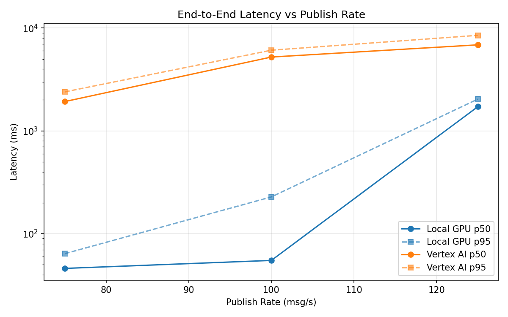
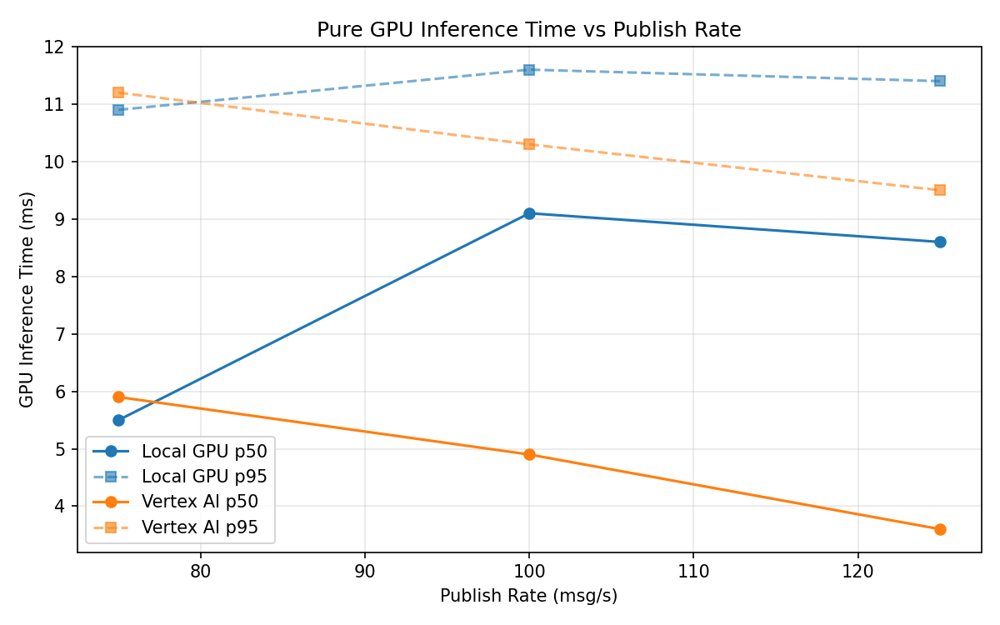
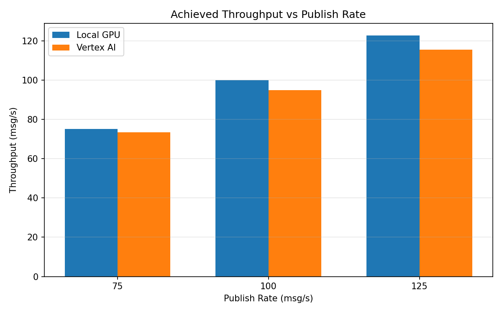

# Benchmark Report

Generated: 2026-03-08 12:08:32

## Configuration

| Parameter | Value |
|---|---|
| Messages per phase | 100s per phase |
| Rates (msg/s) | 75, 100, 125 |
| Experiments | Local GPU, Vertex AI |

## Throughput

| Rate (msg/s) | Local GPU | Vertex AI |
|---|---|---|
| 75 | 75.0 | 73.4 |
| 100 | 100.0 | 94.8 |
| 125 | 122.7 | 115.4 |

## End-to-End Latency (ms)

| Rate | Percentile | Local GPU | Vertex AI |
|---|---|---|---|
| 75 | p50 | 46.0 | 1929.0 |
| 75 | p95 | 64.0 | 2396.0 |
| 75 | p99 | 209.0 | 2452.0 |
| 100 | p50 | 55.0 | 5227.0 |
| 100 | p95 | 228.0 | 6093.0 |
| 100 | p99 | 515.0 | 6204.0 |
| 125 | p50 | 1720.0 | 6868.5 |
| 125 | p95 | 2038.0 | 8501.0 |
| 125 | p99 | 2064.0 | 8794.0 |

## GPU Inference Time (ms)

| Rate | Percentile | Local GPU | Vertex AI |
|---|---|---|---|
| 75 | p50 | 5.5 | 5.9 |
| 75 | p95 | 10.9 | 11.2 |
| 75 | p99 | 11.8 | 14.2 |
| 100 | p50 | 9.1 | 4.9 |
| 100 | p95 | 11.6 | 10.3 |
| 100 | p99 | 12.4 | 12.4 |
| 125 | p50 | 8.6 | 3.6 |
| 125 | p95 | 11.4 | 9.5 |
| 125 | p99 | 12.3 | 12.0 |

## Charts

### Latency vs Publish Rate

### GPU Inference Time vs Publish Rate

### Throughput vs Publish Rate

