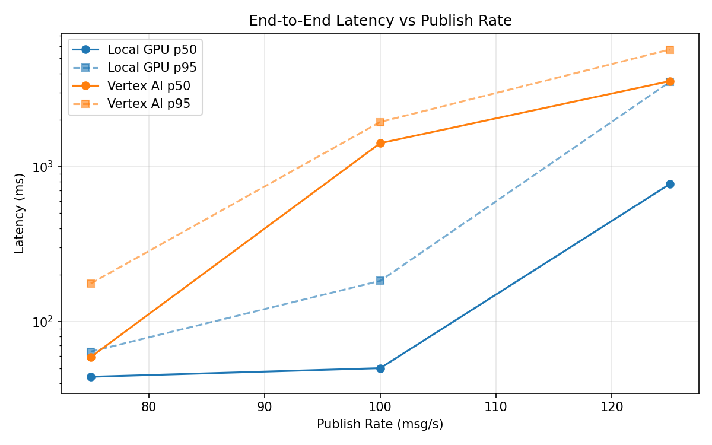
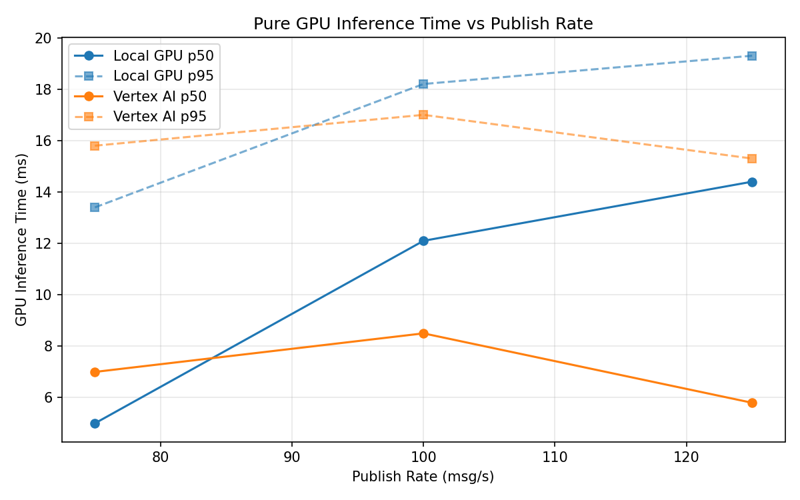
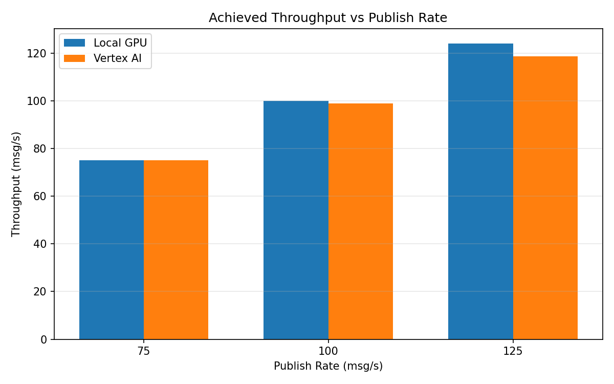

# Benchmark Report

Generated: 2026-03-08 12:20:39

## Configuration

| Parameter | Value |
|---|---|
| Messages per phase | 100s per phase |
| Rates (msg/s) | 75, 100, 125 |
| Experiments | Local GPU, Vertex AI |

## Throughput

| Rate (msg/s) | Local GPU | Vertex AI |
|---|---|---|
| 75 | 75.0 | 75.0 |
| 100 | 99.9 | 98.8 |
| 125 | 124.0 | 118.6 |

## End-to-End Latency (ms)

| Rate | Percentile | Local GPU | Vertex AI |
|---|---|---|---|
| 75 | p50 | 44.0 | 59.0 |
| 75 | p95 | 64.0 | 176.0 |
| 75 | p99 | 421.0 | 685.1 |
| 100 | p50 | 50.0 | 1417.0 |
| 100 | p95 | 183.0 | 1942.0 |
| 100 | p99 | 622.0 | 2008.0 |
| 125 | p50 | 771.0 | 3563.0 |
| 125 | p95 | 3518.0 | 5695.0 |
| 125 | p99 | 4697.0 | 6862.0 |

## GPU Inference Time (ms)

| Rate | Percentile | Local GPU | Vertex AI |
|---|---|---|---|
| 75 | p50 | 5.0 | 7.0 |
| 75 | p95 | 13.4 | 15.8 |
| 75 | p99 | 17.6 | 20.9 |
| 100 | p50 | 12.1 | 8.5 |
| 100 | p95 | 18.2 | 17.0 |
| 100 | p99 | 20.0 | 22.1 |
| 125 | p50 | 14.4 | 5.8 |
| 125 | p95 | 19.3 | 15.3 |
| 125 | p99 | 21.0 | 20.0 |

## Charts

### Latency vs Publish Rate

### GPU Inference Time vs Publish Rate

### Throughput vs Publish Rate

