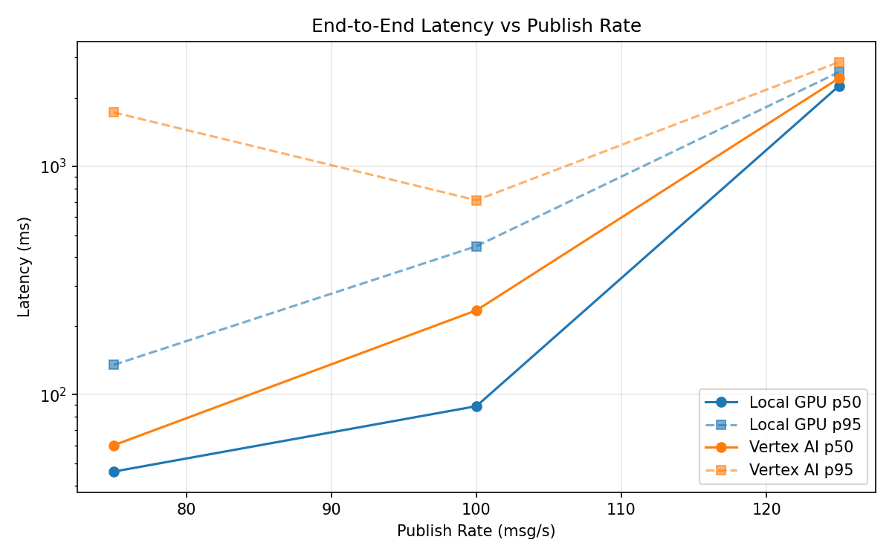
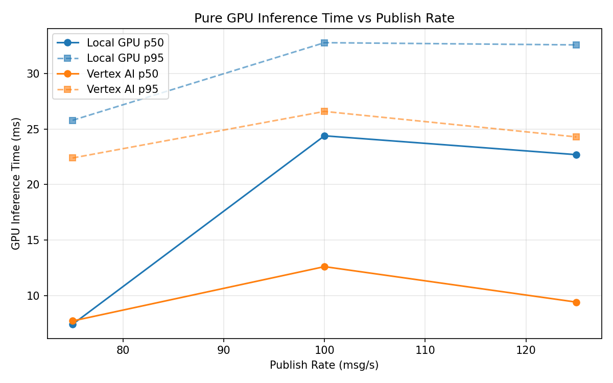
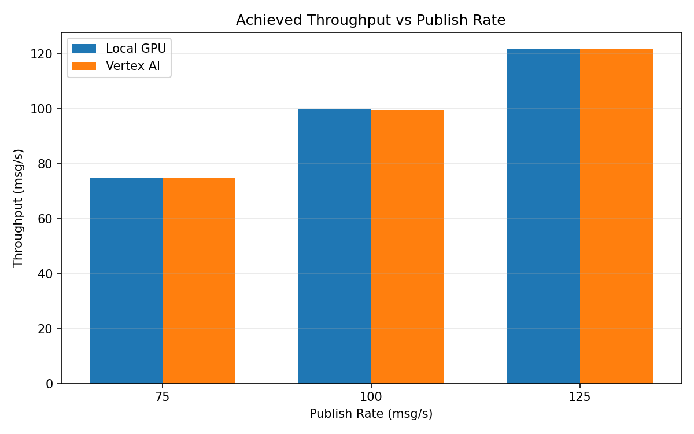

# Benchmark Report

Generated: 2026-03-08 12:33:42

## Configuration

| Parameter | Value |
|---|---|
| Messages per phase | 100s per phase |
| Rates (msg/s) | 75, 100, 125 |
| Experiments | Local GPU, Vertex AI |

## Throughput

| Rate (msg/s) | Local GPU | Vertex AI |
|---|---|---|
| 75 | 75.0 | 75.0 |
| 100 | 99.9 | 99.5 |
| 125 | 121.7 | 121.7 |

## End-to-End Latency (ms)

| Rate | Percentile | Local GPU | Vertex AI |
|---|---|---|---|
| 75 | p50 | 46.0 | 60.0 |
| 75 | p95 | 135.0 | 1724.2 |
| 75 | p99 | 275.0 | 2739.0 |
| 100 | p50 | 89.0 | 234.0 |
| 100 | p95 | 447.0 | 711.0 |
| 100 | p99 | 681.0 | 791.0 |
| 125 | p50 | 2254.0 | 2435.0 |
| 125 | p95 | 2590.1 | 2866.0 |
| 125 | p99 | 2854.0 | 2958.0 |

## GPU Inference Time (ms)

| Rate | Percentile | Local GPU | Vertex AI |
|---|---|---|---|
| 75 | p50 | 7.4 | 7.7 |
| 75 | p95 | 25.8 | 22.4 |
| 75 | p99 | 32.1 | 28.2 |
| 100 | p50 | 24.4 | 12.6 |
| 100 | p95 | 32.8 | 26.6 |
| 100 | p99 | 36.0 | 32.9 |
| 125 | p50 | 22.7 | 9.4 |
| 125 | p95 | 32.6 | 24.3 |
| 125 | p99 | 35.9 | 29.6 |

## Charts

### Latency vs Publish Rate

### GPU Inference Time vs Publish Rate

### Throughput vs Publish Rate

