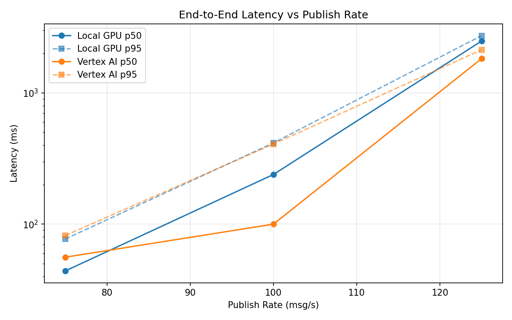
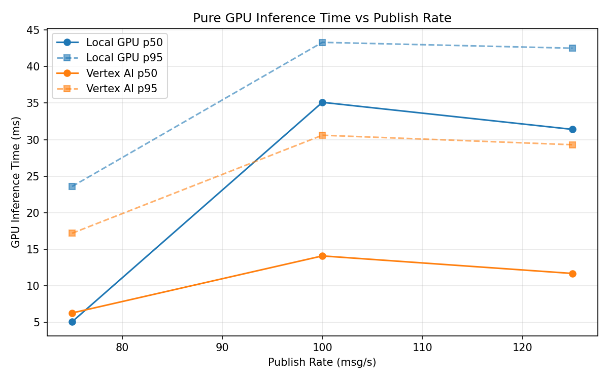
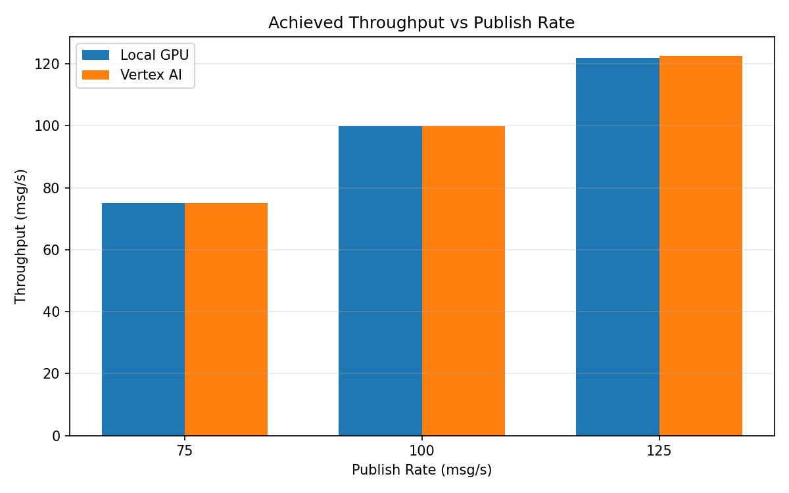

# Benchmark Report

Generated: 2026-03-08 12:46:32

## Configuration

| Parameter | Value |
|---|---|
| Messages per phase | 100s per phase |
| Rates (msg/s) | 75, 100, 125 |
| Experiments | Local GPU, Vertex AI |

## Throughput

| Rate (msg/s) | Local GPU | Vertex AI |
|---|---|---|
| 75 | 75.0 | 75.0 |
| 100 | 99.8 | 99.9 |
| 125 | 121.9 | 122.6 |

## End-to-End Latency (ms)

| Rate | Percentile | Local GPU | Vertex AI |
|---|---|---|---|
| 75 | p50 | 44.0 | 56.0 |
| 75 | p95 | 77.0 | 82.0 |
| 75 | p99 | 464.1 | 276.1 |
| 100 | p50 | 239.0 | 100.0 |
| 100 | p95 | 416.0 | 408.0 |
| 100 | p99 | 524.0 | 701.0 |
| 125 | p50 | 2485.0 | 1826.0 |
| 125 | p95 | 2731.0 | 2134.0 |
| 125 | p99 | 2770.0 | 2242.0 |

## GPU Inference Time (ms)

| Rate | Percentile | Local GPU | Vertex AI |
|---|---|---|---|
| 75 | p50 | 5.1 | 6.3 |
| 75 | p95 | 23.6 | 17.2 |
| 75 | p99 | 39.7 | 26.4 |
| 100 | p50 | 35.1 | 14.1 |
| 100 | p95 | 43.3 | 30.6 |
| 100 | p99 | 47.0 | 39.7 |
| 125 | p50 | 31.4 | 11.7 |
| 125 | p95 | 42.5 | 29.3 |
| 125 | p99 | 46.2 | 38.5 |

## Charts

### Latency vs Publish Rate

### GPU Inference Time vs Publish Rate

### Throughput vs Publish Rate

