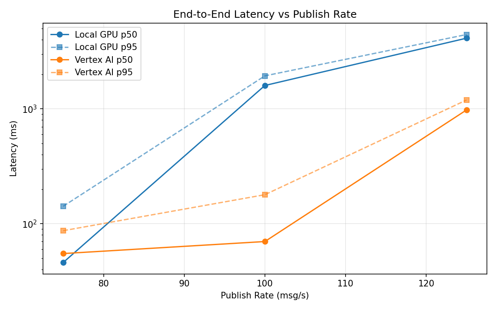
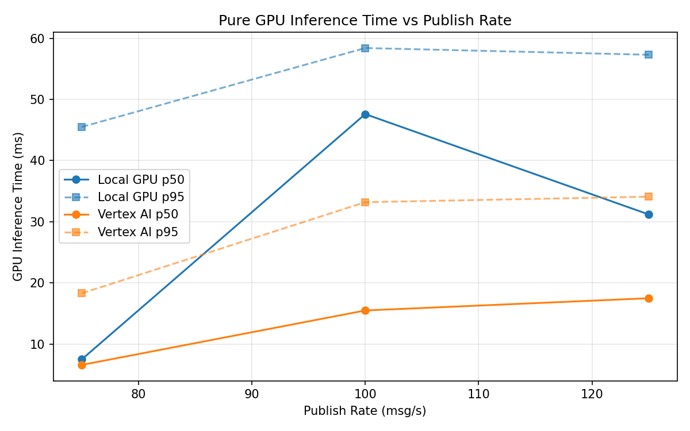
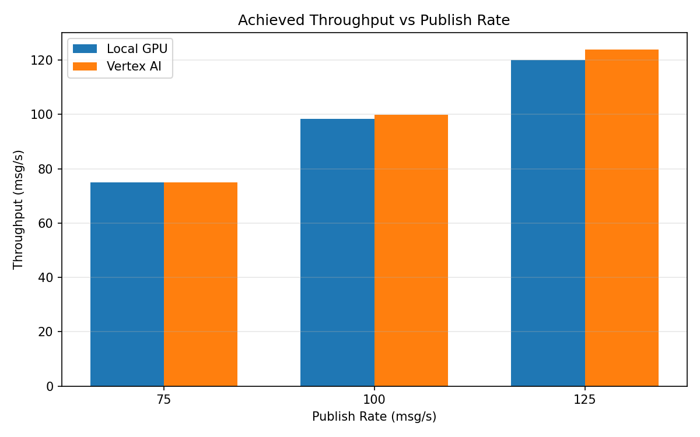

# Benchmark Report

Generated: 2026-03-08 12:57:58

## Configuration

| Parameter | Value |
|---|---|
| Messages per phase | 100s per phase |
| Rates (msg/s) | 75, 100, 125 |
| Experiments | Local GPU, Vertex AI |

## Throughput

| Rate (msg/s) | Local GPU | Vertex AI |
|---|---|---|
| 75 | 75.0 | 75.0 |
| 100 | 98.3 | 99.9 |
| 125 | 120.1 | 123.9 |

## End-to-End Latency (ms)

| Rate | Percentile | Local GPU | Vertex AI |
|---|---|---|---|
| 75 | p50 | 46.0 | 55.0 |
| 75 | p95 | 142.0 | 87.0 |
| 75 | p99 | 473.0 | 337.0 |
| 100 | p50 | 1599.0 | 70.0 |
| 100 | p95 | 1940.0 | 179.0 |
| 100 | p99 | 2009.0 | 352.0 |
| 125 | p50 | 4129.0 | 979.0 |
| 125 | p95 | 4441.0 | 1196.0 |
| 125 | p99 | 4524.0 | 1302.0 |

## GPU Inference Time (ms)

| Rate | Percentile | Local GPU | Vertex AI |
|---|---|---|---|
| 75 | p50 | 7.5 | 6.6 |
| 75 | p95 | 45.5 | 18.3 |
| 75 | p99 | 54.4 | 30.0 |
| 100 | p50 | 47.6 | 15.5 |
| 100 | p95 | 58.4 | 33.2 |
| 100 | p99 | 62.2 | 44.1 |
| 125 | p50 | 31.2 | 17.5 |
| 125 | p95 | 57.3 | 34.1 |
| 125 | p99 | 61.7 | 44.9 |

## Charts

### Latency vs Publish Rate

### GPU Inference Time vs Publish Rate

### Throughput vs Publish Rate

