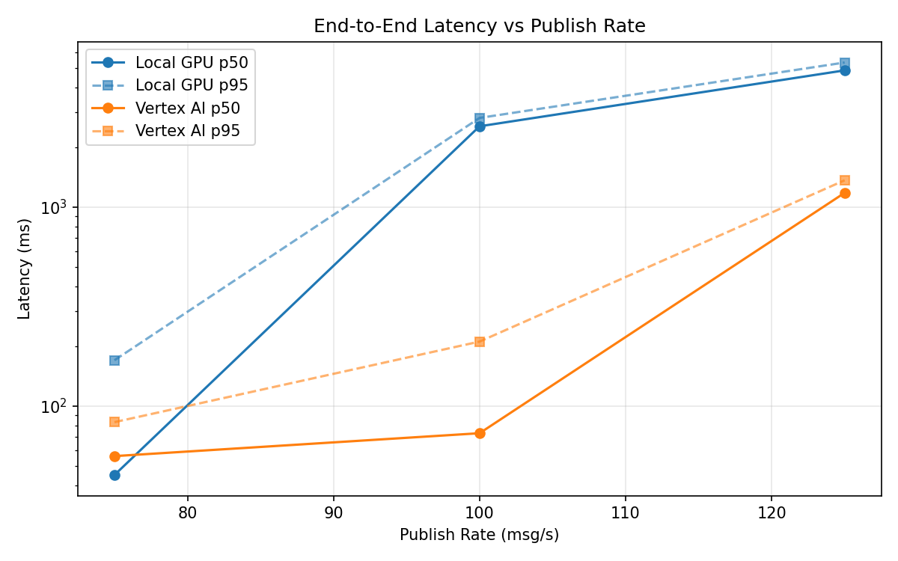
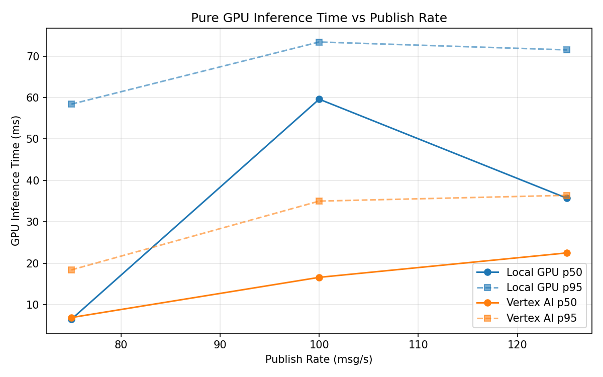
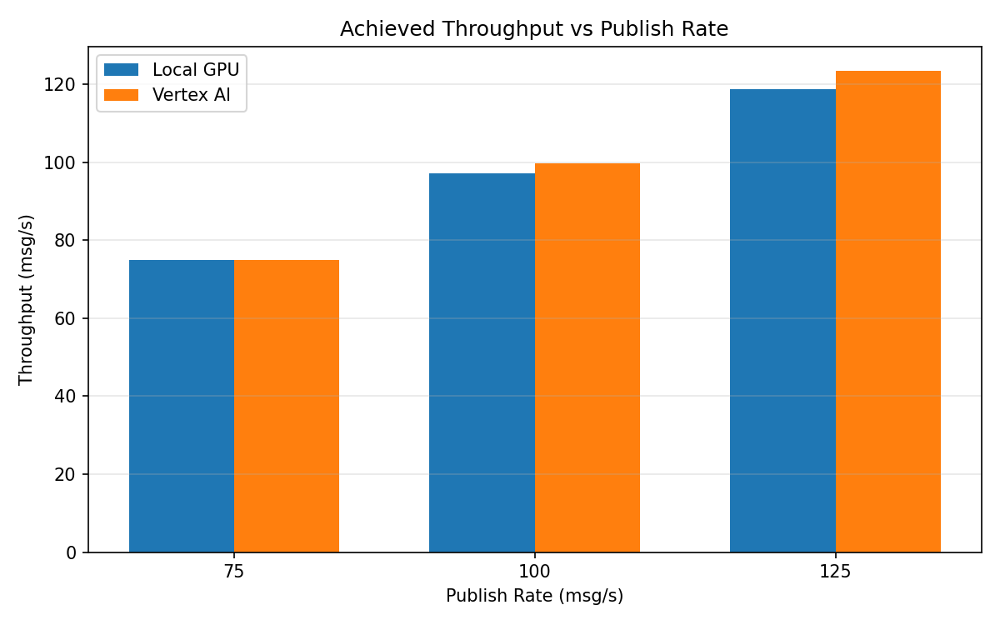

# Benchmark Report

Generated: 2026-03-08 13:09:58

## Configuration

| Parameter | Value |
|---|---|
| Messages per phase | 100s per phase |
| Rates (msg/s) | 75, 100, 125 |
| Experiments | Local GPU, Vertex AI |

## Throughput

| Rate (msg/s) | Local GPU | Vertex AI |
|---|---|---|
| 75 | 74.9 | 75.0 |
| 100 | 97.2 | 99.8 |
| 125 | 118.8 | 123.5 |

## End-to-End Latency (ms)

| Rate | Percentile | Local GPU | Vertex AI |
|---|---|---|---|
| 75 | p50 | 45.0 | 56.0 |
| 75 | p95 | 170.0 | 83.0 |
| 75 | p99 | 329.0 | 200.0 |
| 100 | p50 | 2555.0 | 73.0 |
| 100 | p95 | 2815.0 | 211.0 |
| 100 | p99 | 2915.0 | 485.0 |
| 125 | p50 | 4882.5 | 1182.0 |
| 125 | p95 | 5348.0 | 1367.0 |
| 125 | p99 | 5433.0 | 1460.0 |

## GPU Inference Time (ms)

| Rate | Percentile | Local GPU | Vertex AI |
|---|---|---|---|
| 75 | p50 | 6.5 | 6.9 |
| 75 | p95 | 58.4 | 18.4 |
| 75 | p99 | 69.3 | 30.7 |
| 100 | p50 | 59.6 | 16.6 |
| 100 | p95 | 73.4 | 35.0 |
| 100 | p99 | 78.1 | 46.0 |
| 125 | p50 | 35.7 | 22.5 |
| 125 | p95 | 71.5 | 36.4 |
| 125 | p99 | 76.4 | 46.2 |

## Charts

### Latency vs Publish Rate

### GPU Inference Time vs Publish Rate

### Throughput vs Publish Rate

