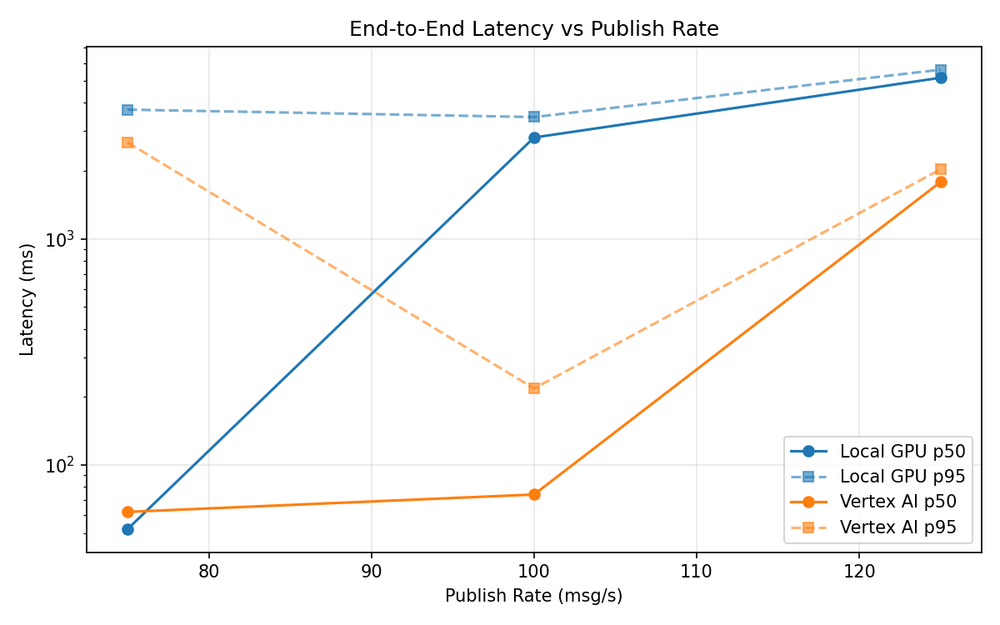
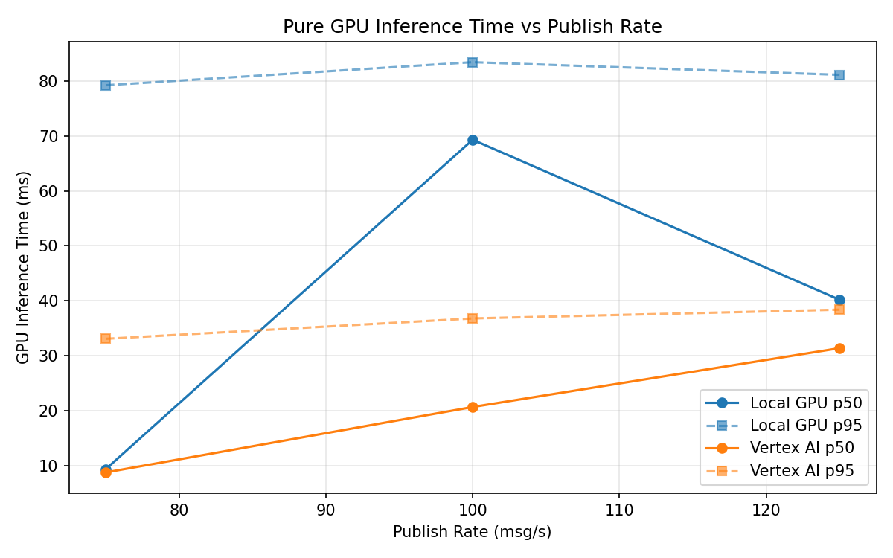
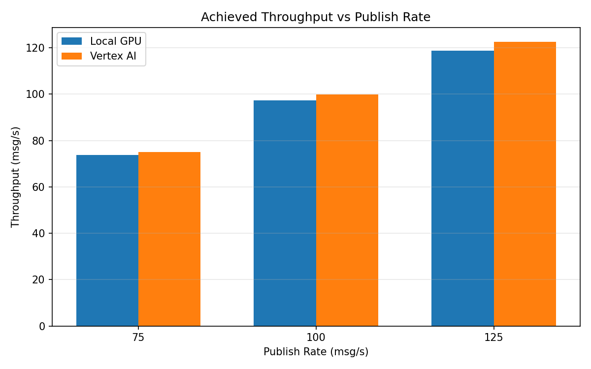

# Benchmark Report

Generated: 2026-03-08 13:22:10

## Configuration

| Parameter | Value |
|---|---|
| Messages per phase | 100s per phase |
| Rates (msg/s) | 75, 100, 125 |
| Experiments | Local GPU, Vertex AI |

## Throughput

| Rate (msg/s) | Local GPU | Vertex AI |
|---|---|---|
| 75 | 73.8 | 75.0 |
| 100 | 97.3 | 99.9 |
| 125 | 118.8 | 122.6 |

## End-to-End Latency (ms)

| Rate | Percentile | Local GPU | Vertex AI |
|---|---|---|---|
| 75 | p50 | 52.0 | 62.0 |
| 75 | p95 | 3729.1 | 2670.1 |
| 75 | p99 | 4870.1 | 3876.1 |
| 100 | p50 | 2807.0 | 74.0 |
| 100 | p95 | 3457.0 | 218.0 |
| 100 | p99 | 3590.0 | 326.0 |
| 125 | p50 | 5159.0 | 1785.0 |
| 125 | p95 | 5603.0 | 2031.0 |
| 125 | p99 | 5760.0 | 2086.0 |

## GPU Inference Time (ms)

| Rate | Percentile | Local GPU | Vertex AI |
|---|---|---|---|
| 75 | p50 | 9.4 | 8.8 |
| 75 | p95 | 79.2 | 33.1 |
| 75 | p99 | 85.0 | 38.3 |
| 100 | p50 | 69.3 | 20.7 |
| 100 | p95 | 83.4 | 36.8 |
| 100 | p99 | 87.9 | 46.7 |
| 125 | p50 | 40.2 | 31.4 |
| 125 | p95 | 81.1 | 38.4 |
| 125 | p99 | 86.4 | 48.7 |

## Charts

### Latency vs Publish Rate

### GPU Inference Time vs Publish Rate

### Throughput vs Publish Rate

