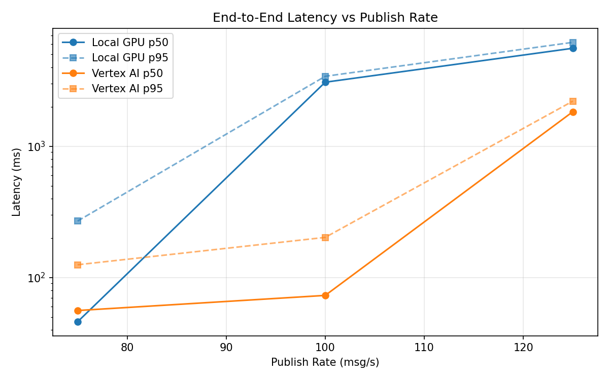
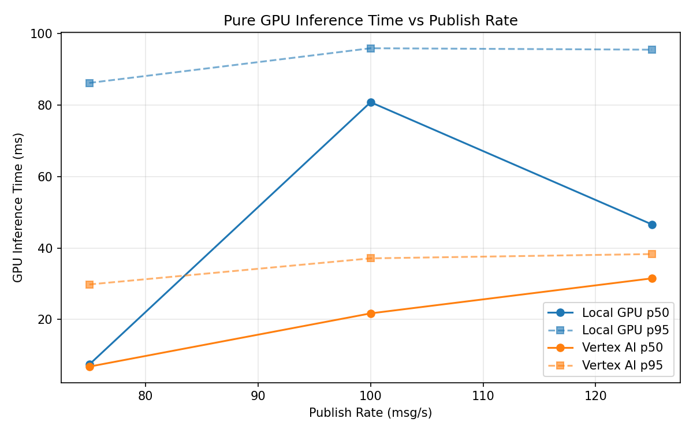
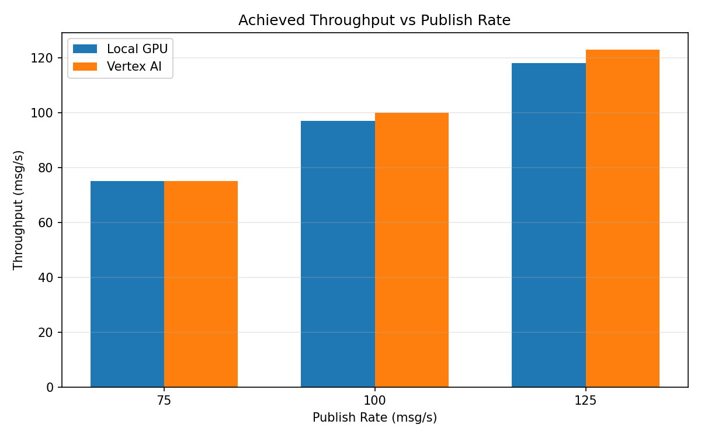

# Benchmark Report

Generated: 2026-03-08 13:34:12

## Configuration

| Parameter | Value |
|---|---|
| Messages per phase | 100s per phase |
| Rates (msg/s) | 75, 100, 125 |
| Experiments | Local GPU, Vertex AI |

## Throughput

| Rate (msg/s) | Local GPU | Vertex AI |
|---|---|---|
| 75 | 75.0 | 75.0 |
| 100 | 96.9 | 99.9 |
| 125 | 117.9 | 122.9 |

## End-to-End Latency (ms)

| Rate | Percentile | Local GPU | Vertex AI |
|---|---|---|---|
| 75 | p50 | 46.0 | 56.0 |
| 75 | p95 | 269.0 | 125.0 |
| 75 | p99 | 532.0 | 1063.0 |
| 100 | p50 | 3071.0 | 73.0 |
| 100 | p95 | 3407.0 | 202.0 |
| 100 | p99 | 3513.0 | 306.0 |
| 125 | p50 | 5569.0 | 1830.0 |
| 125 | p95 | 6179.0 | 2203.0 |
| 125 | p99 | 6284.0 | 2286.0 |

## GPU Inference Time (ms)

| Rate | Percentile | Local GPU | Vertex AI |
|---|---|---|---|
| 75 | p50 | 7.4 | 6.8 |
| 75 | p95 | 86.2 | 29.8 |
| 75 | p99 | 95.1 | 35.7 |
| 100 | p50 | 80.8 | 21.7 |
| 100 | p95 | 95.9 | 37.1 |
| 100 | p99 | 100.6 | 46.7 |
| 125 | p50 | 46.6 | 31.5 |
| 125 | p95 | 95.5 | 38.3 |
| 125 | p99 | 101.6 | 48.1 |

## Charts

### Latency vs Publish Rate

### GPU Inference Time vs Publish Rate

### Throughput vs Publish Rate

