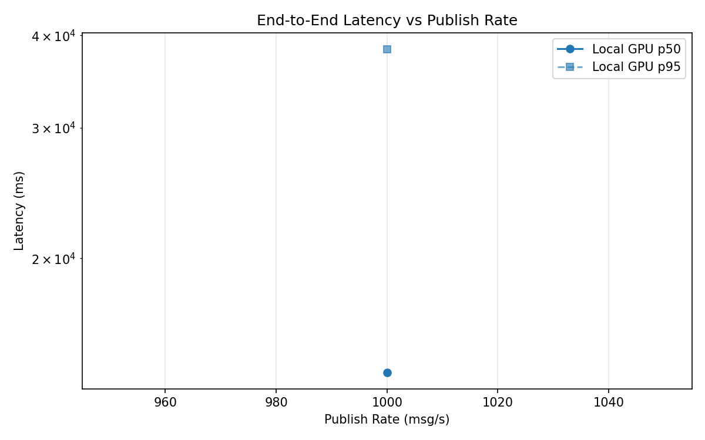
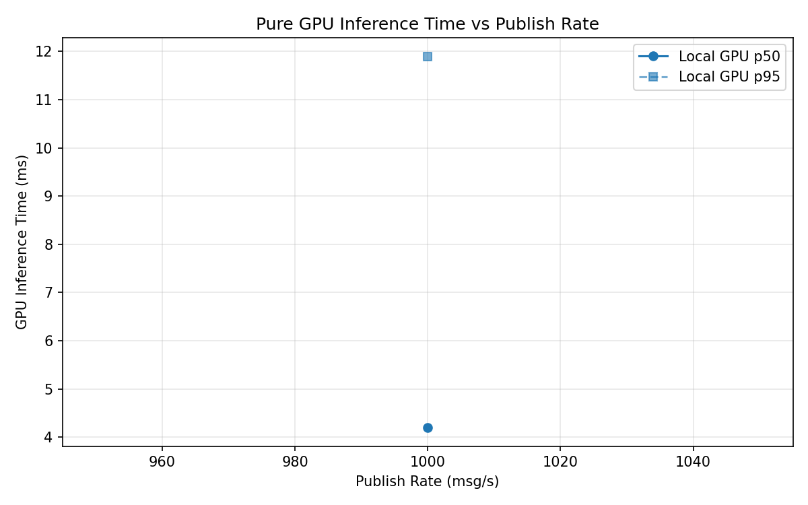
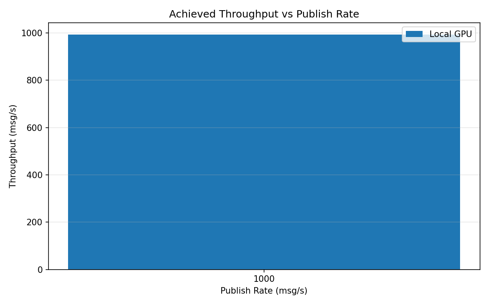

# Benchmark Report

Generated: 2026-03-08 20:39:20

## Configuration

| Parameter | Value |
|---|---|
| Messages per phase | 100s per phase |
| Rates (msg/s) | 1000 |
| Experiments | Local GPU |

## Throughput

| Rate (msg/s) | Local GPU |
|---|---|
| 1000 | 993.1 |

## End-to-End Latency (ms)

| Rate | Percentile | Local GPU |
|---|---|---|
| 1000 | p50 | 14016.5 |
| 1000 | p95 | 38341.0 |
| 1000 | p99 | 40139.0 |

## GPU Inference Time (ms)

| Rate | Percentile | Local GPU |
|---|---|---|
| 1000 | p50 | 4.2 |
| 1000 | p95 | 11.9 |
| 1000 | p99 | 13.4 |

## Charts

### Latency vs Publish Rate

### GPU Inference Time vs Publish Rate

### Throughput vs Publish Rate

