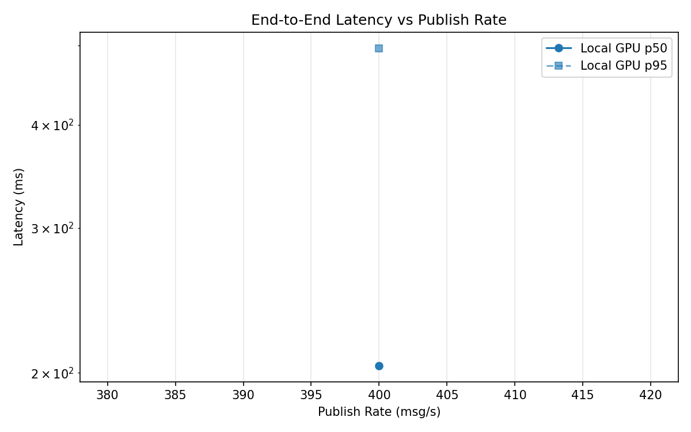
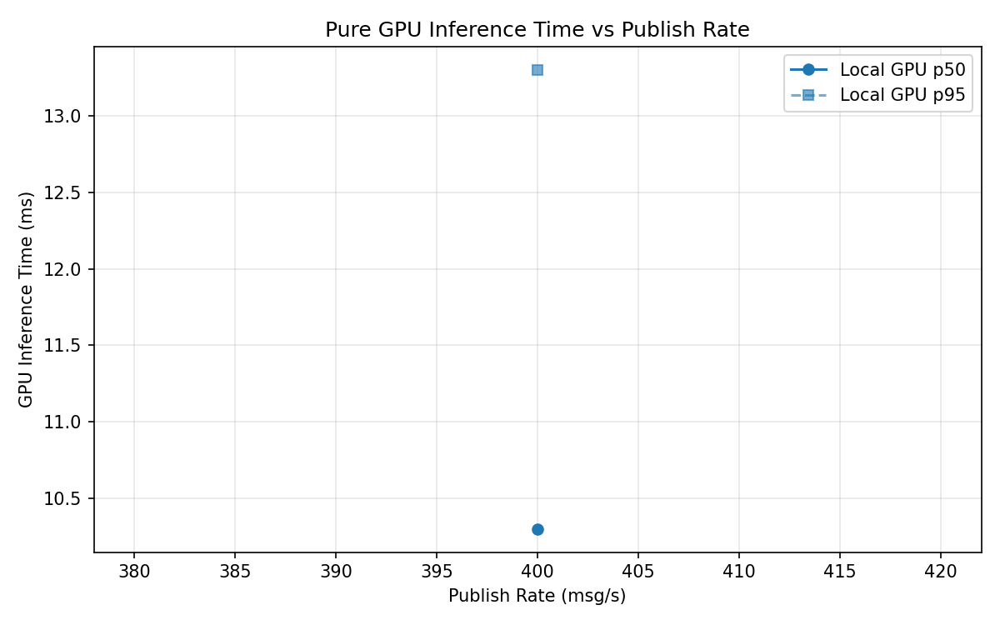
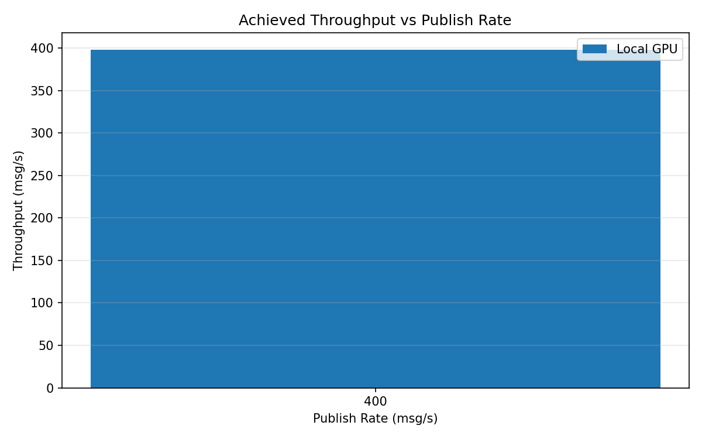

# Benchmark Report

Generated: 2026-03-08 20:01:18

## Configuration

| Parameter | Value |
|---|---|
| Messages per phase | 100s per phase |
| Rates (msg/s) | 400 |
| Experiments | Local GPU |

## Throughput

| Rate (msg/s) | Local GPU |
|---|---|
| 400 | 398.1 |

## End-to-End Latency (ms)

| Rate | Percentile | Local GPU |
|---|---|---|
| 400 | p50 | 204.0 |
| 400 | p95 | 496.0 |
| 400 | p99 | 597.0 |

## GPU Inference Time (ms)

| Rate | Percentile | Local GPU |
|---|---|---|
| 400 | p50 | 10.3 |
| 400 | p95 | 13.3 |
| 400 | p99 | 14.8 |

## Charts

### Latency vs Publish Rate

### GPU Inference Time vs Publish Rate

### Throughput vs Publish Rate

