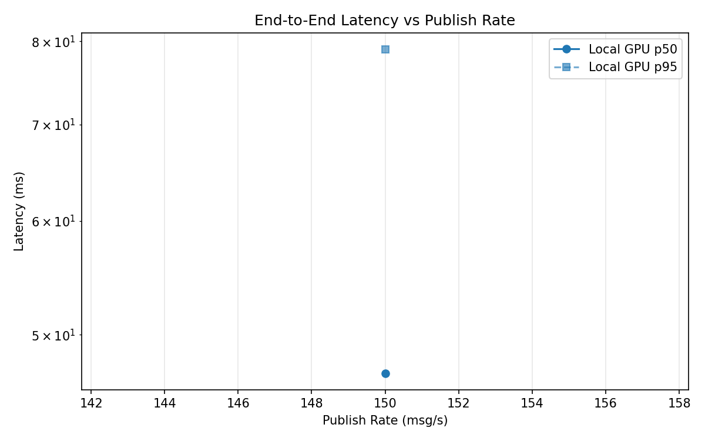
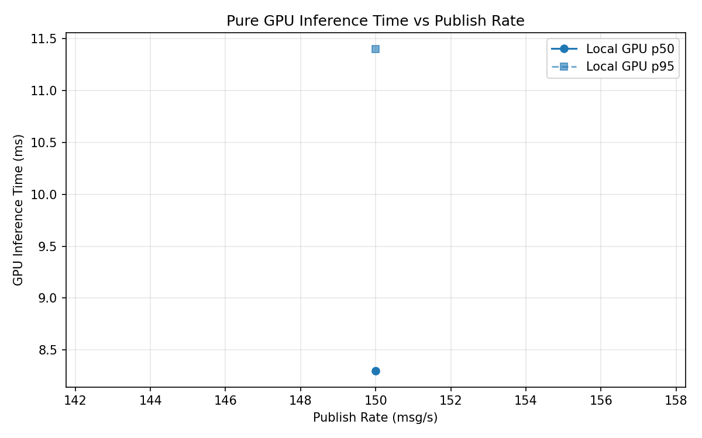
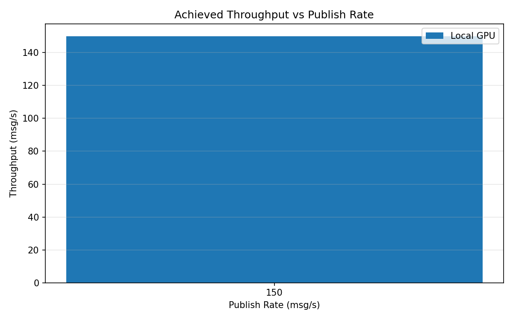

# Benchmark Report

Generated: 2026-03-08 20:54:58

## Configuration

| Parameter | Value |
|---|---|
| Messages per phase | 100s per phase |
| Rates (msg/s) | 150 |
| Experiments | Local GPU |

## Throughput

| Rate (msg/s) | Local GPU |
|---|---|
| 150 | 150.0 |

## End-to-End Latency (ms)

| Rate | Percentile | Local GPU |
|---|---|---|
| 150 | p50 | 47.0 |
| 150 | p95 | 79.0 |
| 150 | p99 | 273.0 |

## GPU Inference Time (ms)

| Rate | Percentile | Local GPU |
|---|---|---|
| 150 | p50 | 8.3 |
| 150 | p95 | 11.4 |
| 150 | p99 | 12.4 |

## Charts

### Latency vs Publish Rate

### GPU Inference Time vs Publish Rate

### Throughput vs Publish Rate

