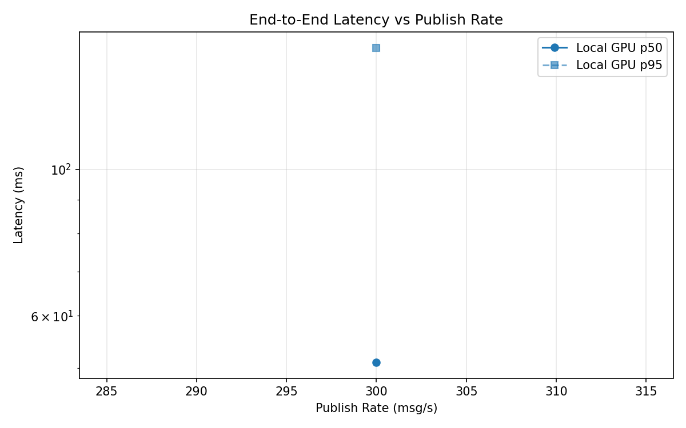
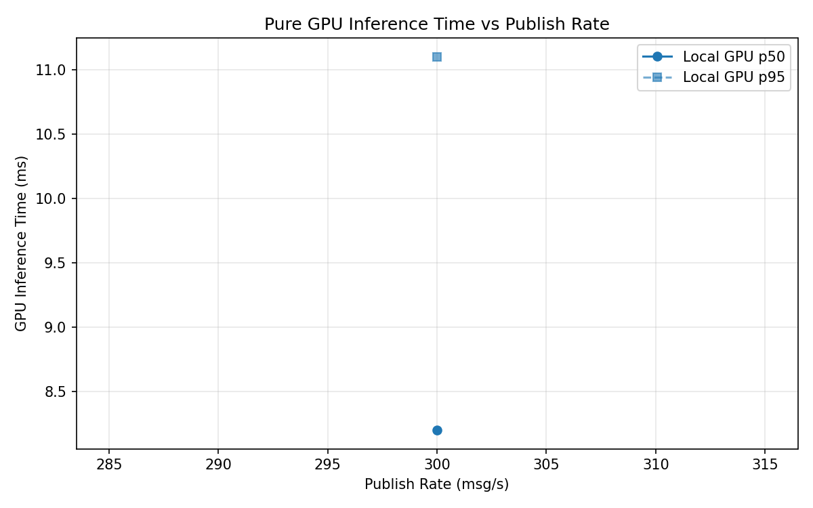
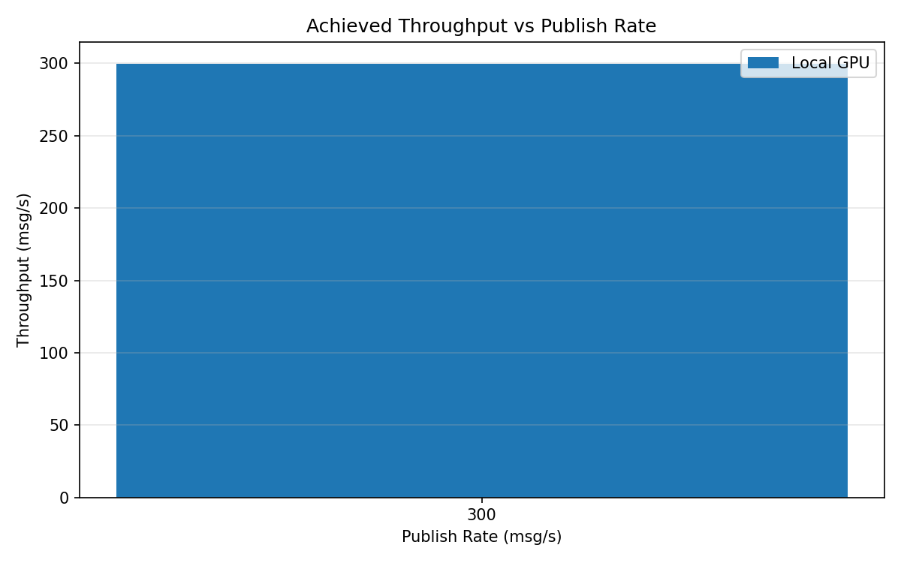

# Benchmark Report

Generated: 2026-03-08 21:03:22

## Configuration

| Parameter | Value |
|---|---|
| Messages per phase | 100s per phase |
| Rates (msg/s) | 300 |
| Experiments | Local GPU |

## Throughput

| Rate (msg/s) | Local GPU |
|---|---|
| 300 | 299.8 |

## End-to-End Latency (ms)

| Rate | Percentile | Local GPU |
|---|---|---|
| 300 | p50 | 51.0 |
| 300 | p95 | 153.0 |
| 300 | p99 | 265.0 |

## GPU Inference Time (ms)

| Rate | Percentile | Local GPU |
|---|---|---|
| 300 | p50 | 8.2 |
| 300 | p95 | 11.1 |
| 300 | p99 | 12.2 |

## Charts

### Latency vs Publish Rate

### GPU Inference Time vs Publish Rate

### Throughput vs Publish Rate

