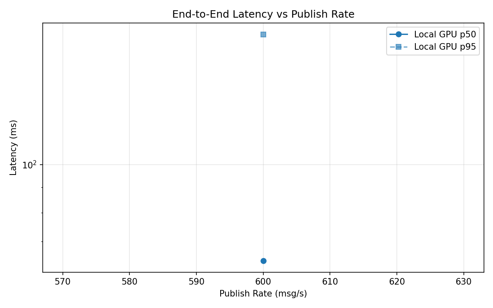
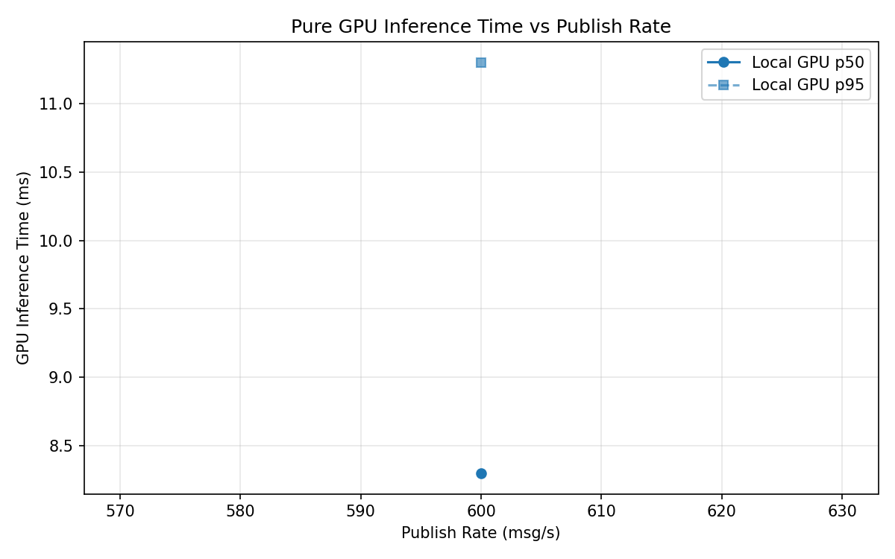
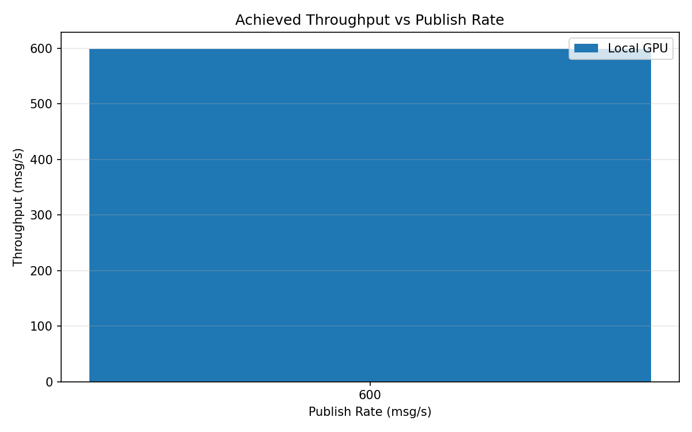

# Benchmark Report

Generated: 2026-03-08 21:20:33

## Configuration

| Parameter | Value |
|---|---|
| Messages per phase | 100s per phase |
| Rates (msg/s) | 600 |
| Experiments | Local GPU |

## Throughput

| Rate (msg/s) | Local GPU |
|---|---|
| 600 | 599.0 |

## End-to-End Latency (ms)

| Rate | Percentile | Local GPU |
|---|---|---|
| 600 | p50 | 64.0 |
| 600 | p95 | 183.0 |
| 600 | p99 | 344.0 |

## GPU Inference Time (ms)

| Rate | Percentile | Local GPU |
|---|---|---|
| 600 | p50 | 8.3 |
| 600 | p95 | 11.3 |
| 600 | p99 | 12.4 |

## Charts

### Latency vs Publish Rate

### GPU Inference Time vs Publish Rate

### Throughput vs Publish Rate

