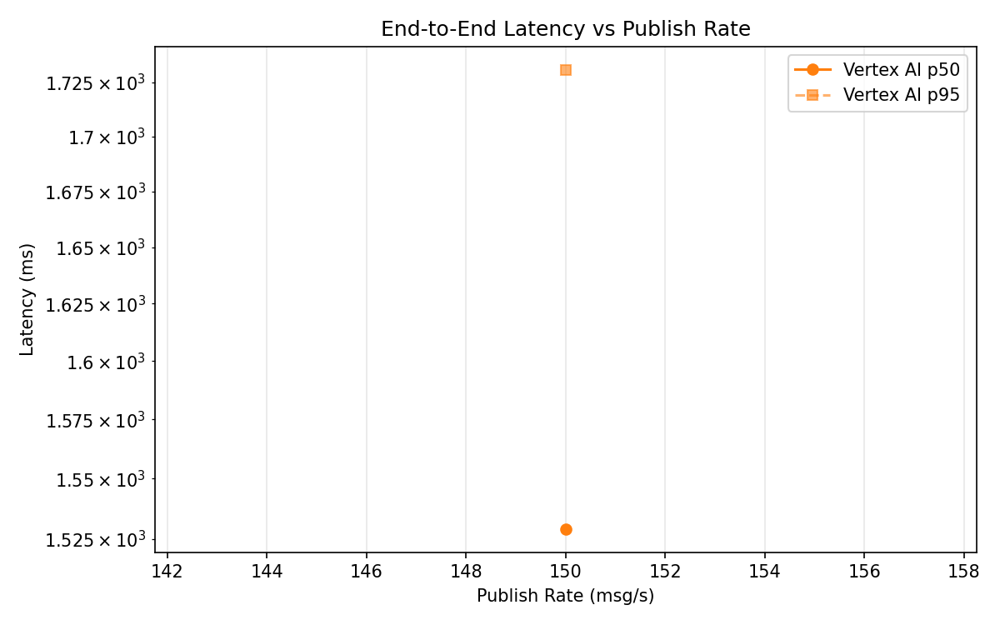
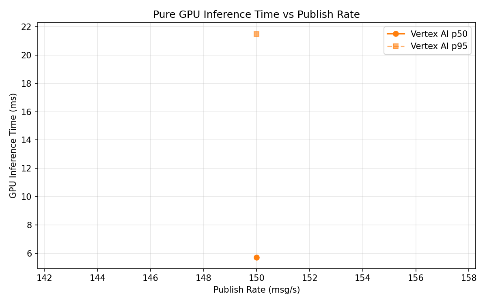
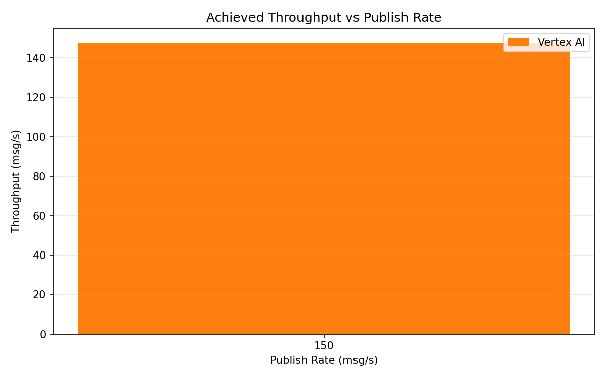

# Benchmark Report

Generated: 2026-03-08 22:36:08

## Configuration

| Parameter | Value |
|---|---|
| Messages per phase | 100s per phase |
| Rates (msg/s) | 150 |
| Experiments | Vertex AI |

## Throughput

| Rate (msg/s) | Vertex AI |
|---|---|
| 150 | 147.7 |

## End-to-End Latency (ms)

| Rate | Percentile | Vertex AI |
|---|---|---|
| 150 | p50 | 1529.0 |
| 150 | p95 | 1731.0 |
| 150 | p99 | 1804.0 |

## GPU Inference Time (ms)

| Rate | Percentile | Vertex AI |
|---|---|---|
| 150 | p50 | 5.7 |
| 150 | p95 | 21.5 |
| 150 | p99 | 31.4 |

## Charts

### Latency vs Publish Rate

### GPU Inference Time vs Publish Rate

### Throughput vs Publish Rate

