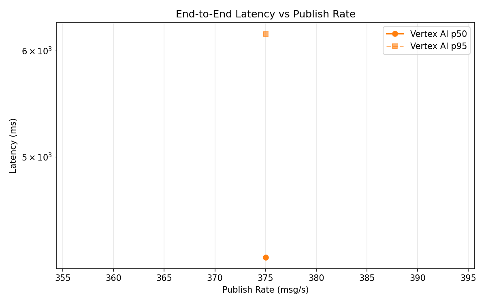
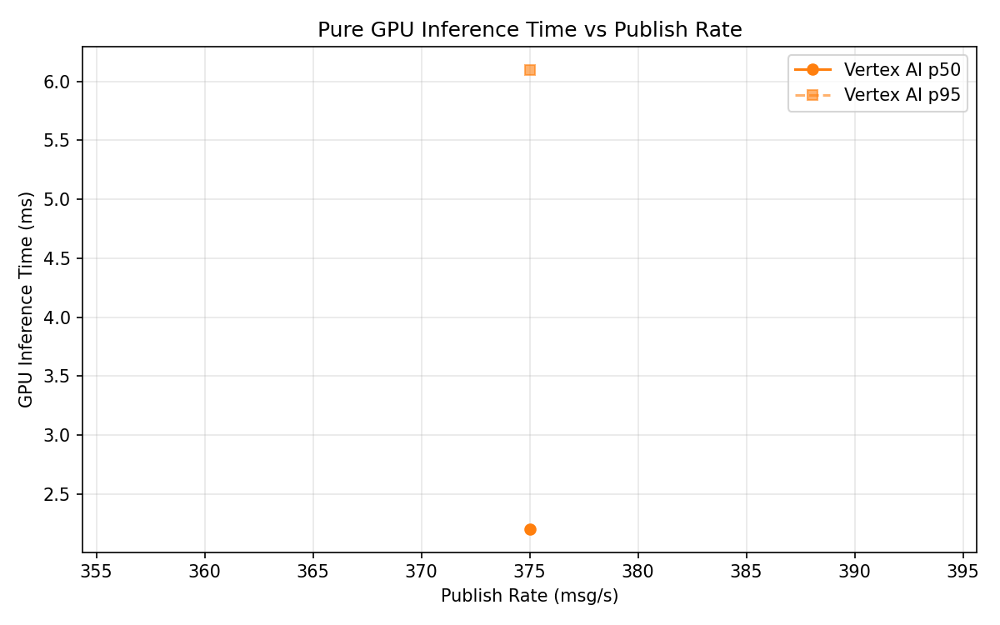
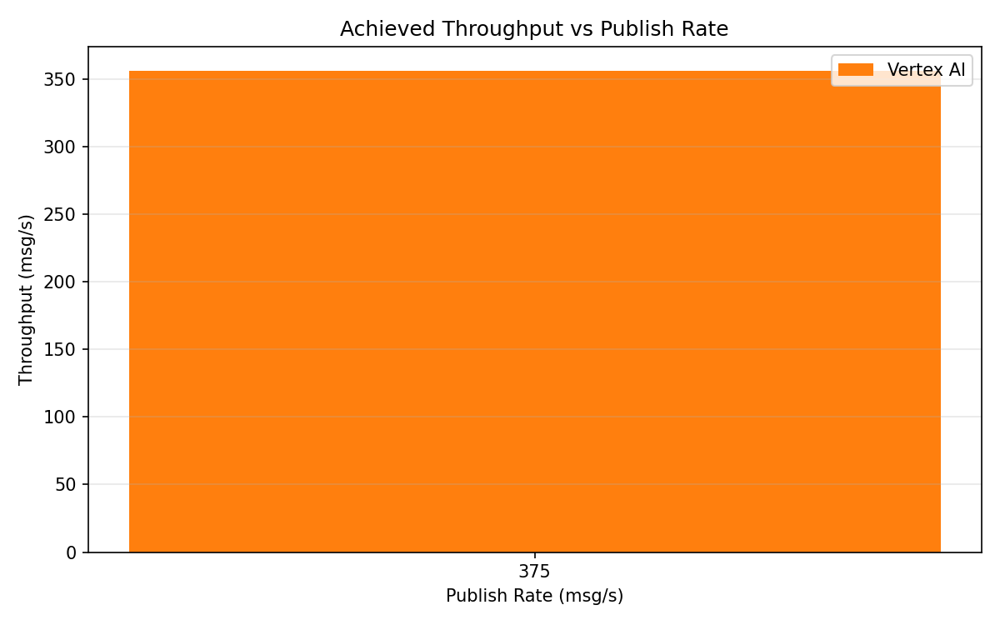

# Benchmark Report

Generated: 2026-03-08 23:24:19

## Configuration

| Parameter | Value |
|---|---|
| Messages per phase | 100s per phase |
| Rates (msg/s) | 375 |
| Experiments | Vertex AI |

## Throughput

| Rate (msg/s) | Vertex AI |
|---|---|
| 375 | 356.1 |

## End-to-End Latency (ms)

| Rate | Percentile | Vertex AI |
|---|---|---|
| 375 | p50 | 4206.0 |
| 375 | p95 | 6175.0 |
| 375 | p99 | 6258.0 |

## GPU Inference Time (ms)

| Rate | Percentile | Vertex AI |
|---|---|---|
| 375 | p50 | 2.2 |
| 375 | p95 | 6.1 |
| 375 | p99 | 10.5 |

## Charts

### Latency vs Publish Rate

### GPU Inference Time vs Publish Rate

### Throughput vs Publish Rate

