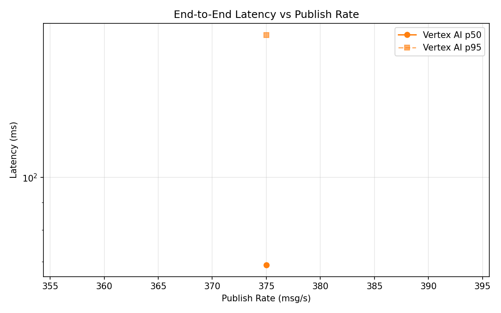
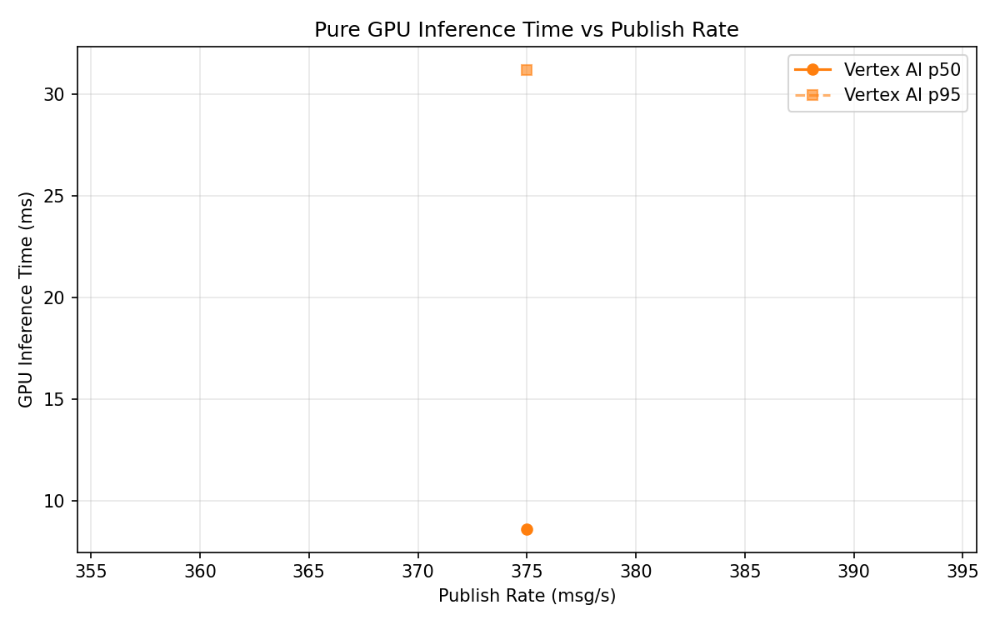

# Benchmark Report

Generated: 2026-03-08 23:58:54

## Configuration

| Parameter | Value |
|---|---|
| Messages per phase | 100s per phase |
| Rates (msg/s) | 375 |
| Experiments | Vertex AI |

## Throughput

| Rate (msg/s) | Vertex AI |
|---|---|
| 375 | 374.5 |

## End-to-End Latency (ms)

| Rate | Percentile | Vertex AI |
|---|---|---|
| 375 | p50 | 69.0 |
| 375 | p95 | 183.0 |
| 375 | p99 | 320.0 |

## GPU Inference Time (ms)

| Rate | Percentile | Vertex AI |
|---|---|---|
| 375 | p50 | 8.6 |
| 375 | p95 | 31.2 |
| 375 | p99 | 38.4 |

## Charts

### Latency vs Publish Rate

### GPU Inference Time vs Publish Rate

### Throughput vs Publish Rate

