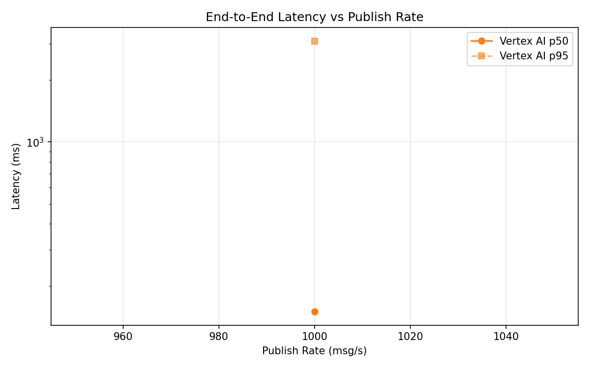
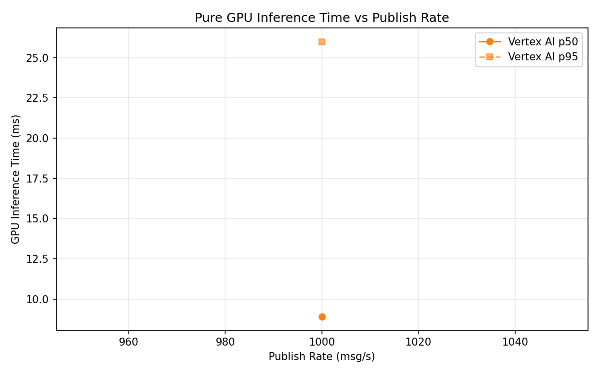
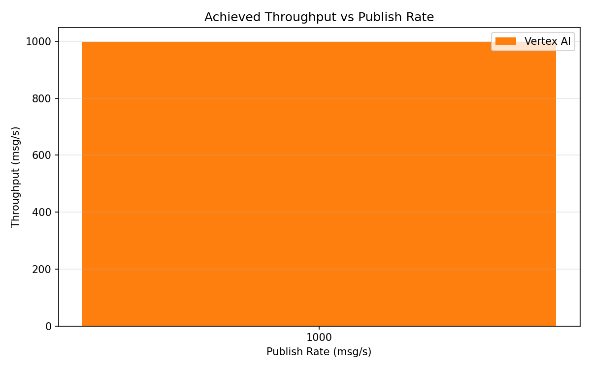

# Benchmark Report

Generated: 2026-03-10 06:40:47

## Configuration

| Parameter | Value |
|---|---|
| Messages per phase | 100s per phase |
| Rates (msg/s) | 1000 |
| Experiments | Vertex AI |

## Throughput

| Rate (msg/s) | Vertex AI |
|---|---|
| 1000 | 998.3 |

## End-to-End Latency (ms)

| Rate | Percentile | Vertex AI |
|---|---|---|
| 1000 | p50 | 150.0 |
| 1000 | p95 | 3093.0 |
| 1000 | p99 | 3413.0 |

## GPU Inference Time (ms)

| Rate | Percentile | Vertex AI |
|---|---|---|
| 1000 | p50 | 8.9 |
| 1000 | p95 | 26.0 |
| 1000 | p99 | 31.6 |

## Charts

### Latency vs Publish Rate

### GPU Inference Time vs Publish Rate

### Throughput vs Publish Rate

