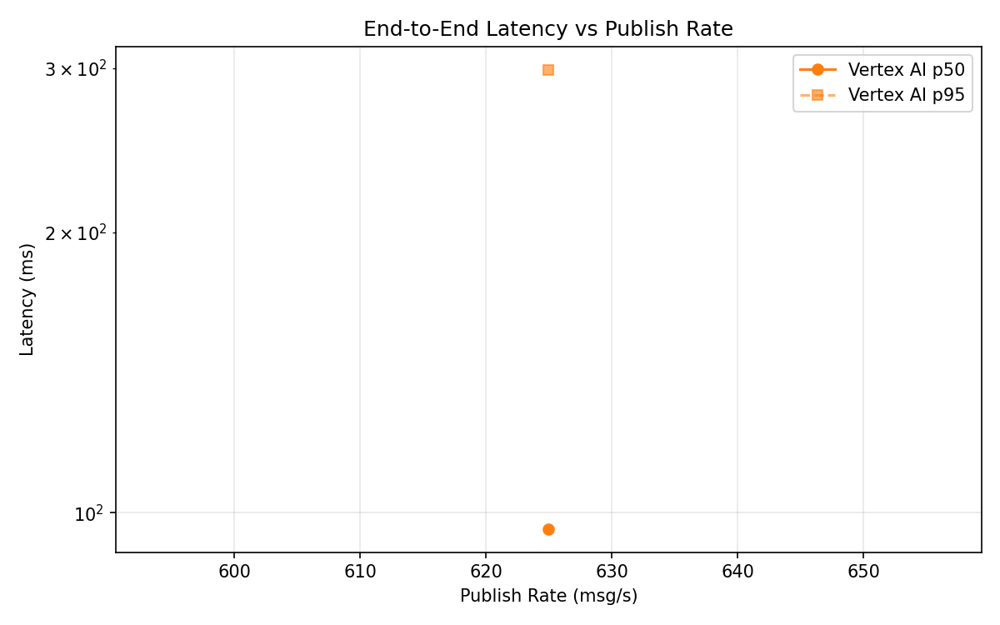
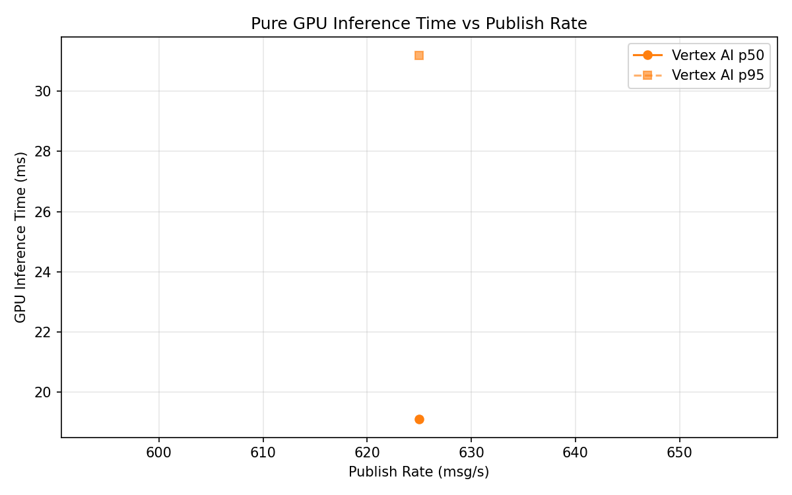
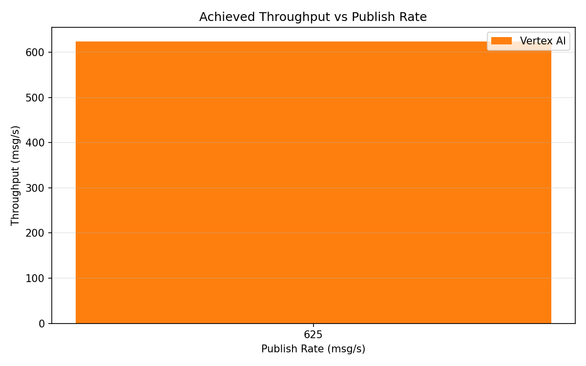

# Benchmark Report

Generated: 2026-03-10 05:50:21

## Configuration

| Parameter | Value |
|---|---|
| Messages per phase | 100s per phase |
| Rates (msg/s) | 625 |
| Experiments | Vertex AI |

## Throughput

| Rate (msg/s) | Vertex AI |
|---|---|
| 625 | 624.0 |

## End-to-End Latency (ms)

| Rate | Percentile | Vertex AI |
|---|---|---|
| 625 | p50 | 96.0 |
| 625 | p95 | 299.0 |
| 625 | p99 | 546.0 |

## GPU Inference Time (ms)

| Rate | Percentile | Vertex AI |
|---|---|---|
| 625 | p50 | 19.1 |
| 625 | p95 | 31.2 |
| 625 | p99 | 36.6 |

## Charts

### Latency vs Publish Rate

### GPU Inference Time vs Publish Rate

### Throughput vs Publish Rate

