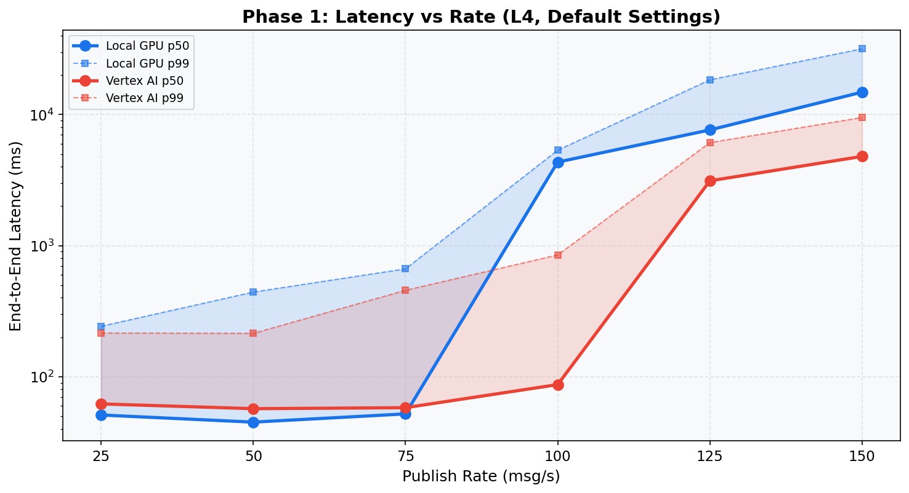
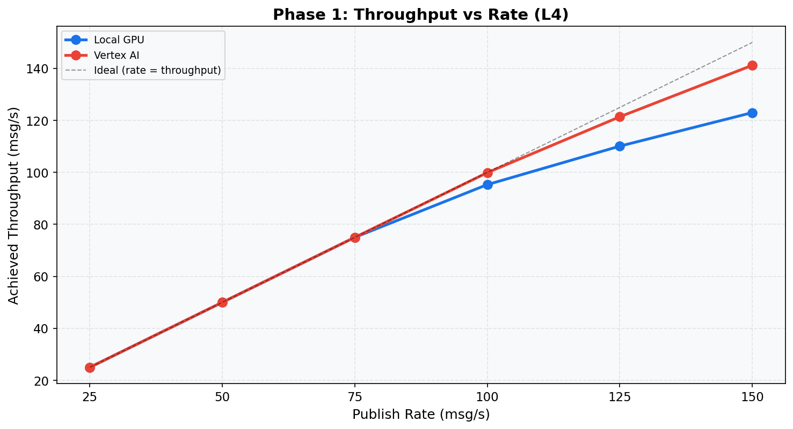

# Phase 1: Baseline Capacity (L4)
[< GPU Summary](gpu_report.md)
## Going In
Single worker, all default settings. The question: **how many msg/s can one worker handle before latency degrades?**
## Configuration
| Parameter | Value | Status |
|---|---|---|
| Local GPU Infrastructure | 1×dataflow:g2s4+l4 | Fixed |
| Vertex AI Infrastructure | 1×dataflow:n1s4 + 1×endpoint:g2s4+l4 | Fixed |
| Model | BERT-base (3-class text classification, max_seq_length=128) | Fixed |
| Region | us-central1 | Fixed |
| Workers | 1 | Default |
| Endpoint Replicas | 1 | Default |
| Harness Threads | 12 | Default |
| max_batch_size | 64 | Default |
| min_batch_size | 1 | Default |
| Publish Rates | 25, 50, 75, 100, 125, 150 msg/s | **Swept** |
| Duration per Rate | 100s | Fixed |

## Results
**Local GPU**
| Rate | Throughput | Latency p50 | p95 | p99 | GPU p50 | GPU p99 |
|---:|---:|---:|---:|---:|---:|---:|
| 25 | 25.0 | 51 ms | 65 ms | 242 ms | 5 ms | 81 ms |
| 50 | 50.0 | 45 ms | 65 ms | 442 ms | 5 ms | 109 ms |
| 75 | 75.0 | 52 ms | 508 ms | 665 ms | 11 ms | 140 ms |
| 100 | 95.3 | 4,340 ms | 5,246 ms | 5,346 ms | 114 ms | 143 ms |
| 125 | 110.1 | 7,634 ms | 16,455 ms | 18,411 ms | 66 ms | 142 ms |
| 150 | 123.0 | 14,830 ms | 29,441 ms | 31,772 ms | 63 ms | 142 ms |

**Vertex AI**
| Rate | Throughput | Latency p50 | p95 | p99 | GPU p50 | GPU p99 |
|---:|---:|---:|---:|---:|---:|---:|
| 25 | 25.0 | 62 ms | 86 ms | 215 ms | 5 ms | 14 ms |
| 50 | 50.0 | 57 ms | 82 ms | 214 ms | 5 ms | 30 ms |
| 75 | 75.0 | 58 ms | 89 ms | 456 ms | 7 ms | 33 ms |
| 100 | 99.9 | 87 ms | 586 ms | 849 ms | 20 ms | 46 ms |
| 125 | 121.4 | 3,123 ms | 5,713 ms | 6,110 ms | 31 ms | 46 ms |
| 150 | 141.2 | 4,796 ms | 9,158 ms | 9,498 ms | 29 ms | 44 ms |

## Conclusion
**Local GPU saturates between 75--100 msg/s** (p50 jumps to 4,340 ms).

**Vertex AI saturates between 100--125 msg/s** (p50 jumps to 3,123 ms).

