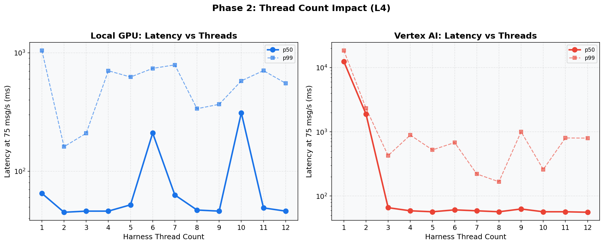
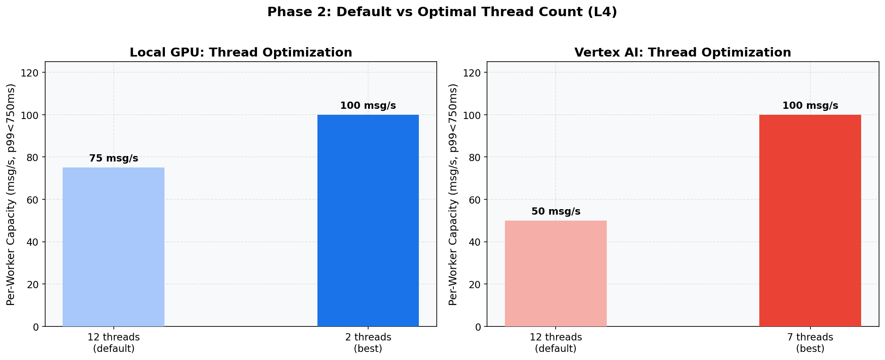

# Phase 2: Thread Count Tuning (L4)
[< GPU Summary](gpu_report.md)
## Going In
Phase 1 showed default 12 harness threads create GPU lock contention for Local GPU (all threads compete for the single GPU) while providing natural HTTP parallelism for Vertex AI. The hypothesis: **fewer threads should reduce lock contention for Local GPU.**
## Configuration
| Parameter | Value | Status |
|---|---|---|
| Local GPU Infrastructure | 1×dataflow:g2s4+l4 | Fixed |
| Vertex AI Infrastructure | 1×dataflow:n1s4 + 1×endpoint:g2s4+l4 | Fixed |
| Model | BERT-base (3-class text classification, max_seq_length=128) | Fixed |
| Region | us-central1 | Fixed |
| Workers | 1 | Default |
| Endpoint Replicas | 1 | Default |
| Harness Threads | **1, 2, 3, 4, 5, 6, 7, 8, 9, 10, 11, 12** | **Swept** |
| max_batch_size | 64 | Default |
| min_batch_size | 1 | Default |
| Publish Rates | varies |  |
| Duration per Rate | 100s | Fixed |

## Results: Latency at 75 msg/s by Thread Count

**Local GPU**
| Threads | Throughput | p50 | p95 | p99 |
|---:|---:|---:|---:|---:|
| 1 | 75.0 | 65 ms | 565 ms | 1,047 ms |
| 2 | 75.0 | 45 ms | 64 ms | 161 ms |
| 3 | 75.0 | 46 ms | 70 ms | 209 ms |
| 4 | 75.0 | 46 ms | 149 ms | 705 ms |
| 5 | 75.0 | 52 ms | 441 ms | 624 ms |
| 6 | 74.8 | 210 ms | 564 ms | 738 ms |
| 7 | 75.0 | 63 ms | 674 ms | 790 ms |
| 8 | 75.0 | 47 ms | 245 ms | 337 ms |
| 9 | 75.0 | 46 ms | 204 ms | 367 ms |
| 10 | 74.8 | 311 ms | 512 ms | 579 ms |
| 11 | 75.0 | 49 ms | 555 ms | 707 ms |
| 12 | 75.0 | 46 ms | 327 ms | 553 ms |

**Vertex AI**
| Threads | Throughput | p50 | p95 | p99 |
|---:|---:|---:|---:|---:|
| 1 | 63.8 | 12,456 ms | 18,215 ms | 18,525 ms |
| 2 | 73.3 | 1,899 ms | 2,205 ms | 2,334 ms |
| 3 | 75.0 | 66 ms | 212 ms | 427 ms |
| 4 | 75.0 | 59 ms | 152 ms | 891 ms |
| 5 | 75.0 | 57 ms | 99 ms | 523 ms |
| 6 | 75.0 | 61 ms | 107 ms | 681 ms |
| 7 | 30.9 | 59 ms | 91 ms | 221 ms |
| 8 | 75.0 | 57 ms | 86 ms | 167 ms |
| 9 | 75.0 | 63 ms | 157 ms | 1,004 ms |
| 10 | 75.0 | 57 ms | 90 ms | 260 ms |
| 11 | 75.0 | 57 ms | 103 ms | 803 ms |
| 12 | 75.0 | 56 ms | 101 ms | 799 ms |

## Conclusion
Thread count has **opposite effects** on the two approaches:

- **Local GPU**: Fewer threads reduce GPU lock contention. With only 2-3 threads, one thread runs inference while the other tokenizes, dramatically improving capacity.
- **Vertex AI**: More threads mean more concurrent HTTP clients. Reducing threads starves the endpoint of work.

**Decision**: Per-experiment thread counts optimized separately.
