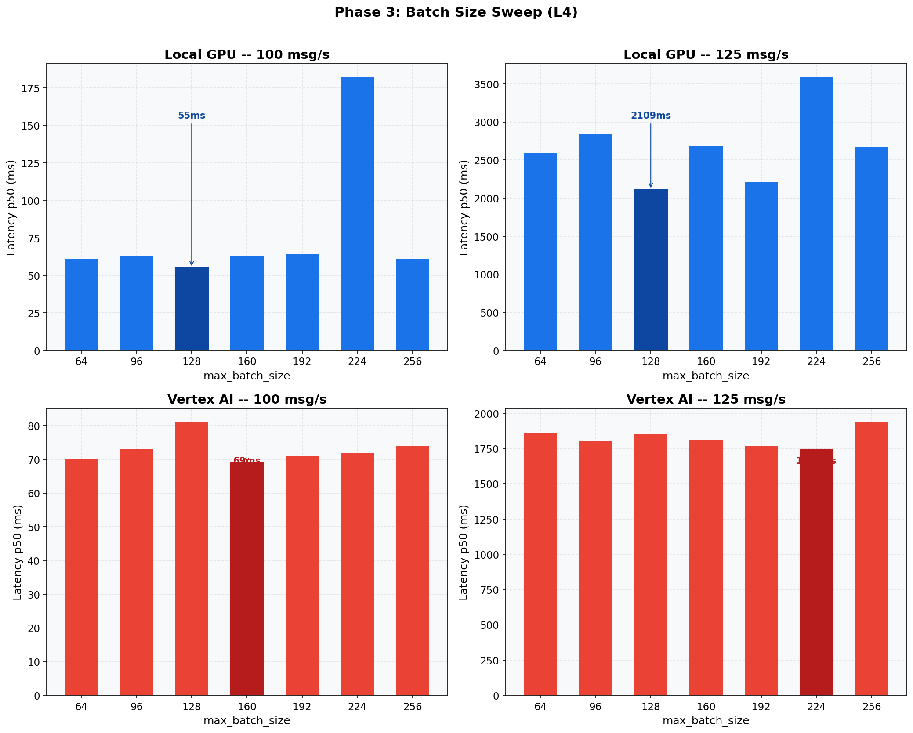

# Phase 3: Batch Size Optimization (L4)
[< GPU Summary](gpu_report.md)
## Going In
Thread counts are fixed from Phase 2. Now we sweep `max_batch_size` -- the max elements RunInference groups per `run_inference()` call.
## Configuration
| Parameter | Value | Status |
|---|---|---|
| Local GPU Infrastructure | 1×dataflow:g2s4+l4 | Fixed |
| Vertex AI Infrastructure | 1×dataflow:n1s4 + 1×endpoint:g2s4+l4 | Fixed |
| Model | BERT-base (3-class text classification, max_seq_length=128) | Fixed |
| Region | us-central1 | Fixed |
| Workers | 1 | Default |
| Endpoint Replicas | 1 | Default |
| Harness Threads | Local GPU=2, Vertex AI=7 | Optimized (Phase 2) |
| max_batch_size | **64, 96, 128, 160, 192, 224, 256** | **Swept** |
| min_batch_size | 1 | Default |
| Publish Rates | varies |  |
| Duration per Rate | 100s | Fixed |

## Results

**Local GPU at 75 msg/s**
| max_batch | Throughput | p50 | p95 | p99 |
|---:|---:|---:|---:|---:|
| 64 | 75.0 | 45 ms | 73 ms | 646 ms |
| 96 | 75.0 | 45 ms | 63 ms | 167 ms |
| 128 | 75.0 | 44 ms | 72 ms | 477 ms |
| 160 | 75.0 | 45 ms | 63 ms | 201 ms |
| 192 | 75.0 | 45 ms | 66 ms | 265 ms |
| 224 | 75.0 | 47 ms | 89 ms | 584 ms |
| 256 | 75.0 | 45 ms | 66 ms | 346 ms |

**Local GPU at 100 msg/s**
| max_batch | Throughput | p50 | p95 | p99 |
|---:|---:|---:|---:|---:|
| 64 | 100.0 | 61 ms | 372 ms | 725 ms |
| 96 | 100.0 | 63 ms | 359 ms | 478 ms |
| 128 | 99.9 | 55 ms | 358 ms | 774 ms |
| 160 | 99.9 | 63 ms | 277 ms | 504 ms |
| 192 | 100.0 | 64 ms | 277 ms | 460 ms |
| 224 | 99.9 | 182 ms | 316 ms | 403 ms |
| 256 | 100.0 | 61 ms | 373 ms | 603 ms |

**Local GPU at 125 msg/s**
| max_batch | Throughput | p50 | p95 | p99 |
|---:|---:|---:|---:|---:|
| 64 | 121.1 | 2,596 ms | 3,177 ms | 3,295 ms |
| 96 | 121.2 | 2,840 ms | 3,223 ms | 3,269 ms |
| 128 | 122.4 | 2,109 ms | 2,500 ms | 2,559 ms |
| 160 | 121.6 | 2,679 ms | 3,190 ms | 3,246 ms |
| 192 | 121.9 | 2,215 ms | 2,627 ms | 2,696 ms |
| 224 | 120.8 | 3,584 ms | 4,320 ms | 4,389 ms |
| 256 | 121.3 | 2,670 ms | 3,035 ms | 3,168 ms |

**Vertex AI at 75 msg/s**
| max_batch | Throughput | p50 | p95 | p99 |
|---:|---:|---:|---:|---:|
| 64 | 75.0 | 55 ms | 85 ms | 534 ms |
| 96 | 75.0 | 55 ms | 82 ms | 206 ms |
| 128 | 75.0 | 59 ms | 106 ms | 632 ms |
| 160 | 75.0 | 55 ms | 88 ms | 445 ms |
| 192 | 75.0 | 57 ms | 88 ms | 280 ms |
| 224 | 74.9 | 55 ms | 81 ms | 217 ms |
| 256 | 75.0 | 57 ms | 91 ms | 257 ms |

**Vertex AI at 100 msg/s**
| max_batch | Throughput | p50 | p95 | p99 |
|---:|---:|---:|---:|---:|
| 64 | 99.9 | 70 ms | 167 ms | 232 ms |
| 96 | 99.9 | 73 ms | 214 ms | 491 ms |
| 128 | 99.9 | 81 ms | 502 ms | 896 ms |
| 160 | 99.9 | 69 ms | 217 ms | 414 ms |
| 192 | 99.9 | 71 ms | 203 ms | 310 ms |
| 224 | 100.0 | 72 ms | 222 ms | 411 ms |
| 256 | 99.9 | 74 ms | 233 ms | 433 ms |

**Vertex AI at 125 msg/s**
| max_batch | Throughput | p50 | p95 | p99 |
|---:|---:|---:|---:|---:|
| 64 | 122.7 | 1,855 ms | 2,064 ms | 2,123 ms |
| 96 | 122.6 | 1,806 ms | 2,001 ms | 2,066 ms |
| 128 | 122.4 | 1,850 ms | 2,104 ms | 2,184 ms |
| 160 | 122.7 | 1,813 ms | 2,115 ms | 2,233 ms |
| 192 | 122.9 | 1,768 ms | 2,028 ms | 2,106 ms |
| 224 | 122.5 | 1,745 ms | 1,945 ms | 2,019 ms |
| 256 | 122.6 | 1,936 ms | 2,132 ms | 2,222 ms |

## Conclusion
Larger batches amortize GPU kernel overhead (Local GPU) and HTTP round-trip overhead (Vertex AI). The optimal batch size balances throughput gains against accumulation wait time.
