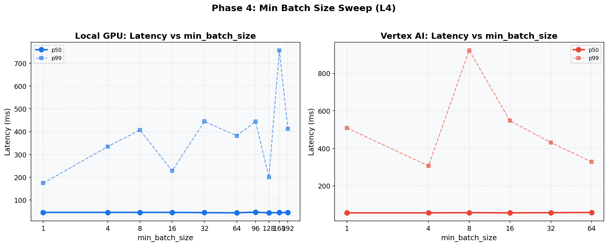

# Phase 4: Min Batch Size (L4)
[< GPU Summary](gpu_report.md)
## Going In
`min_batch_size` controls how long RunInference waits to accumulate elements before calling `run_inference()`. Higher values increase batch efficiency but add wait time.
## Configuration
| Parameter | Value | Status |
|---|---|---|
| Local GPU Infrastructure | 1×dataflow:g2s4+l4 | Fixed |
| Vertex AI Infrastructure | 1×dataflow:n1s4 + 1×endpoint:g2s4+l4 | Fixed |
| Model | BERT-base (3-class text classification, max_seq_length=128) | Fixed |
| Region | us-central1 | Fixed |
| Workers | 1 | Default |
| Endpoint Replicas | 1 | Default |
| Harness Threads | Local GPU=2, Vertex AI=7 | Optimized (Phase 2) |
| max_batch_size | Local GPU=256, Vertex AI=96 | Optimized (Phase 3) |
| min_batch_size | **1, 4, 8, 16, 32, 64, 96, 128, 160, 192** | **Swept** |
| Publish Rates | varies |  |
| Duration per Rate | 100s | Fixed |

## Results

**Local GPU**
| min_batch | Rate | Throughput | p50 | p95 | p99 |
|---:|---:|---:|---:|---:|---:|
| 1 | 75 | 75.0 | 46 ms | 65 ms | 174 ms |
| 1 | 100 | 99.9 | 69 ms | 477 ms | 857 ms |
| 1 | 125 | 121.4 | 3,018 ms | 3,619 ms | 3,674 ms |
| 4 | 75 | 75.0 | 46 ms | 65 ms | 334 ms |
| 4 | 100 | 99.8 | 89 ms | 481 ms | 706 ms |
| 4 | 125 | 121.8 | 2,460 ms | 2,689 ms | 2,761 ms |
| 8 | 75 | 74.9 | 46 ms | 69 ms | 407 ms |
| 8 | 100 | 99.9 | 90 ms | 592 ms | 995 ms |
| 8 | 125 | 122.7 | 2,164 ms | 2,492 ms | 2,545 ms |
| 16 | 75 | 75.0 | 46 ms | 66 ms | 228 ms |
| 16 | 100 | 99.9 | 64 ms | 350 ms | 543 ms |
| 16 | 125 | 122.5 | 1,922 ms | 2,116 ms | 2,151 ms |
| 32 | 75 | 75.0 | 45 ms | 68 ms | 445 ms |
| 32 | 100 | 100.0 | 58 ms | 297 ms | 568 ms |
| 32 | 125 | 122.8 | 1,889 ms | 2,134 ms | 2,208 ms |
| 64 | 75 | 75.0 | 44 ms | 64 ms | 382 ms |
| 64 | 100 | 99.8 | 76 ms | 629 ms | 894 ms |
| 64 | 125 | 122.6 | 1,923 ms | 2,158 ms | 2,205 ms |
| 96 | 75 | 75.0 | 47 ms | 73 ms | 444 ms |
| 96 | 100 | 99.6 | 654 ms | 985 ms | 1,017 ms |
| 96 | 125 | 121.5 | 2,722 ms | 2,932 ms | 2,975 ms |
| 128 | 75 | 75.0 | 44 ms | 62 ms | 200 ms |
| 128 | 100 | 100.0 | 59 ms | 504 ms | 835 ms |
| 128 | 125 | 122.8 | 1,819 ms | 2,168 ms | 2,229 ms |
| 160 | 75 | 75.0 | 45 ms | 66 ms | 756 ms |
| 160 | 100 | 100.0 | 57 ms | 154 ms | 376 ms |
| 160 | 125 | 122.8 | 1,793 ms | 1,958 ms | 1,989 ms |
| 192 | 75 | 75.0 | 46 ms | 126 ms | 412 ms |
| 192 | 100 | 99.9 | 56 ms | 668 ms | 1,252 ms |
| 192 | 125 | 122.2 | 1,830 ms | 2,443 ms | 2,508 ms |

**Vertex AI**
| min_batch | Rate | Throughput | p50 | p95 | p99 |
|---:|---:|---:|---:|---:|---:|
| 1 | 75 | 75.0 | 56 ms | 91 ms | 509 ms |
| 1 | 100 | 99.9 | 73 ms | 317 ms | 616 ms |
| 1 | 125 | 122.8 | 1,790 ms | 1,974 ms | 2,027 ms |
| 4 | 75 | 75.0 | 56 ms | 86 ms | 306 ms |
| 4 | 100 | 100.0 | 74 ms | 326 ms | 654 ms |
| 4 | 125 | 122.9 | 1,702 ms | 2,026 ms | 2,139 ms |
| 8 | 75 | 75.0 | 57 ms | 115 ms | 922 ms |
| 8 | 100 | 99.9 | 74 ms | 253 ms | 547 ms |
| 8 | 125 | 122.9 | 1,674 ms | 1,956 ms | 2,046 ms |
| 16 | 75 | 75.0 | 56 ms | 90 ms | 547 ms |
| 16 | 100 | 99.9 | 74 ms | 369 ms | 648 ms |
| 16 | 125 | 123.0 | 1,625 ms | 1,778 ms | 1,833 ms |
| 32 | 75 | 75.0 | 57 ms | 89 ms | 431 ms |
| 32 | 100 | 99.9 | 75 ms | 241 ms | 435 ms |
| 32 | 125 | 123.0 | 1,699 ms | 1,954 ms | 2,045 ms |
| 64 | 75 | 75.0 | 58 ms | 86 ms | 328 ms |
| 64 | 100 | 99.9 | 76 ms | 328 ms | 670 ms |
| 64 | 125 | 122.9 | 1,657 ms | 1,844 ms | 1,911 ms |

## Conclusion
The `min_batch_size` tradeoff: higher values force batches to fill, which improves GPU utilization but adds queue wait time. The optimal value depends on the incoming message rate.
