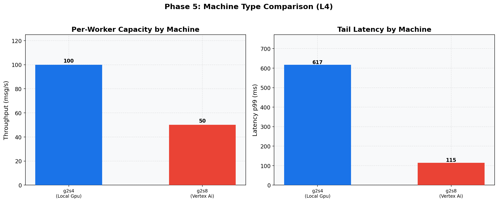

# Phase 5: Machine Type Sweep (L4)
[< GPU Summary](gpu_report.md)
## Going In
Do bigger worker machines (more vCPUs, more RAM) improve per-worker capacity? We compare the default machine to a larger variant.
## Configuration
| Parameter | Value | Status |
|---|---|---|
| Local GPU Infrastructure | **g2-standard-4, g2-standard-8** (swept) | **Swept** |
| Vertex AI Infrastructure | **g2-standard-4, g2-standard-8** (swept) | **Swept** |
| Model | BERT-base (3-class text classification, max_seq_length=128) | Fixed |
| Region | us-central1 | Fixed |
| Workers | 1 | Default |
| Endpoint Replicas | 1 | Default |
| Harness Threads | Local GPU=2, Vertex AI=7 | Optimized (Phase 2) |
| max_batch_size | Local GPU=256, Vertex AI=96 | Optimized (Phase 3) |
| min_batch_size | Local GPU=8, Vertex AI=32 | Optimized (Phase 4) |
| Publish Rates | varies |  |
| Duration per Rate | 100s | Fixed |

## Worker Machine Analysis (Local GPU)
| Experiment | Best Machine | Capacity | p50 | p99 |
|---|---|---:|---:|---:|
| Local GPU | g2-standard-4 | 100 msg/s | 58 ms | 617 ms |
| Vertex AI | g2-standard-8 | 50 msg/s | 56 ms | 115 ms |

## Endpoint Machine Analysis (Vertex AI)
| Experiment | Best Machine | Capacity | p50 | p99 |
|---|---|---:|---:|---:|
| Vertex AI | g2-standard-4 | 100 msg/s | 73 ms | 428 ms |

## Phase 5b: Endpoint Follow-Up

**Endpoint machine: g2s8**
| Rate | Throughput | p50 | p99 |
|---:|---:|---:|---:|
| 50 | 50.0 | 57 ms | 113 ms |
| 75 | 75.0 | 55 ms | 100 ms |
| 100 | 99.9 | 57 ms | 482 ms |
| 125 | 124.9 | 59 ms | 516 ms |
| 150 | 149.1 | 625 ms | 3,967 ms |

## Conclusion
Machine type affects capacity differently for each approach. Larger machines provide more CPU headroom for tokenization and pipeline overhead, but GPU inference speed is hardware-bound.
