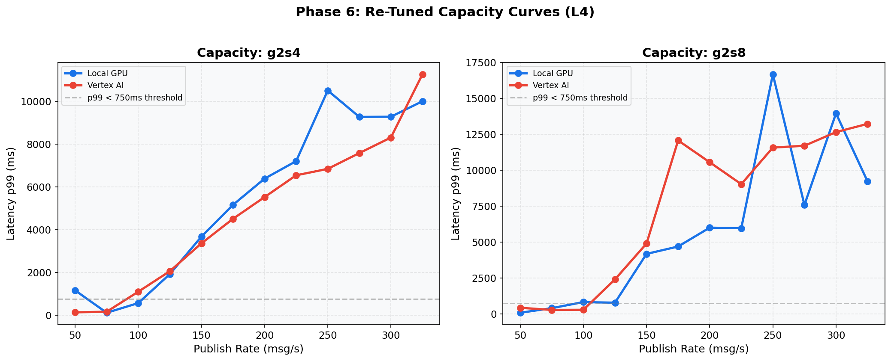
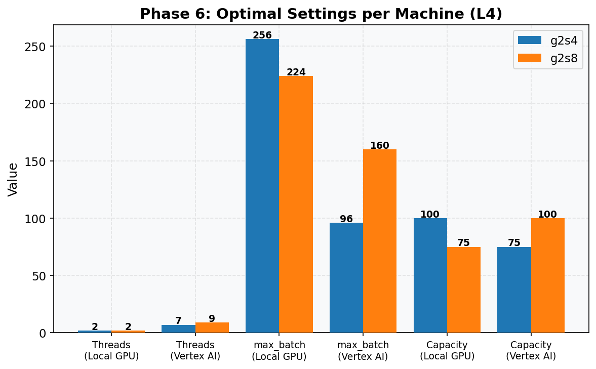

# Phase 6: Re-Tune for Each Machine (L4)
[< GPU Summary](gpu_report.md)
## Going In
Each machine type may have different optimal settings for threads, batch size, and min_batch_size. Phase 6 repeats the thread/batch sweeps for each machine and finds the optimal configuration.
## Configuration
| Parameter | Value | Status |
|---|---|---|
| Local GPU Infrastructure | g2s4, g2s8 | From Phase 5 |
| Vertex AI Infrastructure | g2s4, g2s8 | From Phase 5 |
| Model | BERT-base (3-class text classification, max_seq_length=128) | Fixed |
| Region | us-central1 | Fixed |
| Workers | 1 | Default |
| Endpoint Replicas | 1 | Default |
| Harness Threads | **re-swept per machine** | **Swept** |
| max_batch_size | **re-swept per machine** | **Swept** |
| min_batch_size | **re-swept per machine** | **Swept** |
| Publish Rates | fine-grained capacity sweep | **Swept** |
| Duration per Rate | 100s | Fixed |

## Machine: g2-standard-4
### Optimal Settings
| Setting | Local GPU | Vertex AI |
|---|---|---|
| Threads | 2 | 7 |
| max_batch_size | 256 | 96 |
| min_batch_size | 8 | 32 |
| **Per-Worker Capacity** | **100 msg/s** | **75 msg/s** |

### Capacity Verification
| Experiment | Rate | Throughput | p50 | p99 |
|---|---:|---:|---:|---:|
| Local GPU | 100 | 99.9 | 56 ms | 564 ms |
| Vertex AI | 75 | 75.0 | 56 ms | 160 ms |

## Machine: g2-standard-8
### Optimal Settings
| Setting | Local GPU | Vertex AI |
|---|---|---|
| Threads | 2 | 9 |
| max_batch_size | 224 | 160 |
| min_batch_size | 192 | 1 |
| **Per-Worker Capacity** | **75 msg/s** | **100 msg/s** |

### Capacity Verification
| Experiment | Rate | Throughput | p50 | p99 |
|---|---:|---:|---:|---:|
| Local GPU | 75 | 74.9 | 44 ms | 406 ms |
| Vertex AI | 100 | 99.9 | 75 ms | 293 ms |

## Conclusion
Re-tuning for each machine type yields the final per-worker/per-replica capacity numbers used for scaling calculations in Phase 7.
