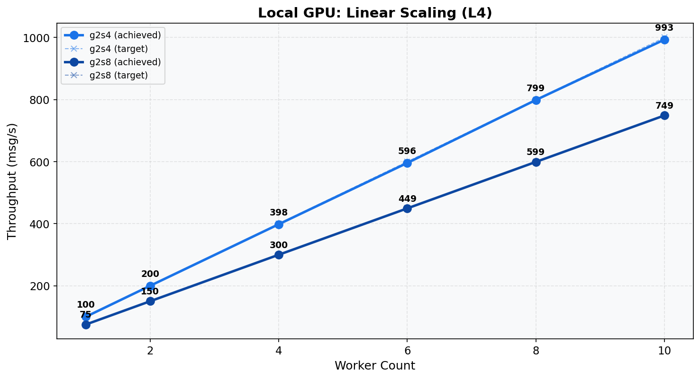
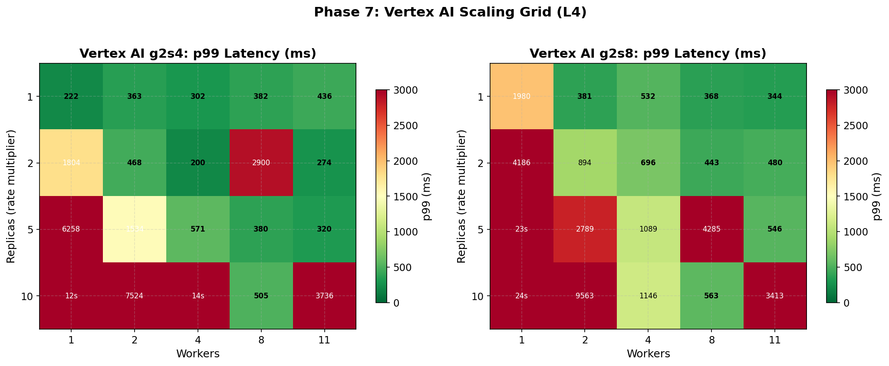

# Phase 7: Scaling Verification (L4)
[< GPU Summary](gpu_report.md)
## Going In
With optimized per-worker settings from Phase 6, we verify scaling: does adding workers deliver proportional throughput? For Vertex AI, we also sweep endpoint replicas.
## Configuration
| Parameter | Value | Status |
|---|---|---|
| Local GPU Infrastructure | g2s4, g2s8 | From Phase 5 |
| Vertex AI Infrastructure | g2s4, g2s8 | From Phase 5 |
| Model | BERT-base (3-class text classification, max_seq_length=128) | Fixed |
| Region | us-central1 | Fixed |
| Workers | **1, 2, 4, 6, 8, 10** | **Swept** |
| Endpoint Replicas | **1, 2, 5, 10** | **Swept** |
| Harness Threads | per-machine optimal | Optimized (Phase 6) |
| max_batch_size | per-machine optimal | Optimized (Phase 6) |
| min_batch_size | per-machine optimal | Optimized (Phase 6) |
| Publish Rates | varies |  |
| Duration per Rate | 100s | Fixed |

## Local GPU Scaling
| Config | Rate | Workers | Throughput | p50 | p99 |
|---|---:|---:|---:|---:|---:|
| g2s4 | 1000 | 10 | 993.1 | 14,016 ms | 40,139 ms |
| g2s4 | 100 | 1 | 100.0 | 56 ms | 462 ms |
| g2s4 | 200 | 2 | 199.8 | 113 ms | 613 ms |
| g2s4 | 400 | 4 | 398.1 | 204 ms | 597 ms |
| g2s4 | 600 | 6 | 595.7 | 190 ms | 708 ms |
| g2s4 | 800 | 8 | 798.6 | 166 ms | 578 ms |
| g2s8 | 750 | 10 | 748.7 | 116 ms | 959 ms |
| g2s8 | 75 | 1 | 75.0 | 43 ms | 563 ms |
| g2s8 | 150 | 2 | 150.0 | 47 ms | 273 ms |
| g2s8 | 300 | 4 | 299.8 | 51 ms | 265 ms |
| g2s8 | 450 | 6 | 449.3 | 58 ms | 337 ms |
| g2s8 | 600 | 8 | 599.0 | 64 ms | 344 ms |

## Vertex AI Scaling
| Config | Rate | Replicas | Workers | Throughput | p50 | p99 |
|---|---:|---:|---:|---:|---:|---:|
| g2s4 | 750 | 10 | 1 | 685.0 | 4,982 ms | 11,655 ms |
| g2s4 | 750 | 10 | 11 | 748.9 | 140 ms | 3,736 ms |
| g2s4 | 750 | 10 | 2 | 723.1 | 2,781 ms | 7,524 ms |
| g2s4 | 750 | 10 | 4 | 739.7 | 1,316 ms | 14,362 ms |
| g2s4 | 750 | 10 | 8 | 748.8 | 104 ms | 505 ms |
| g2s4 | 75 | 1 | 1 | 74.9 | 68 ms | 222 ms |
| g2s4 | 75 | 1 | 11 | 74.6 | 107 ms | 436 ms |
| g2s4 | 75 | 1 | 2 | 75.0 | 61 ms | 363 ms |
| g2s4 | 75 | 1 | 4 | 75.0 | 78 ms | 302 ms |
| g2s4 | 75 | 1 | 8 | 74.9 | 101 ms | 382 ms |
| g2s4 | 150 | 2 | 1 | 147.7 | 1,529 ms | 1,804 ms |
| g2s4 | 150 | 2 | 11 | 131.8 | 83 ms | 274 ms |
| g2s4 | 150 | 2 | 2 | 149.9 | 60 ms | 468 ms |
| g2s4 | 150 | 2 | 4 | 149.9 | 62 ms | 200 ms |
| g2s4 | 150 | 2 | 8 | 114.0 | 76 ms | 2,900 ms |
| g2s4 | 375 | 5 | 1 | 356.1 | 4,206 ms | 6,258 ms |
| g2s4 | 375 | 5 | 11 | 374.5 | 69 ms | 320 ms |
| g2s4 | 375 | 5 | 2 | 369.9 | 1,239 ms | 1,534 ms |
| g2s4 | 375 | 5 | 4 | 374.4 | 68 ms | 571 ms |
| g2s4 | 375 | 5 | 8 | 374.6 | 65 ms | 380 ms |
| g2s8 | 1000 | 10 | 1 | 890.3 | 9,045 ms | 23,574 ms |
| g2s8 | 1000 | 10 | 11 | 998.3 | 150 ms | 3,413 ms |
| g2s8 | 1000 | 10 | 2 | 969.4 | 2,546 ms | 9,563 ms |
| g2s8 | 1000 | 10 | 4 | 989.9 | 787 ms | 1,146 ms |
| g2s8 | 1000 | 10 | 8 | 998.3 | 153 ms | 563 ms |
| g2s8 | 125 | 1 | 1 | 124.0 | 799 ms | 1,980 ms |
| g2s8 | 125 | 1 | 11 | 124.9 | 103 ms | 344 ms |
| g2s8 | 125 | 1 | 2 | 124.9 | 63 ms | 381 ms |
| g2s8 | 125 | 1 | 4 | 124.9 | 76 ms | 532 ms |
| g2s8 | 125 | 1 | 8 | 124.9 | 89 ms | 368 ms |
| g2s8 | 250 | 2 | 1 | 241.4 | 3,623 ms | 4,186 ms |
| g2s8 | 250 | 2 | 11 | 249.8 | 87 ms | 480 ms |
| g2s8 | 250 | 2 | 2 | 249.1 | 394 ms | 894 ms |
| g2s8 | 250 | 2 | 4 | 249.9 | 75 ms | 696 ms |
| g2s8 | 250 | 2 | 8 | 249.6 | 79 ms | 443 ms |
| g2s8 | 625 | 5 | 1 | 579.2 | 7,089 ms | 22,552 ms |
| g2s8 | 625 | 5 | 11 | 624.0 | 96 ms | 546 ms |
| g2s8 | 625 | 5 | 2 | 610.2 | 1,969 ms | 2,789 ms |
| g2s8 | 625 | 5 | 4 | 619.7 | 488 ms | 1,089 ms |
| g2s8 | 625 | 5 | 8 | 623.1 | 155 ms | 4,285 ms |

## Conclusion
Local GPU scales linearly: each additional worker adds approximately the per-worker capacity measured in Phase 6.

Vertex AI scaling depends on the ratio of workers to replicas. Too many workers per replica causes endpoint contention; too few wastes capacity.
