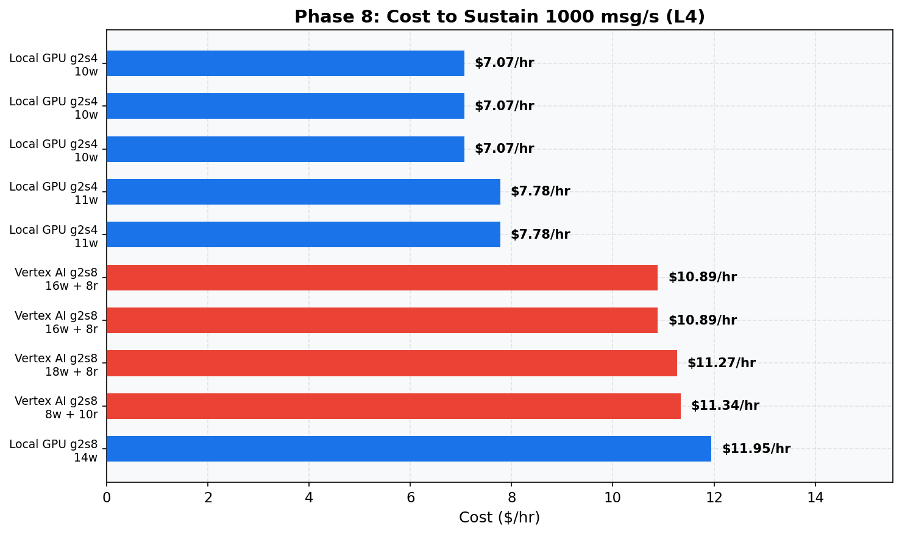
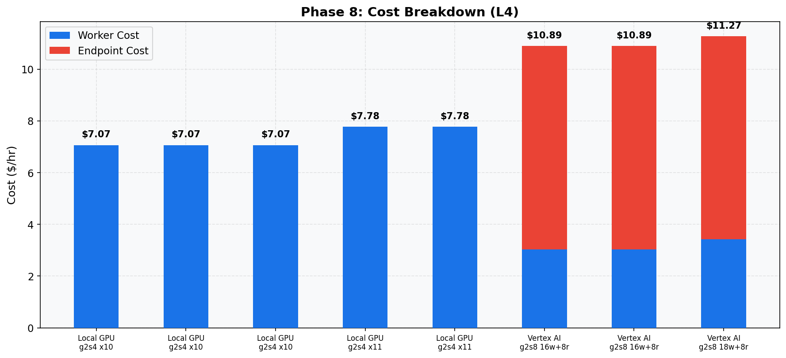

# Phase 8: Cost Analysis (L4)
[< GPU Summary](gpu_report.md)
## Going In
Target: sustain **1000 msg/s** with **p99 < 750ms**. Which configuration is cheapest?
## Configuration
| Parameter | Value | Status |
|---|---|---|
| Local GPU Infrastructure | 1×dataflow:g2s4+l4 | Fixed |
| Vertex AI Infrastructure | 1×dataflow:n1s4 + 1×endpoint:g2s4+l4 | Fixed |
| Model | BERT-base (3-class text classification, max_seq_length=128) | Fixed |
| Region | us-central1 | Fixed |
| Workers | projected from capacity | Projected |
| Endpoint Replicas | projected from capacity | Projected |
| Harness Threads | per-machine optimal | Optimized (Phase 6) |
| max_batch_size | per-machine optimal | Optimized (Phase 6) |
| min_batch_size | per-machine optimal | Optimized (Phase 6) |
| Publish Rates | 1000 msg/s target | Target |
| Duration per Rate | 100s | Fixed |

## Assumptions
- **Projected scaling**: per-worker capacity (tested in Phase 6) is extrapolated to calculate the total workers/replicas needed. Phase 7 verified linear scaling up to the tested worker counts.
- CPU-only Vertex AI workers (GPU is on the endpoint)
- On-demand pricing, us-central1

## Qualifying Configurations (sorted by cost)
| Rank | Experiment | Config | Workers | Replicas | Basis | $/hr | $/M msgs | Breakdown |
|---:|---|---|---:|---:|---|---:|---:|---|
| 1 | Local Gpu | g2s4 | 10 | - | Projected (validated at 1w, 2w, 8w) | $7.07 | $1.96 | 10w × $0.71 (GPU included) |
| 2 | Local Gpu | g2s4 | 11 | - | Projected (validated at 4w, 6w) | $7.78 | $2.16 | 11w × $0.71 (GPU included) |
| 3 | Vertex Ai | g2s8 endpoint | 16 | 8 | Projected (validated at 1r/2w, 2r/4w) | $10.89 | $3.03 | 16w × $0.19 + 8r × $0.98 (GPU incl) |
| 4 | Vertex Ai | g2s8 endpoint | 18 | 8 | Projected (validated at 5r/11w) | $11.27 | $3.13 | 18w × $0.19 + 8r × $0.98 (GPU incl) |
| 5 | Vertex Ai | g2s8 endpoint | 8 | 10 | Tested | $11.34 | $3.15 | 8w × $0.19 + 10r × $0.98 (GPU incl) |
| 6 | Local Gpu | g2s8 | 14 | - | Projected (validated at 1w, 2w, 4w, 6w, 8w) | $11.95 | $3.32 | 14w × $0.85 (GPU included) |
| 7 | Vertex Ai | g2s4 endpoint | 11 | 14 | Projected (validated at 5r/4w, 10r/8w) | $13.47 | $3.74 | 11w × $0.19 + 14r × $0.81 (GPU incl) |
| 8 | Vertex Ai | g2s8 endpoint | 32 | 8 | Projected (validated at 1r/4w, 2r/8w) | $13.93 | $3.87 | 32w × $0.19 + 8r × $0.98 (GPU incl) |
| 9 | Vertex Ai | g2s4 endpoint | 14 | 14 | Projected (validated at 1r/1w, 2r/2w) | $14.04 | $3.90 | 14w × $0.19 + 14r × $0.81 (GPU incl) |
| 10 | Vertex Ai | g2s4 endpoint | 22 | 14 | Projected (validated at 5r/8w) | $15.56 | $4.32 | 22w × $0.19 + 14r × $0.81 (GPU incl) |
| 11 | Vertex Ai | g2s8 endpoint | 44 | 8 | Projected (validated at 2r/11w) | $16.21 | $4.50 | 44w × $0.19 + 8r × $0.98 (GPU incl) |
| 12 | Vertex Ai | g2s4 endpoint | 27 | 14 | Projected (validated at 1r/2w, 2r/4w) | $16.51 | $4.59 | 27w × $0.19 + 14r × $0.81 (GPU incl) |
| 13 | Vertex Ai | g2s4 endpoint | 30 | 14 | Projected (validated at 5r/11w) | $17.08 | $4.74 | 30w × $0.19 + 14r × $0.81 (GPU incl) |
| 14 | Vertex Ai | g2s8 endpoint | 64 | 8 | Projected (validated at 1r/8w) | $20.01 | $5.56 | 64w × $0.19 + 8r × $0.98 (GPU incl) |
| 15 | Vertex Ai | g2s4 endpoint | 54 | 14 | Projected (validated at 1r/4w) | $21.64 | $6.01 | 54w × $0.19 + 14r × $0.81 (GPU incl) |

## Conclusion
**Cheapest option: Local Gpu at $7.07/hr** ($1.96 per million messages).

Configuration: 10w × $0.71 (GPU included)
