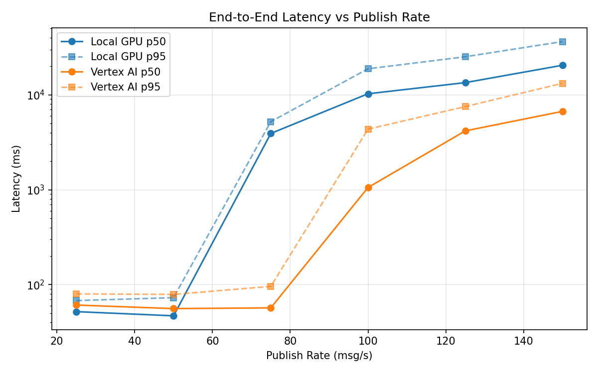
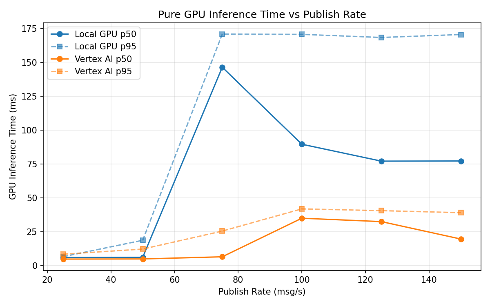
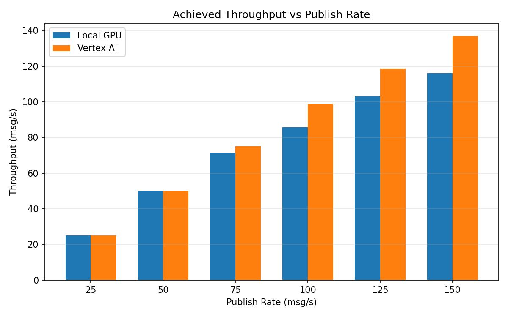

# Benchmark Report

Generated: 2026-03-07 18:52:05

## Configuration

| Parameter | Value |
|---|---|
| Messages per phase | 100s per phase |
| Rates (msg/s) | 25, 50, 75, 100, 125, 150 |
| Experiments | Local GPU, Vertex AI |

## Throughput

| Rate (msg/s) | Local GPU | Vertex AI |
|---|---|---|
| 25 | 25.0 | 25.0 |
| 50 | 50.0 | 50.0 |
| 75 | 71.2 | 75.0 |
| 100 | 85.8 | 98.9 |
| 125 | 103.1 | 118.5 |
| 150 | 116.0 | 137.0 |

## End-to-End Latency (ms)

| Rate | Percentile | Local GPU | Vertex AI |
|---|---|---|---|
| 25 | p50 | 52.0 | 61.0 |
| 25 | p95 | 68.0 | 80.0 |
| 25 | p99 | 253.1 | 117.0 |
| 50 | p50 | 47.0 | 56.0 |
| 50 | p95 | 73.0 | 79.0 |
| 50 | p99 | 388.0 | 276.1 |
| 75 | p50 | 3920.0 | 57.0 |
| 75 | p95 | 5216.0 | 96.0 |
| 75 | p99 | 5496.0 | 395.0 |
| 100 | p50 | 10265.0 | 1057.0 |
| 100 | p95 | 18816.0 | 4349.8 |
| 100 | p99 | 19345.1 | 5050.8 |
| 125 | p50 | 13444.0 | 4170.0 |
| 125 | p95 | 25184.8 | 7520.0 |
| 125 | p99 | 30934.0 | 7883.0 |
| 150 | p50 | 20491.5 | 6695.5 |
| 150 | p95 | 36406.5 | 13227.0 |
| 150 | p99 | 38448.1 | 14102.0 |

## GPU Inference Time (ms)

| Rate | Percentile | Local GPU | Vertex AI |
|---|---|---|---|
| 25 | p50 | 5.8 | 4.7 |
| 25 | p95 | 6.5 | 8.3 |
| 25 | p99 | 99.7 | 10.6 |
| 50 | p50 | 6.0 | 4.8 |
| 50 | p95 | 18.6 | 12.1 |
| 50 | p99 | 143.2 | 33.8 |
| 75 | p50 | 146.5 | 6.4 |
| 75 | p95 | 171.0 | 25.4 |
| 75 | p99 | 181.0 | 37.6 |
| 100 | p50 | 89.6 | 34.9 |
| 100 | p95 | 170.8 | 41.8 |
| 100 | p99 | 182.0 | 50.2 |
| 125 | p50 | 77.1 | 32.4 |
| 125 | p95 | 168.5 | 40.5 |
| 125 | p99 | 183.1 | 48.9 |
| 150 | p50 | 77.2 | 19.5 |
| 150 | p95 | 170.7 | 39.0 |
| 150 | p99 | 184.4 | 47.8 |

## Charts

### Latency vs Publish Rate

### GPU Inference Time vs Publish Rate

### Throughput vs Publish Rate

