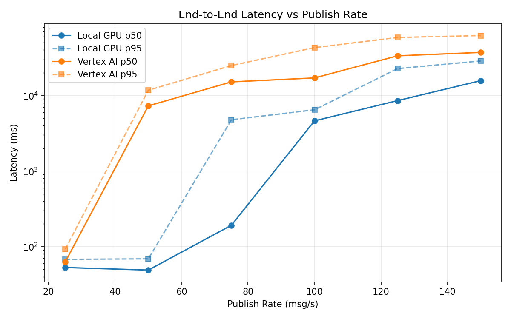
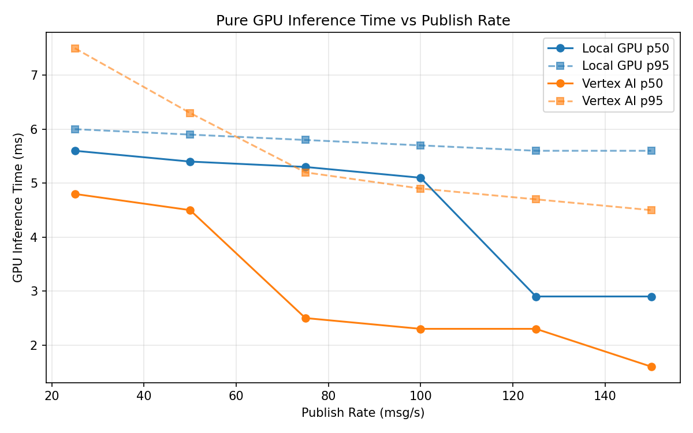
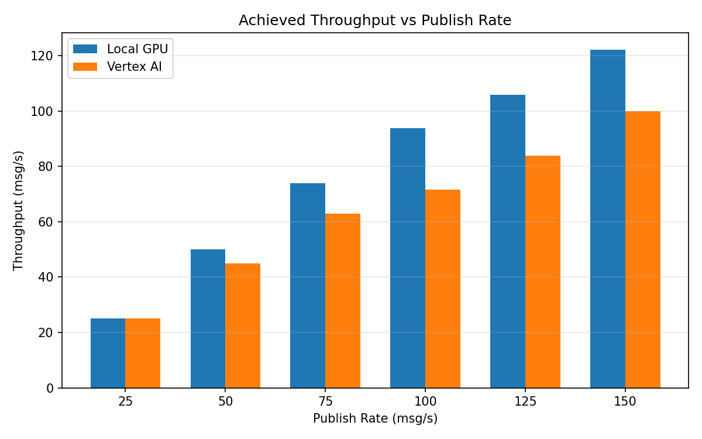

# Benchmark Report

Generated: 2026-03-07 19:12:32

## Configuration

| Parameter | Value |
|---|---|
| Messages per phase | 100s per phase |
| Rates (msg/s) | 25, 50, 75, 100, 125, 150 |
| Experiments | Local GPU, Vertex AI |

## Throughput

| Rate (msg/s) | Local GPU | Vertex AI |
|---|---|---|
| 25 | 25.0 | 25.0 |
| 50 | 50.0 | 45.0 |
| 75 | 73.9 | 63.0 |
| 100 | 93.9 | 71.6 |
| 125 | 105.9 | 83.8 |
| 150 | 122.2 | 99.9 |

## End-to-End Latency (ms)

| Rate | Percentile | Local GPU | Vertex AI |
|---|---|---|---|
| 25 | p50 | 53.0 | 63.0 |
| 25 | p95 | 68.0 | 93.0 |
| 25 | p99 | 86.0 | 343.4 |
| 50 | p50 | 49.0 | 7278.5 |
| 50 | p95 | 69.0 | 11712.0 |
| 50 | p99 | 141.0 | 11931.0 |
| 75 | p50 | 192.0 | 15110.5 |
| 75 | p95 | 4768.0 | 24834.3 |
| 75 | p99 | 5458.0 | 25097.0 |
| 100 | p50 | 4611.0 | 17040.0 |
| 100 | p95 | 6457.0 | 42842.0 |
| 100 | p99 | 6527.0 | 44856.0 |
| 125 | p50 | 8535.5 | 33403.0 |
| 125 | p95 | 22631.3 | 58405.7 |
| 125 | p99 | 37230.8 | 60495.9 |
| 150 | p50 | 15673.5 | 37057.5 |
| 150 | p95 | 28563.2 | 61899.2 |
| 150 | p99 | 29537.0 | 64497.8 |

## GPU Inference Time (ms)

| Rate | Percentile | Local GPU | Vertex AI |
|---|---|---|---|
| 25 | p50 | 5.6 | 4.8 |
| 25 | p95 | 6.0 | 7.5 |
| 25 | p99 | 6.7 | 9.4 |
| 50 | p50 | 5.4 | 4.5 |
| 50 | p95 | 5.9 | 6.3 |
| 50 | p99 | 6.6 | 8.6 |
| 75 | p50 | 5.3 | 2.5 |
| 75 | p95 | 5.8 | 5.2 |
| 75 | p99 | 6.6 | 7.8 |
| 100 | p50 | 5.1 | 2.3 |
| 100 | p95 | 5.7 | 4.9 |
| 100 | p99 | 6.2 | 6.7 |
| 125 | p50 | 2.9 | 2.3 |
| 125 | p95 | 5.6 | 4.7 |
| 125 | p99 | 6.0 | 5.9 |
| 150 | p50 | 2.9 | 1.6 |
| 150 | p95 | 5.6 | 4.5 |
| 150 | p99 | 5.9 | 5.3 |

## Charts

### Latency vs Publish Rate

### GPU Inference Time vs Publish Rate

### Throughput vs Publish Rate

