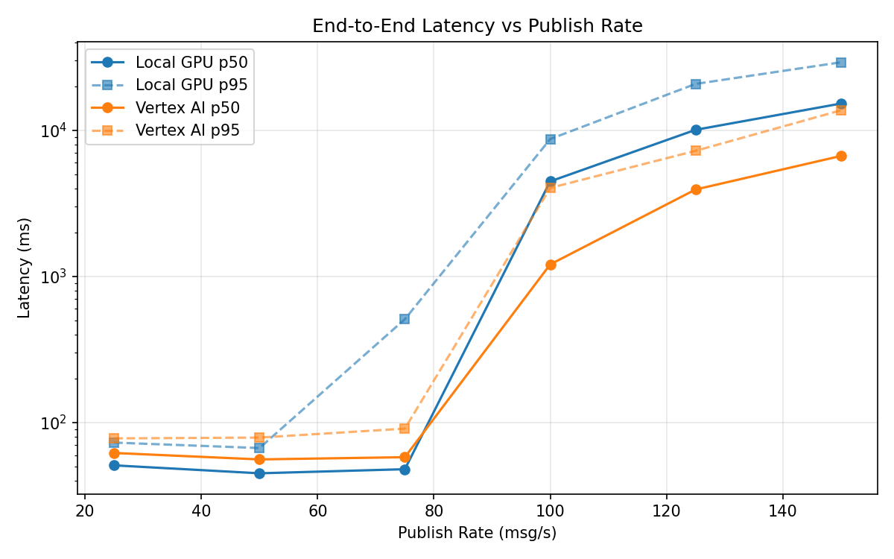
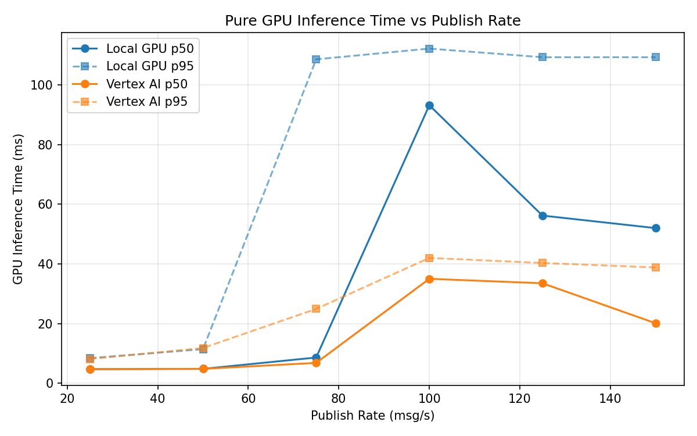
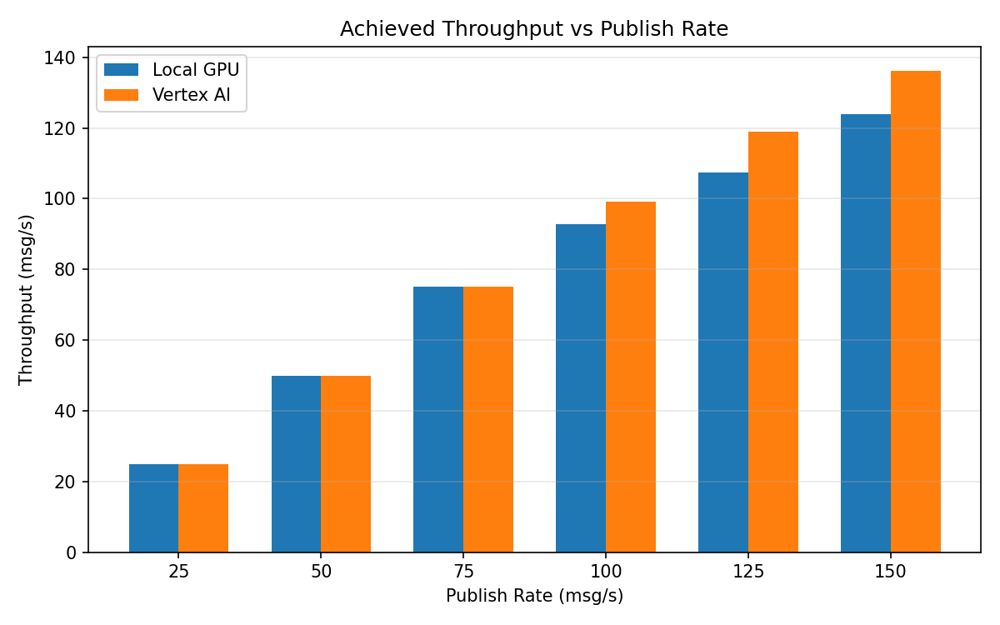

# Benchmark Report

Generated: 2026-03-07 22:10:03

## Configuration

| Parameter | Value |
|---|---|
| Messages per phase | 100s per phase |
| Rates (msg/s) | 25, 50, 75, 100, 125, 150 |
| Experiments | Local GPU, Vertex AI |

## Throughput

| Rate (msg/s) | Local GPU | Vertex AI |
|---|---|---|
| 25 | 25.0 | 25.0 |
| 50 | 50.0 | 50.0 |
| 75 | 75.0 | 75.0 |
| 100 | 92.8 | 99.1 |
| 125 | 107.3 | 118.9 |
| 150 | 123.8 | 136.2 |

## End-to-End Latency (ms)

| Rate | Percentile | Local GPU | Vertex AI |
|---|---|---|---|
| 25 | p50 | 51.0 | 62.0 |
| 25 | p95 | 73.0 | 78.0 |
| 25 | p99 | 319.0 | 243.2 |
| 50 | p50 | 45.0 | 56.0 |
| 50 | p95 | 67.0 | 79.0 |
| 50 | p99 | 147.0 | 398.0 |
| 75 | p50 | 48.0 | 58.0 |
| 75 | p95 | 510.0 | 91.0 |
| 75 | p99 | 669.0 | 213.0 |
| 100 | p50 | 4477.0 | 1210.0 |
| 100 | p95 | 8723.1 | 4038.4 |
| 100 | p99 | 9934.4 | 4583.8 |
| 125 | p50 | 10086.0 | 3939.0 |
| 125 | p95 | 20795.0 | 7246.0 |
| 125 | p99 | 22332.0 | 7573.0 |
| 150 | p50 | 15261.5 | 6683.0 |
| 150 | p95 | 29240.0 | 13713.0 |
| 150 | p99 | 31332.1 | 14490.0 |

## GPU Inference Time (ms)

| Rate | Percentile | Local GPU | Vertex AI |
|---|---|---|---|
| 25 | p50 | 4.7 | 4.7 |
| 25 | p95 | 8.4 | 8.1 |
| 25 | p99 | 76.9 | 17.7 |
| 50 | p50 | 4.8 | 4.8 |
| 50 | p95 | 11.4 | 11.8 |
| 50 | p99 | 61.0 | 35.3 |
| 75 | p50 | 8.6 | 6.8 |
| 75 | p95 | 108.6 | 24.9 |
| 75 | p99 | 117.1 | 37.2 |
| 100 | p50 | 93.2 | 35.0 |
| 100 | p95 | 112.2 | 42.0 |
| 100 | p99 | 119.4 | 52.1 |
| 125 | p50 | 56.2 | 33.5 |
| 125 | p95 | 109.3 | 40.3 |
| 125 | p99 | 116.6 | 50.5 |
| 150 | p50 | 52.0 | 20.1 |
| 150 | p95 | 109.3 | 38.8 |
| 150 | p99 | 117.5 | 47.3 |

## Charts

### Latency vs Publish Rate

### GPU Inference Time vs Publish Rate

### Throughput vs Publish Rate

