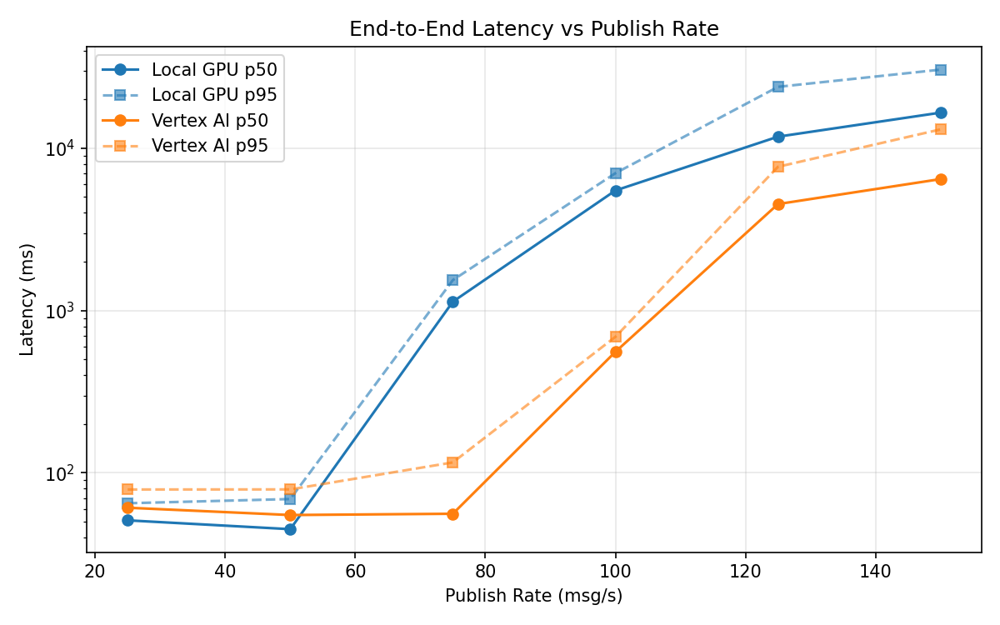
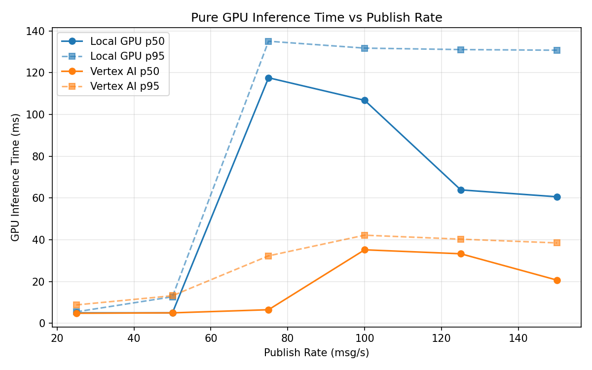
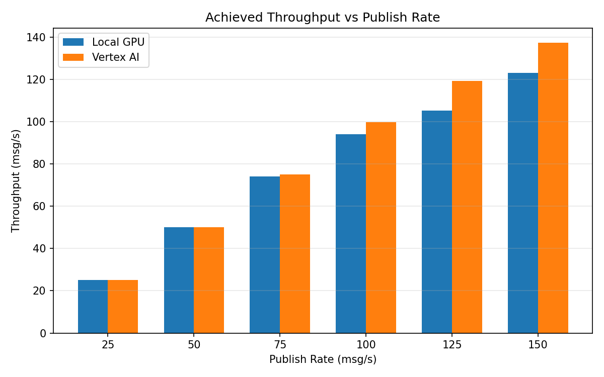

# Benchmark Report

Generated: 2026-03-07 22:29:04

## Configuration

| Parameter | Value |
|---|---|
| Messages per phase | 100s per phase |
| Rates (msg/s) | 25, 50, 75, 100, 125, 150 |
| Experiments | Local GPU, Vertex AI |

## Throughput

| Rate (msg/s) | Local GPU | Vertex AI |
|---|---|---|
| 25 | 25.0 | 25.0 |
| 50 | 50.0 | 50.0 |
| 75 | 74.0 | 75.0 |
| 100 | 93.9 | 99.8 |
| 125 | 105.2 | 119.1 |
| 150 | 123.1 | 137.3 |

## End-to-End Latency (ms)

| Rate | Percentile | Local GPU | Vertex AI |
|---|---|---|---|
| 25 | p50 | 51.0 | 61.0 |
| 25 | p95 | 65.0 | 79.0 |
| 25 | p99 | 170.4 | 412.2 |
| 50 | p50 | 45.0 | 55.0 |
| 50 | p95 | 69.0 | 79.1 |
| 50 | p99 | 473.2 | 457.1 |
| 75 | p50 | 1134.0 | 56.0 |
| 75 | p95 | 1540.0 | 116.0 |
| 75 | p99 | 1790.0 | 672.0 |
| 100 | p50 | 5490.5 | 557.0 |
| 100 | p95 | 7016.0 | 689.0 |
| 100 | p99 | 7211.0 | 983.0 |
| 125 | p50 | 11780.0 | 4529.0 |
| 125 | p95 | 23878.1 | 7685.0 |
| 125 | p99 | 26034.2 | 8039.8 |
| 150 | p50 | 16563.5 | 6453.0 |
| 150 | p95 | 30476.0 | 13059.1 |
| 150 | p99 | 32780.0 | 13858.0 |

## GPU Inference Time (ms)

| Rate | Percentile | Local GPU | Vertex AI |
|---|---|---|---|
| 25 | p50 | 5.0 | 4.8 |
| 25 | p95 | 5.5 | 8.8 |
| 25 | p99 | 60.6 | 32.4 |
| 50 | p50 | 5.0 | 5.0 |
| 50 | p95 | 12.7 | 13.2 |
| 50 | p99 | 115.8 | 36.8 |
| 75 | p50 | 117.6 | 6.5 |
| 75 | p95 | 135.1 | 32.3 |
| 75 | p99 | 143.7 | 38.7 |
| 100 | p50 | 106.8 | 35.2 |
| 100 | p95 | 131.8 | 42.2 |
| 100 | p99 | 139.4 | 51.2 |
| 125 | p50 | 63.9 | 33.3 |
| 125 | p95 | 131.1 | 40.3 |
| 125 | p99 | 139.9 | 50.9 |
| 150 | p50 | 60.6 | 20.7 |
| 150 | p95 | 130.8 | 38.5 |
| 150 | p99 | 141.8 | 46.6 |

## Charts

### Latency vs Publish Rate

### GPU Inference Time vs Publish Rate

### Throughput vs Publish Rate

