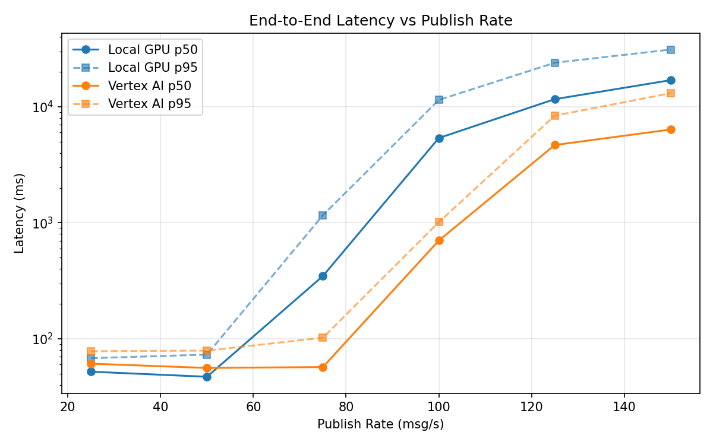
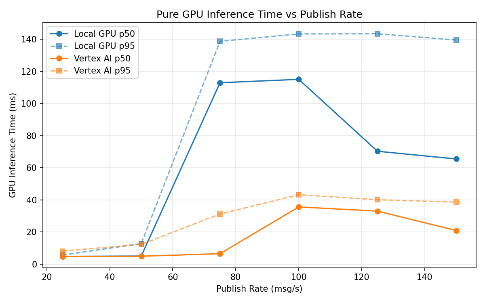
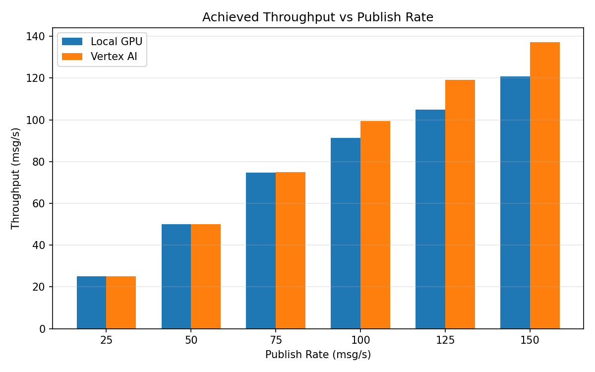

# Benchmark Report

Generated: 2026-03-07 22:48:22

## Configuration

| Parameter | Value |
|---|---|
| Messages per phase | 100s per phase |
| Rates (msg/s) | 25, 50, 75, 100, 125, 150 |
| Experiments | Local GPU, Vertex AI |

## Throughput

| Rate (msg/s) | Local GPU | Vertex AI |
|---|---|---|
| 25 | 25.0 | 25.0 |
| 50 | 50.0 | 50.0 |
| 75 | 74.8 | 75.0 |
| 100 | 91.4 | 99.4 |
| 125 | 104.8 | 119.1 |
| 150 | 120.8 | 137.2 |

## End-to-End Latency (ms)

| Rate | Percentile | Local GPU | Vertex AI |
|---|---|---|---|
| 25 | p50 | 52.0 | 61.0 |
| 25 | p95 | 68.0 | 78.0 |
| 25 | p99 | 338.3 | 113.0 |
| 50 | p50 | 47.0 | 56.0 |
| 50 | p95 | 73.0 | 79.0 |
| 50 | p99 | 636.0 | 225.2 |
| 75 | p50 | 347.0 | 57.0 |
| 75 | p95 | 1161.0 | 102.0 |
| 75 | p99 | 1522.0 | 487.0 |
| 100 | p50 | 5375.0 | 702.0 |
| 100 | p95 | 11452.0 | 1012.0 |
| 100 | p99 | 12579.9 | 1278.0 |
| 125 | p50 | 11626.5 | 4678.5 |
| 125 | p95 | 23953.6 | 8379.1 |
| 125 | p99 | 25975.1 | 8857.0 |
| 150 | p50 | 16950.5 | 6367.5 |
| 150 | p95 | 31111.4 | 13083.0 |
| 150 | p99 | 33220.0 | 13791.0 |

## GPU Inference Time (ms)

| Rate | Percentile | Local GPU | Vertex AI |
|---|---|---|---|
| 25 | p50 | 4.8 | 4.7 |
| 25 | p95 | 5.6 | 8.1 |
| 25 | p99 | 84.6 | 10.4 |
| 50 | p50 | 5.0 | 4.9 |
| 50 | p95 | 12.8 | 12.3 |
| 50 | p99 | 128.8 | 34.9 |
| 75 | p50 | 113.0 | 6.5 |
| 75 | p95 | 138.8 | 31.2 |
| 75 | p99 | 147.6 | 38.9 |
| 100 | p50 | 115.1 | 35.6 |
| 100 | p95 | 143.4 | 43.2 |
| 100 | p99 | 153.7 | 53.9 |
| 125 | p50 | 70.3 | 33.0 |
| 125 | p95 | 143.5 | 40.1 |
| 125 | p99 | 154.0 | 49.2 |
| 150 | p50 | 65.5 | 20.9 |
| 150 | p95 | 139.6 | 38.6 |
| 150 | p99 | 151.6 | 47.5 |

## Charts

### Latency vs Publish Rate

### GPU Inference Time vs Publish Rate

### Throughput vs Publish Rate

