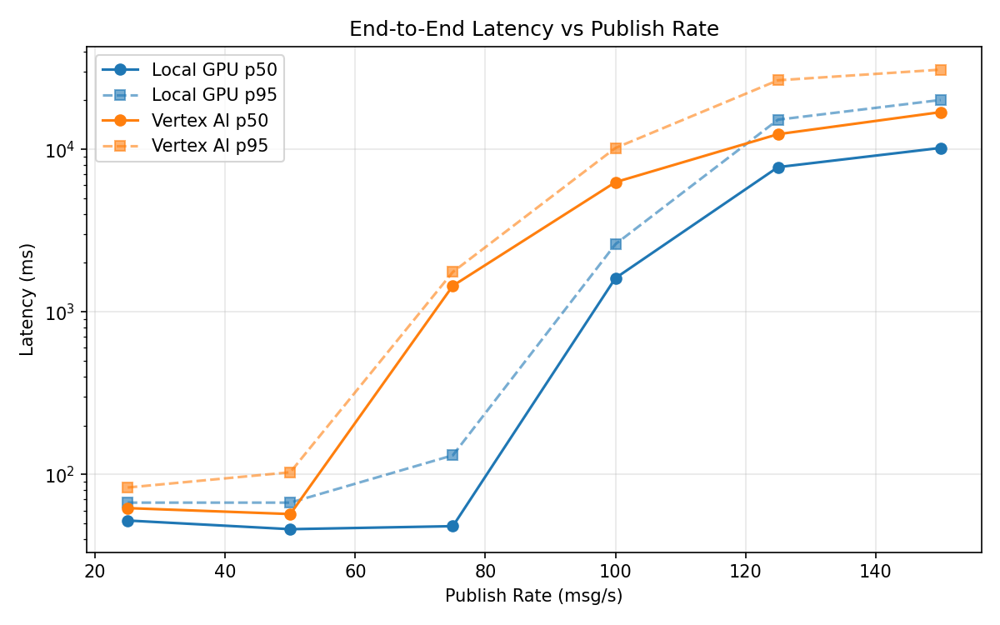
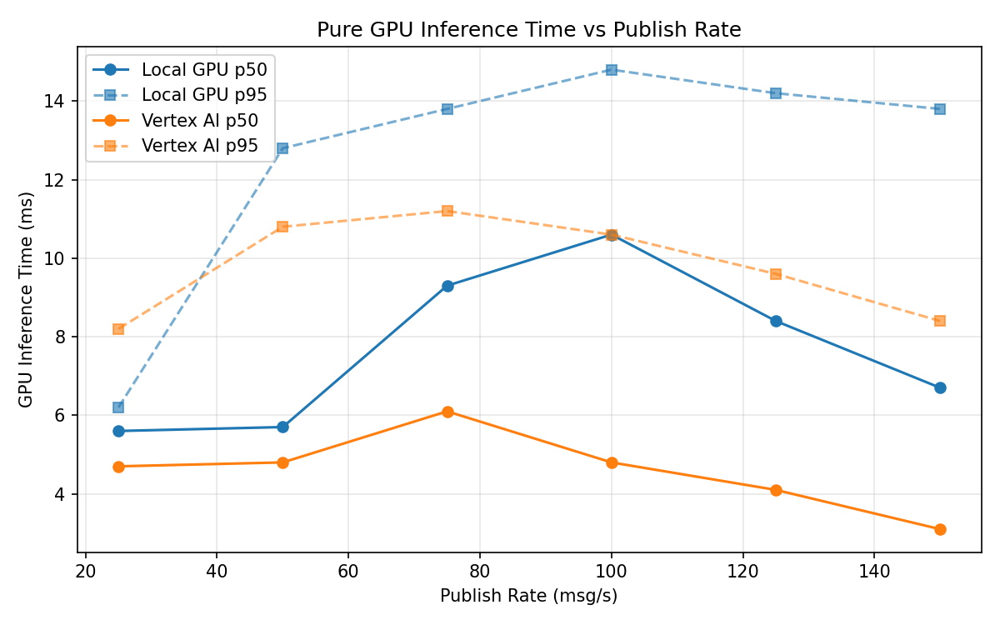
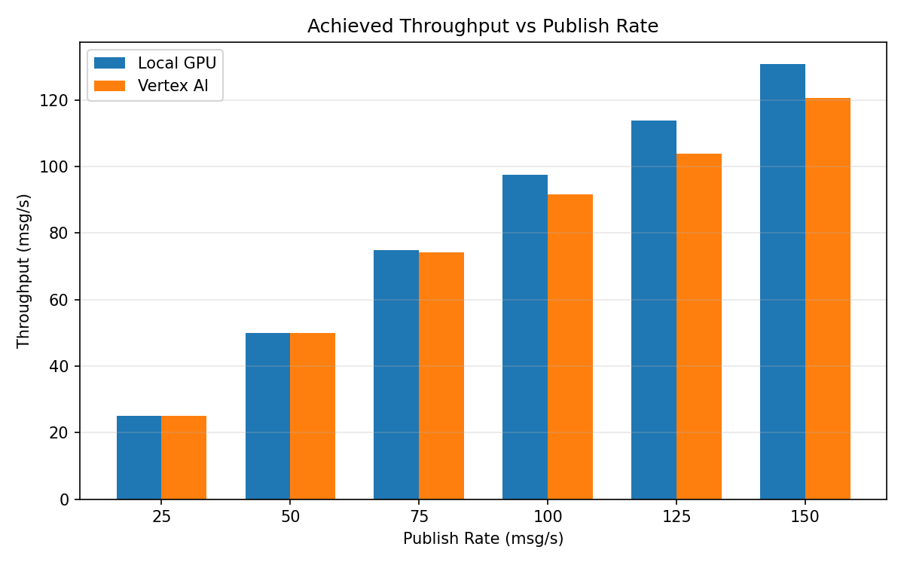

# Benchmark Report

Generated: 2026-03-07 19:31:25

## Configuration

| Parameter | Value |
|---|---|
| Messages per phase | 100s per phase |
| Rates (msg/s) | 25, 50, 75, 100, 125, 150 |
| Experiments | Local GPU, Vertex AI |

## Throughput

| Rate (msg/s) | Local GPU | Vertex AI |
|---|---|---|
| 25 | 25.0 | 25.0 |
| 50 | 50.0 | 50.0 |
| 75 | 74.8 | 74.1 |
| 100 | 97.4 | 91.6 |
| 125 | 113.9 | 103.8 |
| 150 | 130.8 | 120.5 |

## End-to-End Latency (ms)

| Rate | Percentile | Local GPU | Vertex AI |
|---|---|---|---|
| 25 | p50 | 52.0 | 62.0 |
| 25 | p95 | 67.0 | 83.0 |
| 25 | p99 | 97.0 | 251.1 |
| 50 | p50 | 46.0 | 57.0 |
| 50 | p95 | 67.0 | 103.0 |
| 50 | p99 | 113.0 | 720.0 |
| 75 | p50 | 48.0 | 1447.0 |
| 75 | p95 | 131.0 | 1759.0 |
| 75 | p99 | 664.1 | 1808.0 |
| 100 | p50 | 1612.0 | 6277.5 |
| 100 | p95 | 2607.0 | 10187.0 |
| 100 | p99 | 2692.0 | 10611.0 |
| 125 | p50 | 7769.0 | 12388.0 |
| 125 | p95 | 15212.0 | 26582.0 |
| 125 | p99 | 15585.0 | 28241.0 |
| 150 | p50 | 10195.5 | 16932.0 |
| 150 | p95 | 20115.2 | 30908.4 |
| 150 | p99 | 21604.1 | 32478.0 |

## GPU Inference Time (ms)

| Rate | Percentile | Local GPU | Vertex AI |
|---|---|---|---|
| 25 | p50 | 5.6 | 4.7 |
| 25 | p95 | 6.2 | 8.2 |
| 25 | p99 | 11.7 | 10.0 |
| 50 | p50 | 5.7 | 4.8 |
| 50 | p95 | 12.8 | 10.8 |
| 50 | p99 | 14.1 | 13.5 |
| 75 | p50 | 9.3 | 6.1 |
| 75 | p95 | 13.8 | 11.2 |
| 75 | p99 | 15.5 | 14.4 |
| 100 | p50 | 10.6 | 4.8 |
| 100 | p95 | 14.8 | 10.6 |
| 100 | p99 | 16.4 | 13.4 |
| 125 | p50 | 8.4 | 4.1 |
| 125 | p95 | 14.2 | 9.6 |
| 125 | p99 | 16.0 | 12.0 |
| 150 | p50 | 6.7 | 3.1 |
| 150 | p95 | 13.8 | 8.4 |
| 150 | p99 | 15.8 | 11.3 |

## Charts

### Latency vs Publish Rate

### GPU Inference Time vs Publish Rate

### Throughput vs Publish Rate

