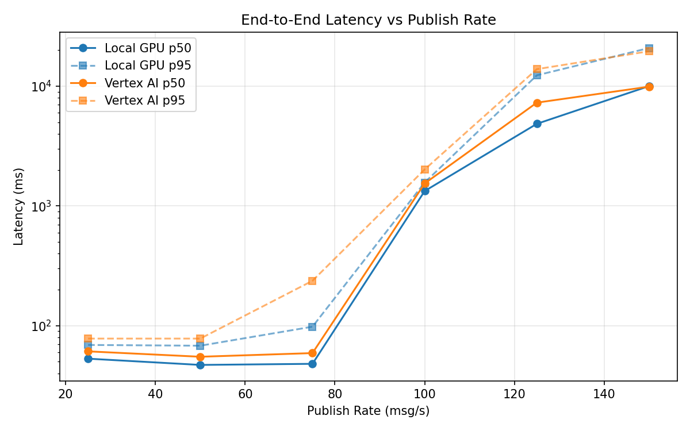
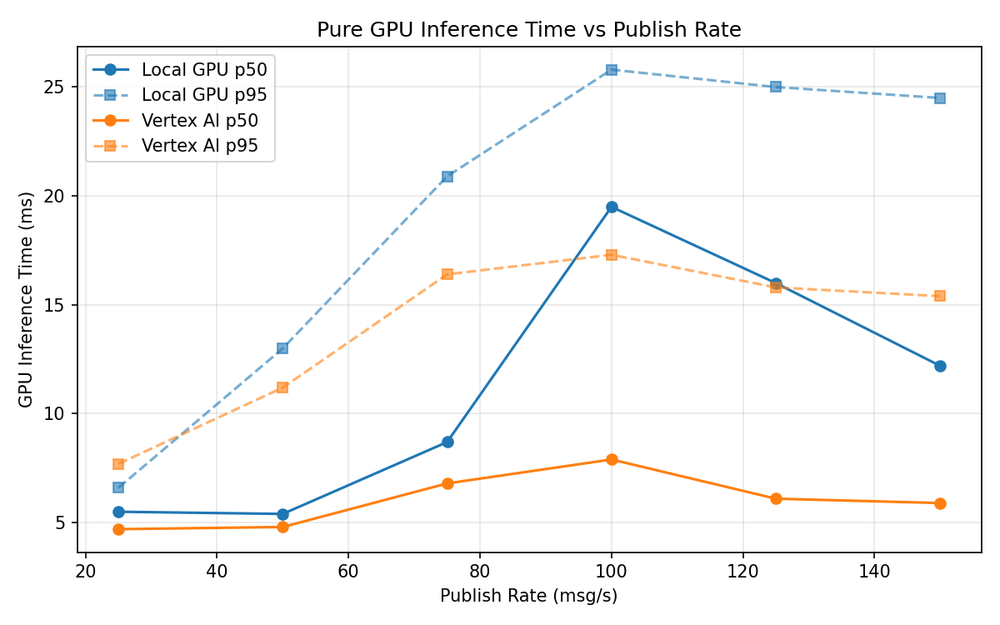
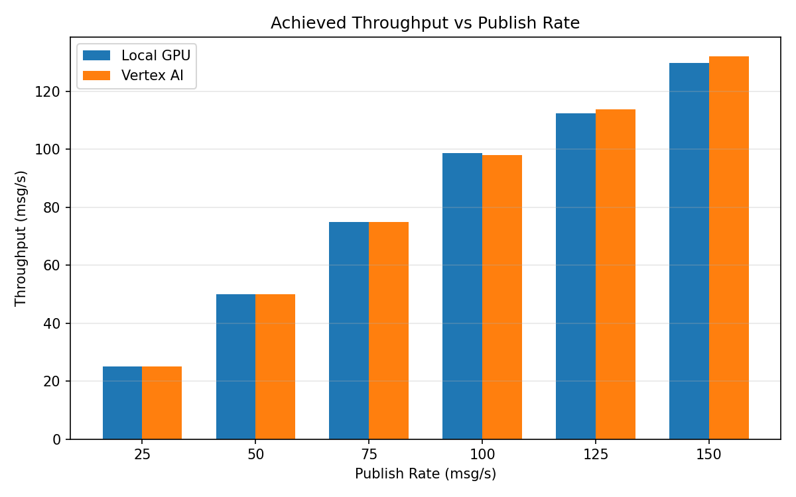

# Benchmark Report

Generated: 2026-03-07 19:50:16

## Configuration

| Parameter | Value |
|---|---|
| Messages per phase | 100s per phase |
| Rates (msg/s) | 25, 50, 75, 100, 125, 150 |
| Experiments | Local GPU, Vertex AI |

## Throughput

| Rate (msg/s) | Local GPU | Vertex AI |
|---|---|---|
| 25 | 25.0 | 25.0 |
| 50 | 50.0 | 50.0 |
| 75 | 75.0 | 74.9 |
| 100 | 98.6 | 98.1 |
| 125 | 112.5 | 113.7 |
| 150 | 129.9 | 132.1 |

## End-to-End Latency (ms)

| Rate | Percentile | Local GPU | Vertex AI |
|---|---|---|---|
| 25 | p50 | 53.0 | 61.0 |
| 25 | p95 | 69.0 | 78.0 |
| 25 | p99 | 436.4 | 111.0 |
| 50 | p50 | 47.0 | 55.0 |
| 50 | p95 | 68.0 | 78.0 |
| 50 | p99 | 131.0 | 140.2 |
| 75 | p50 | 48.0 | 59.0 |
| 75 | p95 | 98.0 | 237.0 |
| 75 | p99 | 370.0 | 881.1 |
| 100 | p50 | 1331.0 | 1540.0 |
| 100 | p95 | 1568.0 | 2016.0 |
| 100 | p99 | 1611.0 | 2071.0 |
| 125 | p50 | 4849.5 | 7286.0 |
| 125 | p95 | 12328.6 | 13876.0 |
| 125 | p99 | 16377.3 | 14234.0 |
| 150 | p50 | 10013.5 | 9913.0 |
| 150 | p95 | 20832.2 | 19576.2 |
| 150 | p99 | 22001.1 | 20846.0 |

## GPU Inference Time (ms)

| Rate | Percentile | Local GPU | Vertex AI |
|---|---|---|---|
| 25 | p50 | 5.5 | 4.7 |
| 25 | p95 | 6.6 | 7.7 |
| 25 | p99 | 18.7 | 9.9 |
| 50 | p50 | 5.4 | 4.8 |
| 50 | p95 | 13.0 | 11.2 |
| 50 | p99 | 21.5 | 15.6 |
| 75 | p50 | 8.7 | 6.8 |
| 75 | p95 | 20.9 | 16.4 |
| 75 | p99 | 24.6 | 21.0 |
| 100 | p50 | 19.5 | 7.9 |
| 100 | p95 | 25.8 | 17.3 |
| 100 | p99 | 28.0 | 21.9 |
| 125 | p50 | 16.0 | 6.1 |
| 125 | p95 | 25.0 | 15.8 |
| 125 | p99 | 28.0 | 20.4 |
| 150 | p50 | 12.2 | 5.9 |
| 150 | p95 | 24.5 | 15.4 |
| 150 | p99 | 27.5 | 19.5 |

## Charts

### Latency vs Publish Rate

### GPU Inference Time vs Publish Rate

### Throughput vs Publish Rate

