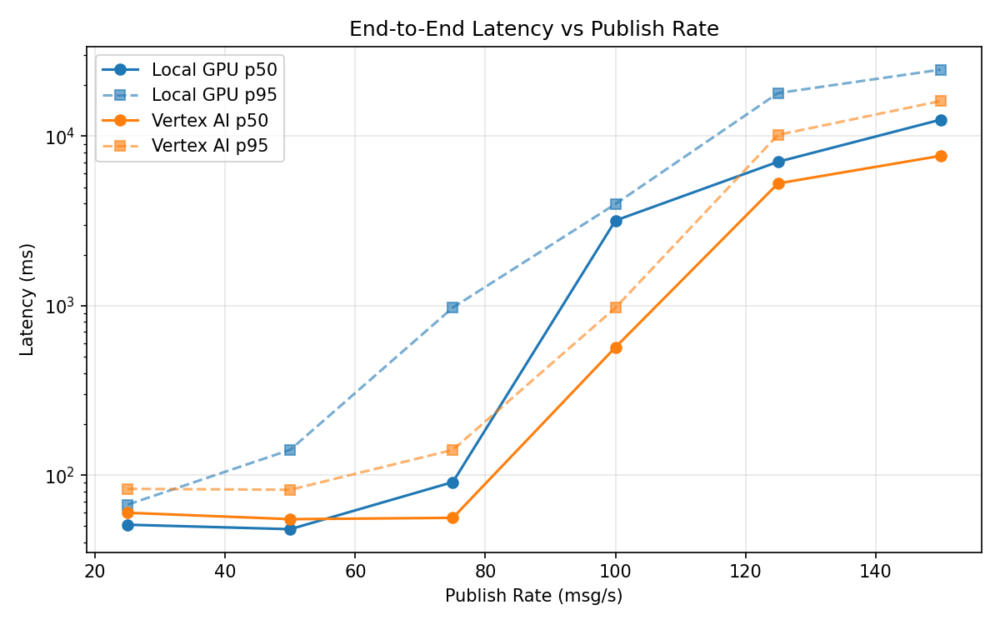
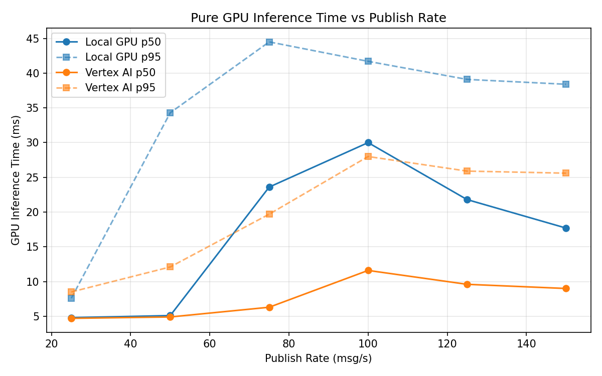
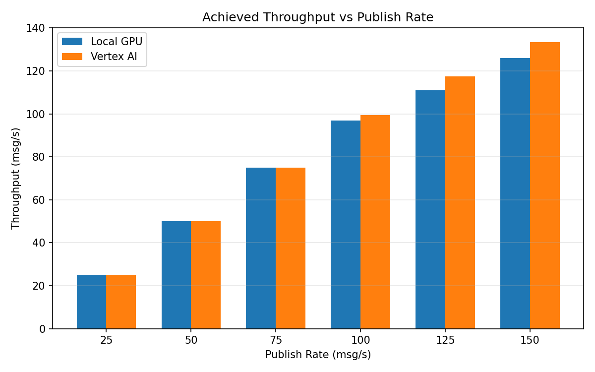

# Benchmark Report

Generated: 2026-03-07 20:09:03

## Configuration

| Parameter | Value |
|---|---|
| Messages per phase | 100s per phase |
| Rates (msg/s) | 25, 50, 75, 100, 125, 150 |
| Experiments | Local GPU, Vertex AI |

## Throughput

| Rate (msg/s) | Local GPU | Vertex AI |
|---|---|---|
| 25 | 25.0 | 25.0 |
| 50 | 50.0 | 50.0 |
| 75 | 75.0 | 75.0 |
| 100 | 96.8 | 99.5 |
| 125 | 111.0 | 117.5 |
| 150 | 126.0 | 133.4 |

## End-to-End Latency (ms)

| Rate | Percentile | Local GPU | Vertex AI |
|---|---|---|---|
| 25 | p50 | 51.0 | 60.0 |
| 25 | p95 | 67.0 | 83.0 |
| 25 | p99 | 82.0 | 131.0 |
| 50 | p50 | 48.0 | 55.0 |
| 50 | p95 | 141.1 | 82.0 |
| 50 | p99 | 317.0 | 687.0 |
| 75 | p50 | 91.0 | 56.0 |
| 75 | p95 | 974.0 | 141.0 |
| 75 | p99 | 1471.0 | 423.0 |
| 100 | p50 | 3178.0 | 568.0 |
| 100 | p95 | 3978.0 | 971.0 |
| 100 | p99 | 4092.0 | 1204.0 |
| 125 | p50 | 7057.0 | 5261.0 |
| 125 | p95 | 17949.0 | 10173.0 |
| 125 | p99 | 20206.0 | 11722.2 |
| 150 | p50 | 12503.0 | 7653.5 |
| 150 | p95 | 24678.1 | 16115.0 |
| 150 | p99 | 25933.0 | 17648.1 |

## GPU Inference Time (ms)

| Rate | Percentile | Local GPU | Vertex AI |
|---|---|---|---|
| 25 | p50 | 4.8 | 4.7 |
| 25 | p95 | 7.6 | 8.5 |
| 25 | p99 | 11.7 | 11.2 |
| 50 | p50 | 5.1 | 4.9 |
| 50 | p95 | 34.3 | 12.1 |
| 50 | p99 | 55.8 | 21.5 |
| 75 | p50 | 23.6 | 6.3 |
| 75 | p95 | 44.5 | 19.7 |
| 75 | p99 | 62.2 | 28.0 |
| 100 | p50 | 30.0 | 11.6 |
| 100 | p95 | 41.7 | 28.0 |
| 100 | p99 | 57.8 | 33.9 |
| 125 | p50 | 21.8 | 9.6 |
| 125 | p95 | 39.1 | 25.9 |
| 125 | p99 | 54.1 | 32.7 |
| 150 | p50 | 17.7 | 9.0 |
| 150 | p95 | 38.4 | 25.6 |
| 150 | p99 | 50.7 | 31.5 |

## Charts

### Latency vs Publish Rate

### GPU Inference Time vs Publish Rate

### Throughput vs Publish Rate

