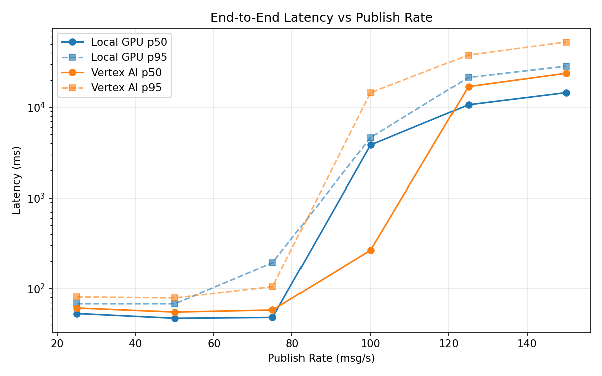
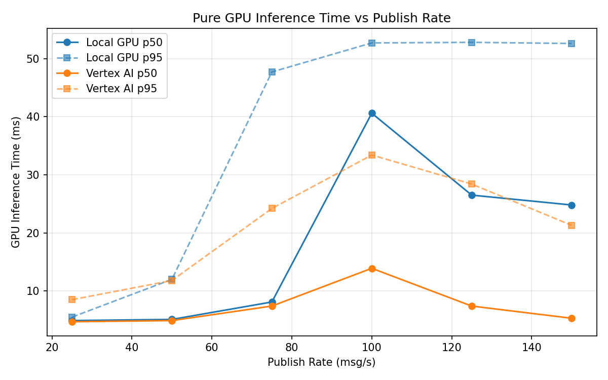
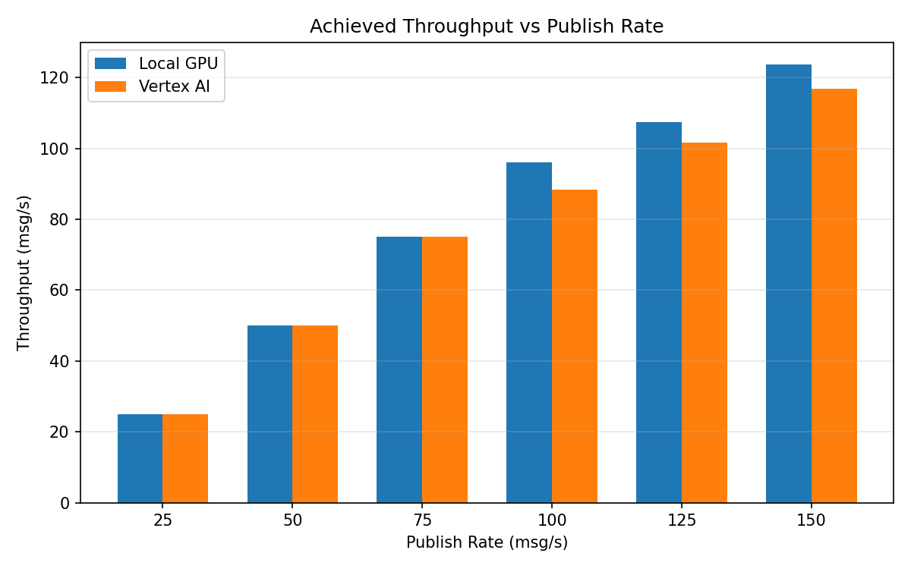

# Benchmark Report

Generated: 2026-03-07 20:28:21

## Configuration

| Parameter | Value |
|---|---|
| Messages per phase | 100s per phase |
| Rates (msg/s) | 25, 50, 75, 100, 125, 150 |
| Experiments | Local GPU, Vertex AI |

## Throughput

| Rate (msg/s) | Local GPU | Vertex AI |
|---|---|---|
| 25 | 25.0 | 25.0 |
| 50 | 50.0 | 50.0 |
| 75 | 75.0 | 75.0 |
| 100 | 96.1 | 88.3 |
| 125 | 107.3 | 101.6 |
| 150 | 123.7 | 116.8 |

## End-to-End Latency (ms)

| Rate | Percentile | Local GPU | Vertex AI |
|---|---|---|---|
| 25 | p50 | 53.0 | 61.0 |
| 25 | p95 | 68.0 | 81.0 |
| 25 | p99 | 229.1 | 410.4 |
| 50 | p50 | 47.0 | 55.0 |
| 50 | p95 | 68.0 | 79.0 |
| 50 | p99 | 534.0 | 304.0 |
| 75 | p50 | 48.0 | 58.0 |
| 75 | p95 | 193.0 | 105.0 |
| 75 | p99 | 240.0 | 306.0 |
| 100 | p50 | 3833.0 | 265.0 |
| 100 | p95 | 4629.0 | 14504.9 |
| 100 | p99 | 4757.0 | 16283.9 |
| 125 | p50 | 10661.0 | 16939.0 |
| 125 | p95 | 21354.0 | 37820.4 |
| 125 | p99 | 22953.0 | 42920.1 |
| 150 | p50 | 14507.0 | 23753.0 |
| 150 | p95 | 28479.1 | 52641.1 |
| 150 | p99 | 29934.0 | 58511.0 |

## GPU Inference Time (ms)

| Rate | Percentile | Local GPU | Vertex AI |
|---|---|---|---|
| 25 | p50 | 4.9 | 4.7 |
| 25 | p95 | 5.5 | 8.5 |
| 25 | p99 | 38.3 | 14.6 |
| 50 | p50 | 5.1 | 4.9 |
| 50 | p95 | 12.0 | 11.8 |
| 50 | p99 | 48.6 | 18.7 |
| 75 | p50 | 8.1 | 7.4 |
| 75 | p95 | 47.7 | 24.2 |
| 75 | p99 | 52.9 | 33.7 |
| 100 | p50 | 40.6 | 13.9 |
| 100 | p95 | 52.7 | 33.4 |
| 100 | p99 | 57.4 | 43.0 |
| 125 | p50 | 26.5 | 7.4 |
| 125 | p95 | 52.8 | 28.4 |
| 125 | p99 | 57.8 | 34.4 |
| 150 | p50 | 24.8 | 5.3 |
| 150 | p95 | 52.6 | 21.3 |
| 150 | p99 | 57.8 | 32.0 |

## Charts

### Latency vs Publish Rate

### GPU Inference Time vs Publish Rate

### Throughput vs Publish Rate

