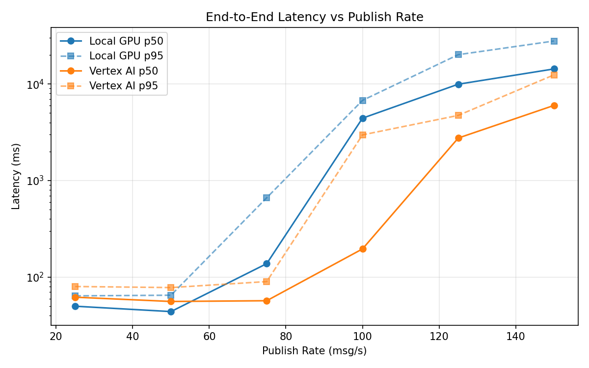
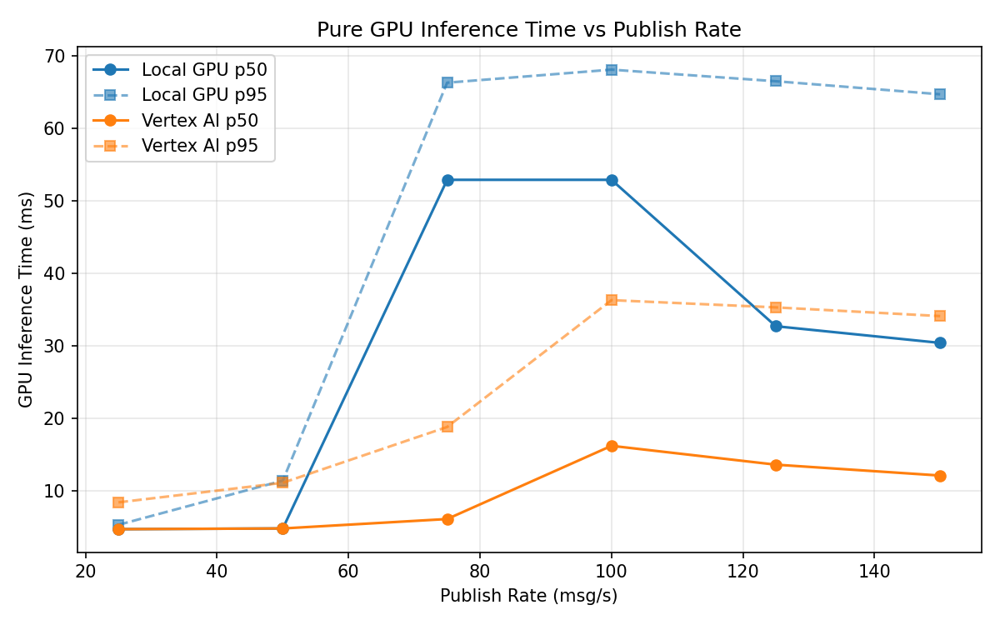
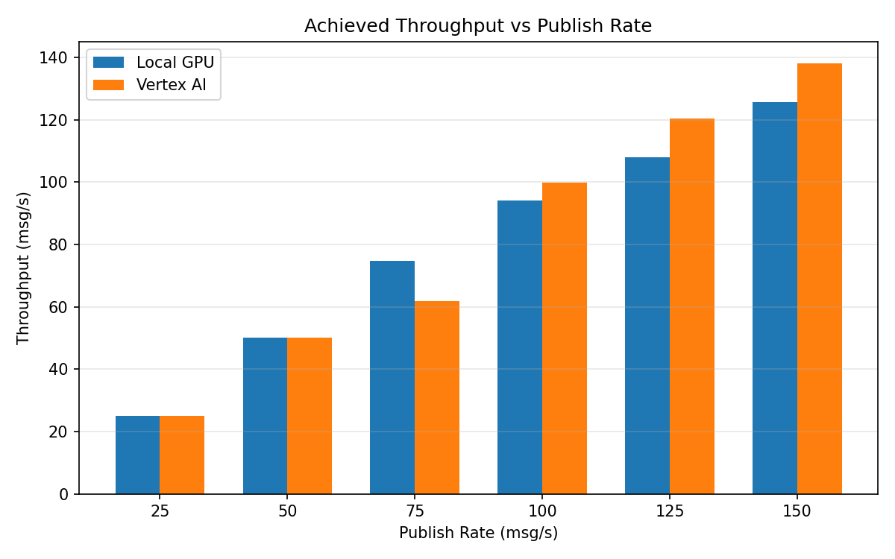

# Benchmark Report

Generated: 2026-03-07 20:48:20

## Configuration

| Parameter | Value |
|---|---|
| Messages per phase | 100s per phase |
| Rates (msg/s) | 25, 50, 75, 100, 125, 150 |
| Experiments | Local GPU, Vertex AI |

## Throughput

| Rate (msg/s) | Local GPU | Vertex AI |
|---|---|---|
| 25 | 25.0 | 25.0 |
| 50 | 50.0 | 50.0 |
| 75 | 74.8 | 61.9 |
| 100 | 94.0 | 99.8 |
| 125 | 108.0 | 120.5 |
| 150 | 125.7 | 138.1 |

## End-to-End Latency (ms)

| Rate | Percentile | Local GPU | Vertex AI |
|---|---|---|---|
| 25 | p50 | 50.0 | 62.0 |
| 25 | p95 | 64.0 | 80.0 |
| 25 | p99 | 86.0 | 169.3 |
| 50 | p50 | 44.0 | 56.0 |
| 50 | p95 | 65.0 | 78.0 |
| 50 | p99 | 190.0 | 111.0 |
| 75 | p50 | 138.0 | 57.0 |
| 75 | p95 | 664.1 | 90.0 |
| 75 | p99 | 864.0 | 270.0 |
| 100 | p50 | 4428.0 | 196.0 |
| 100 | p95 | 6768.0 | 2974.0 |
| 100 | p99 | 7772.0 | 3652.0 |
| 125 | p50 | 9954.0 | 2757.0 |
| 125 | p95 | 20127.0 | 4731.0 |
| 125 | p99 | 21643.1 | 5100.0 |
| 150 | p50 | 14327.5 | 6002.0 |
| 150 | p95 | 27881.1 | 12439.0 |
| 150 | p99 | 30268.0 | 13323.0 |

## GPU Inference Time (ms)

| Rate | Percentile | Local GPU | Vertex AI |
|---|---|---|---|
| 25 | p50 | 4.7 | 4.7 |
| 25 | p95 | 5.3 | 8.4 |
| 25 | p99 | 11.0 | 10.6 |
| 50 | p50 | 4.8 | 4.8 |
| 50 | p95 | 11.4 | 11.1 |
| 50 | p99 | 54.8 | 15.4 |
| 75 | p50 | 52.9 | 6.1 |
| 75 | p95 | 66.3 | 18.8 |
| 75 | p99 | 71.5 | 31.4 |
| 100 | p50 | 52.9 | 16.2 |
| 100 | p95 | 68.1 | 36.3 |
| 100 | p99 | 73.1 | 45.7 |
| 125 | p50 | 32.7 | 13.6 |
| 125 | p95 | 66.5 | 35.3 |
| 125 | p99 | 71.7 | 44.9 |
| 150 | p50 | 30.4 | 12.1 |
| 150 | p95 | 64.7 | 34.1 |
| 150 | p99 | 70.4 | 40.8 |

## Charts

### Latency vs Publish Rate

### GPU Inference Time vs Publish Rate

### Throughput vs Publish Rate

