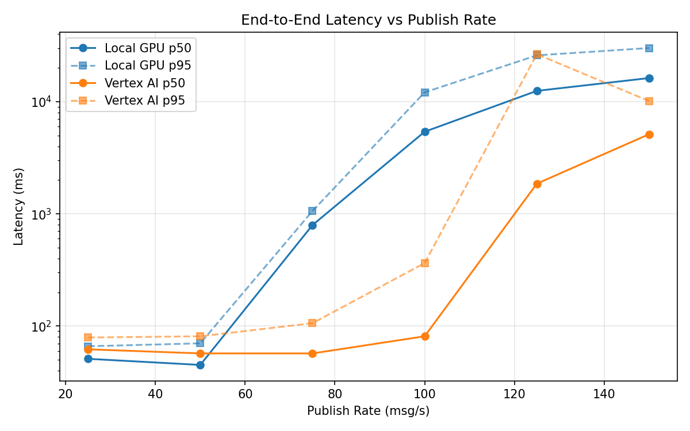
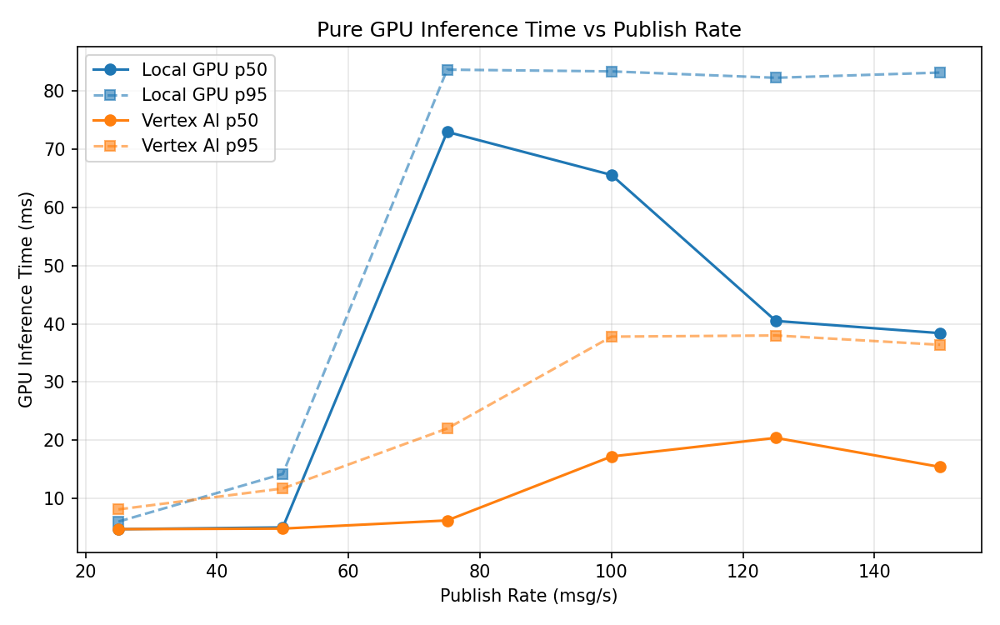
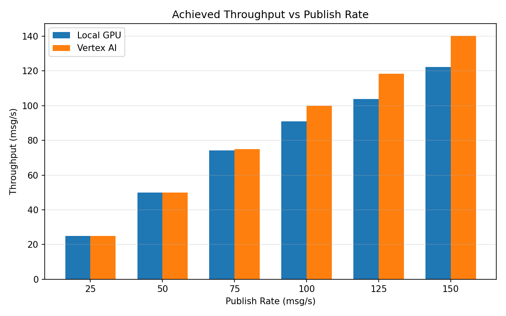

# Benchmark Report

Generated: 2026-03-07 21:08:33

## Configuration

| Parameter | Value |
|---|---|
| Messages per phase | 100s per phase |
| Rates (msg/s) | 25, 50, 75, 100, 125, 150 |
| Experiments | Local GPU, Vertex AI |

## Throughput

| Rate (msg/s) | Local GPU | Vertex AI |
|---|---|---|
| 25 | 25.0 | 25.0 |
| 50 | 50.0 | 50.0 |
| 75 | 74.1 | 74.9 |
| 100 | 91.0 | 99.9 |
| 125 | 103.9 | 118.4 |
| 150 | 122.3 | 140.3 |

## End-to-End Latency (ms)

| Rate | Percentile | Local GPU | Vertex AI |
|---|---|---|---|
| 25 | p50 | 51.0 | 62.0 |
| 25 | p95 | 66.0 | 79.0 |
| 25 | p99 | 91.0 | 116.0 |
| 50 | p50 | 45.0 | 57.0 |
| 50 | p95 | 70.1 | 81.0 |
| 50 | p99 | 726.0 | 414.0 |
| 75 | p50 | 794.0 | 57.0 |
| 75 | p95 | 1060.0 | 106.0 |
| 75 | p99 | 1254.0 | 754.1 |
| 100 | p50 | 5400.5 | 81.0 |
| 100 | p95 | 12123.3 | 364.0 |
| 100 | p99 | 13416.9 | 655.0 |
| 125 | p50 | 12495.0 | 1859.0 |
| 125 | p95 | 25914.0 | 26511.8 |
| 125 | p99 | 28150.0 | 34889.0 |
| 150 | p50 | 16250.5 | 5129.0 |
| 150 | p95 | 30109.1 | 10143.0 |
| 150 | p99 | 31934.0 | 10638.0 |

## GPU Inference Time (ms)

| Rate | Percentile | Local GPU | Vertex AI |
|---|---|---|---|
| 25 | p50 | 4.7 | 4.7 |
| 25 | p95 | 6.0 | 8.1 |
| 25 | p99 | 8.9 | 10.4 |
| 50 | p50 | 5.0 | 4.8 |
| 50 | p95 | 14.2 | 11.7 |
| 50 | p99 | 76.3 | 28.5 |
| 75 | p50 | 73.0 | 6.2 |
| 75 | p95 | 83.7 | 22.0 |
| 75 | p99 | 89.2 | 35.7 |
| 100 | p50 | 65.6 | 17.2 |
| 100 | p95 | 83.4 | 37.8 |
| 100 | p99 | 89.4 | 46.9 |
| 125 | p50 | 40.5 | 20.4 |
| 125 | p95 | 82.3 | 38.0 |
| 125 | p99 | 89.3 | 45.6 |
| 150 | p50 | 38.4 | 15.4 |
| 150 | p95 | 83.2 | 36.4 |
| 150 | p99 | 90.5 | 44.7 |

## Charts

### Latency vs Publish Rate

### GPU Inference Time vs Publish Rate

### Throughput vs Publish Rate

