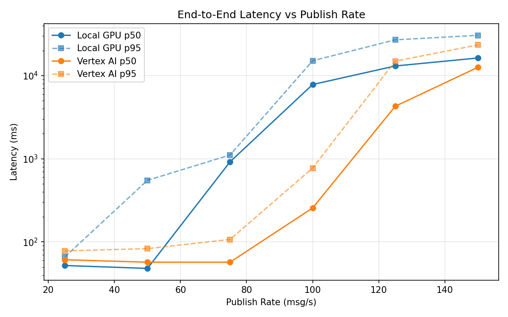
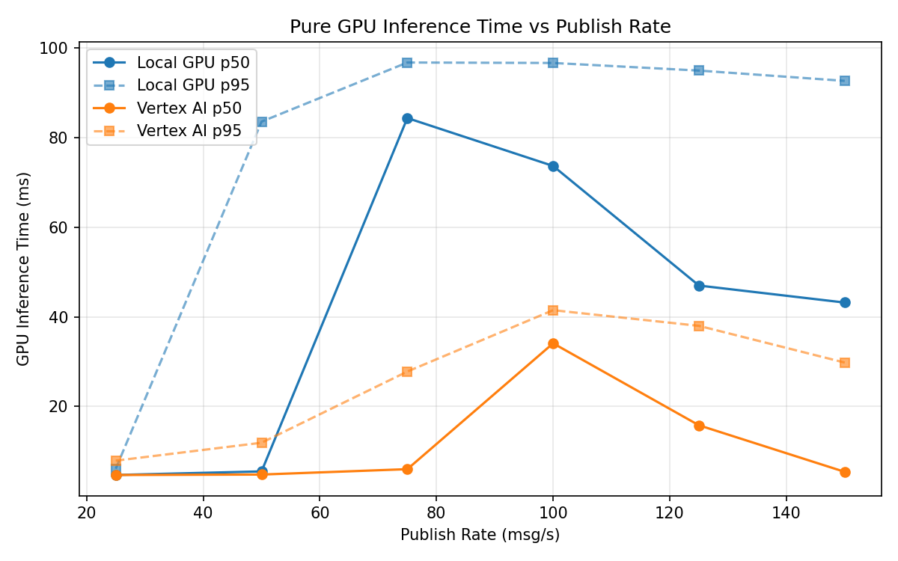
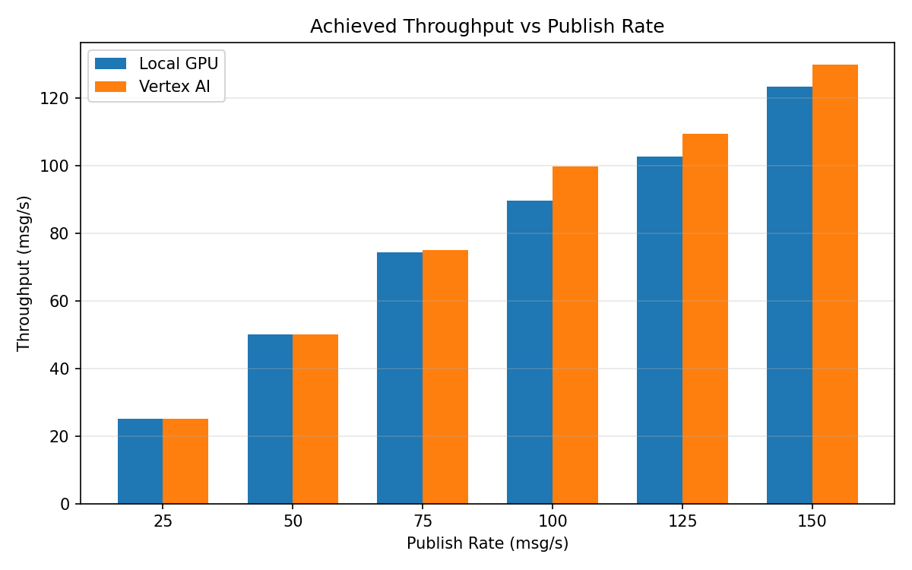

# Benchmark Report

Generated: 2026-03-07 21:28:49

## Configuration

| Parameter | Value |
|---|---|
| Messages per phase | 100s per phase |
| Rates (msg/s) | 25, 50, 75, 100, 125, 150 |
| Experiments | Local GPU, Vertex AI |

## Throughput

| Rate (msg/s) | Local GPU | Vertex AI |
|---|---|---|
| 25 | 25.0 | 25.0 |
| 50 | 50.0 | 50.0 |
| 75 | 74.3 | 75.0 |
| 100 | 89.6 | 99.8 |
| 125 | 102.7 | 109.5 |
| 150 | 123.4 | 130.0 |

## End-to-End Latency (ms)

| Rate | Percentile | Local GPU | Vertex AI |
|---|---|---|---|
| 25 | p50 | 52.0 | 61.0 |
| 25 | p95 | 66.0 | 78.0 |
| 25 | p99 | 83.0 | 109.0 |
| 50 | p50 | 48.0 | 57.0 |
| 50 | p95 | 550.5 | 83.0 |
| 50 | p99 | 1657.0 | 468.0 |
| 75 | p50 | 919.0 | 57.0 |
| 75 | p95 | 1111.0 | 107.0 |
| 75 | p99 | 1300.0 | 651.0 |
| 100 | p50 | 7828.0 | 256.0 |
| 100 | p95 | 15117.0 | 774.0 |
| 100 | p99 | 15725.0 | 917.0 |
| 125 | p50 | 13070.5 | 4282.0 |
| 125 | p95 | 26979.0 | 14952.1 |
| 125 | p99 | 29208.0 | 17286.0 |
| 150 | p50 | 16310.5 | 12598.0 |
| 150 | p95 | 30566.8 | 23433.1 |
| 150 | p99 | 32832.0 | 24318.0 |

## GPU Inference Time (ms)

| Rate | Percentile | Local GPU | Vertex AI |
|---|---|---|---|
| 25 | p50 | 4.7 | 4.7 |
| 25 | p95 | 6.1 | 7.9 |
| 25 | p99 | 8.4 | 10.1 |
| 50 | p50 | 5.5 | 4.8 |
| 50 | p95 | 83.6 | 11.9 |
| 50 | p99 | 93.0 | 30.1 |
| 75 | p50 | 84.4 | 6.0 |
| 75 | p95 | 96.8 | 27.8 |
| 75 | p99 | 102.7 | 37.9 |
| 100 | p50 | 73.7 | 34.1 |
| 100 | p95 | 96.7 | 41.5 |
| 100 | p99 | 103.5 | 51.1 |
| 125 | p50 | 47.0 | 15.8 |
| 125 | p95 | 95.0 | 38.0 |
| 125 | p99 | 102.6 | 45.6 |
| 150 | p50 | 43.2 | 5.4 |
| 150 | p95 | 92.7 | 29.8 |
| 150 | p99 | 100.2 | 37.6 |

## Charts

### Latency vs Publish Rate

### GPU Inference Time vs Publish Rate

### Throughput vs Publish Rate

