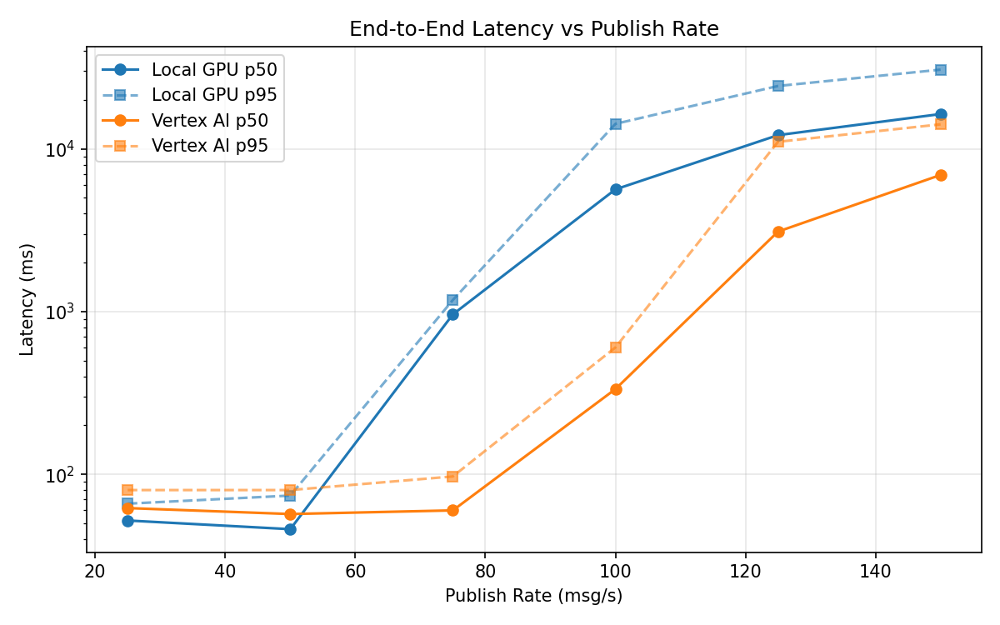
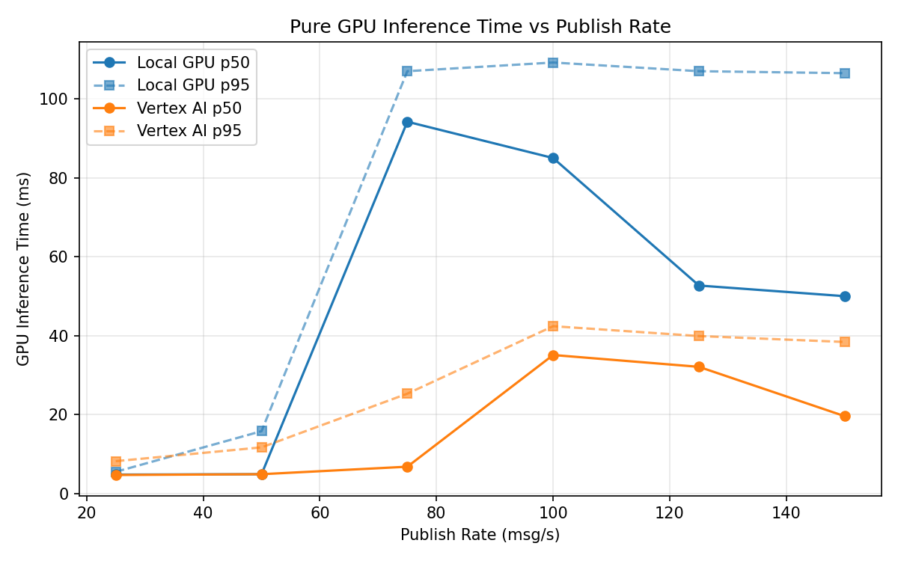
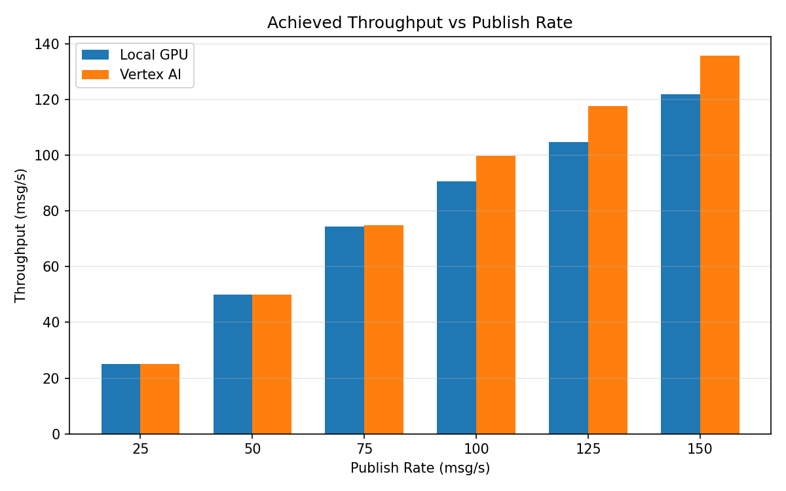

# Benchmark Report

Generated: 2026-03-07 21:50:06

## Configuration

| Parameter | Value |
|---|---|
| Messages per phase | 100s per phase |
| Rates (msg/s) | 25, 50, 75, 100, 125, 150 |
| Experiments | Local GPU, Vertex AI |

## Throughput

| Rate (msg/s) | Local GPU | Vertex AI |
|---|---|---|
| 25 | 25.0 | 25.0 |
| 50 | 50.0 | 50.0 |
| 75 | 74.4 | 75.0 |
| 100 | 90.7 | 99.7 |
| 125 | 104.8 | 117.6 |
| 150 | 121.8 | 135.8 |

## End-to-End Latency (ms)

| Rate | Percentile | Local GPU | Vertex AI |
|---|---|---|---|
| 25 | p50 | 52.0 | 62.0 |
| 25 | p95 | 66.0 | 80.0 |
| 25 | p99 | 228.1 | 296.4 |
| 50 | p50 | 46.0 | 57.0 |
| 50 | p95 | 74.0 | 80.0 |
| 50 | p99 | 367.1 | 162.0 |
| 75 | p50 | 961.0 | 60.0 |
| 75 | p95 | 1178.0 | 97.0 |
| 75 | p99 | 1408.0 | 358.0 |
| 100 | p50 | 5636.0 | 334.0 |
| 100 | p95 | 14239.0 | 602.0 |
| 100 | p99 | 14798.0 | 730.0 |
| 125 | p50 | 12139.5 | 3101.0 |
| 125 | p95 | 24335.1 | 11047.5 |
| 125 | p99 | 26787.0 | 34549.6 |
| 150 | p50 | 16362.0 | 6911.0 |
| 150 | p95 | 30665.2 | 14144.0 |
| 150 | p99 | 32252.0 | 15272.0 |

## GPU Inference Time (ms)

| Rate | Percentile | Local GPU | Vertex AI |
|---|---|---|---|
| 25 | p50 | 4.8 | 4.7 |
| 25 | p95 | 5.5 | 8.2 |
| 25 | p99 | 72.8 | 11.9 |
| 50 | p50 | 4.9 | 4.9 |
| 50 | p95 | 15.8 | 11.7 |
| 50 | p99 | 89.7 | 23.4 |
| 75 | p50 | 94.2 | 6.8 |
| 75 | p95 | 107.0 | 25.3 |
| 75 | p99 | 113.5 | 36.8 |
| 100 | p50 | 85.0 | 35.1 |
| 100 | p95 | 109.2 | 42.4 |
| 100 | p99 | 116.8 | 52.3 |
| 125 | p50 | 52.7 | 32.1 |
| 125 | p95 | 107.0 | 39.9 |
| 125 | p99 | 114.5 | 49.1 |
| 150 | p50 | 50.0 | 19.6 |
| 150 | p95 | 106.5 | 38.4 |
| 150 | p99 | 114.9 | 47.7 |

## Charts

### Latency vs Publish Rate

### GPU Inference Time vs Publish Rate

### Throughput vs Publish Rate

