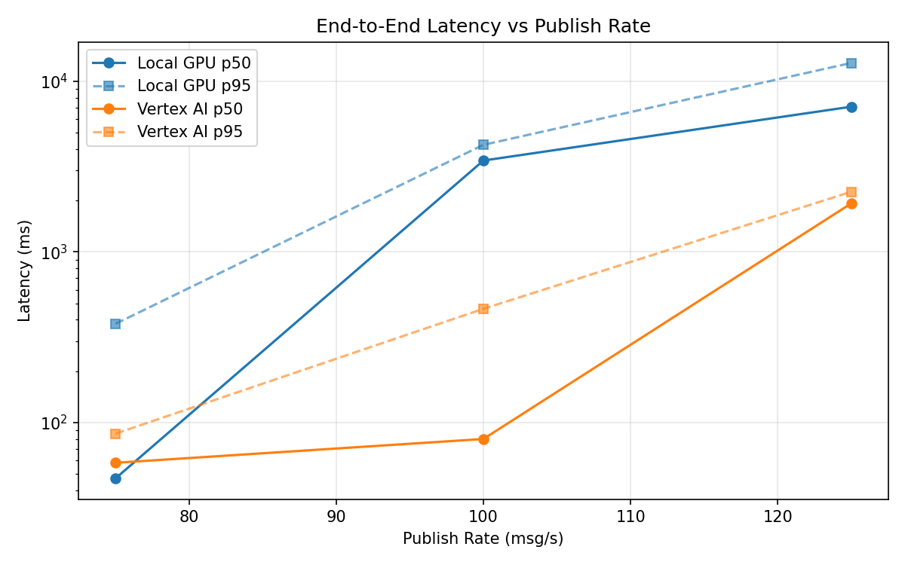
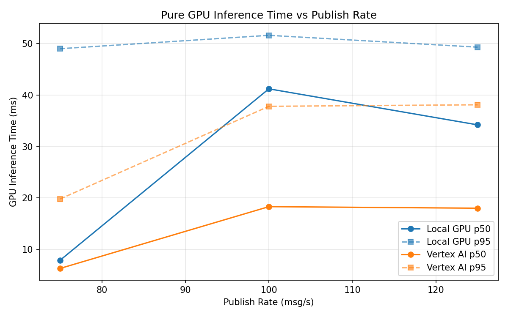
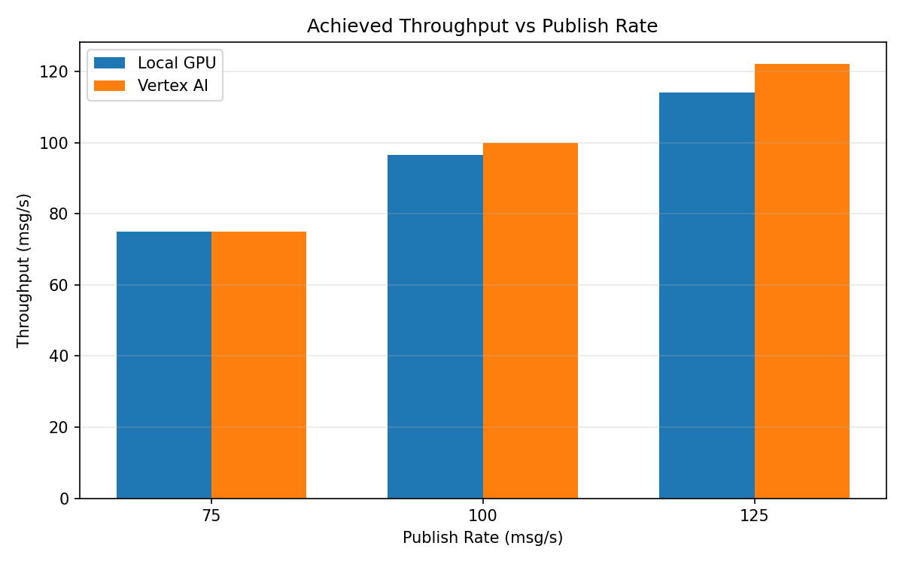

# Benchmark Report

Generated: 2026-03-07 23:27:08

## Configuration

| Parameter | Value |
|---|---|
| Messages per phase | 100s per phase |
| Rates (msg/s) | 75, 100, 125 |
| Experiments | Local GPU, Vertex AI |

## Throughput

| Rate (msg/s) | Local GPU | Vertex AI |
|---|---|---|
| 75 | 75.0 | 75.0 |
| 100 | 96.6 | 99.9 |
| 125 | 114.2 | 122.2 |

## End-to-End Latency (ms)

| Rate | Percentile | Local GPU | Vertex AI |
|---|---|---|---|
| 75 | p50 | 47.0 | 58.0 |
| 75 | p95 | 379.0 | 86.0 |
| 75 | p99 | 715.0 | 156.0 |
| 100 | p50 | 3434.5 | 80.0 |
| 100 | p95 | 4247.0 | 464.1 |
| 100 | p99 | 4307.0 | 777.0 |
| 125 | p50 | 7105.5 | 1926.0 |
| 125 | p95 | 12827.0 | 2253.0 |
| 125 | p99 | 13314.0 | 2317.0 |

## GPU Inference Time (ms)

| Rate | Percentile | Local GPU | Vertex AI |
|---|---|---|---|
| 75 | p50 | 7.9 | 6.3 |
| 75 | p95 | 49.0 | 19.8 |
| 75 | p99 | 53.9 | 33.9 |
| 100 | p50 | 41.2 | 18.3 |
| 100 | p95 | 51.6 | 37.8 |
| 100 | p99 | 55.3 | 46.0 |
| 125 | p50 | 34.2 | 18.0 |
| 125 | p95 | 49.3 | 38.1 |
| 125 | p99 | 53.2 | 48.2 |

## Charts

### Latency vs Publish Rate

### GPU Inference Time vs Publish Rate

### Throughput vs Publish Rate

