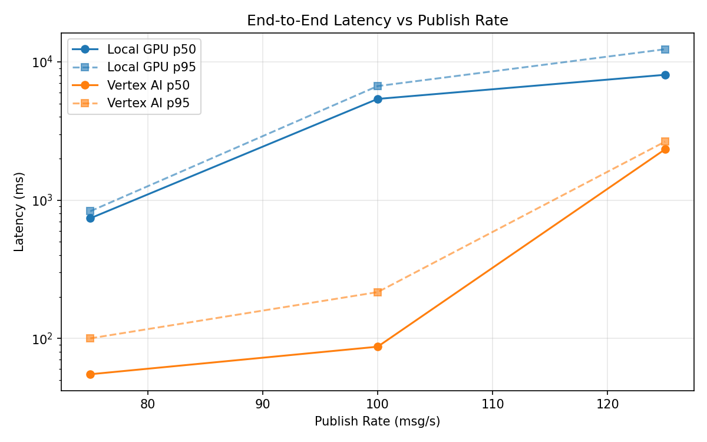
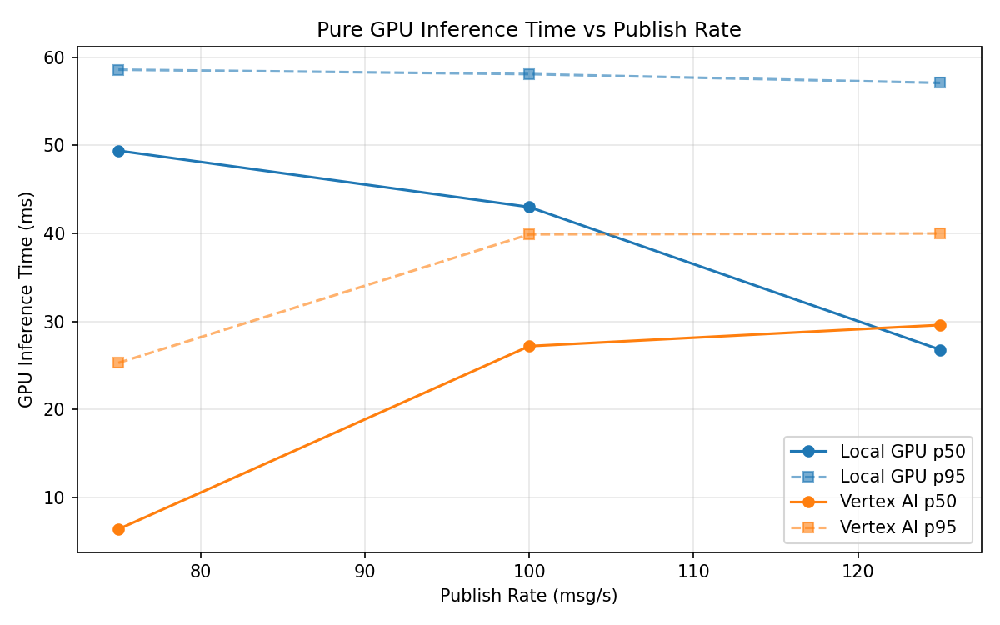
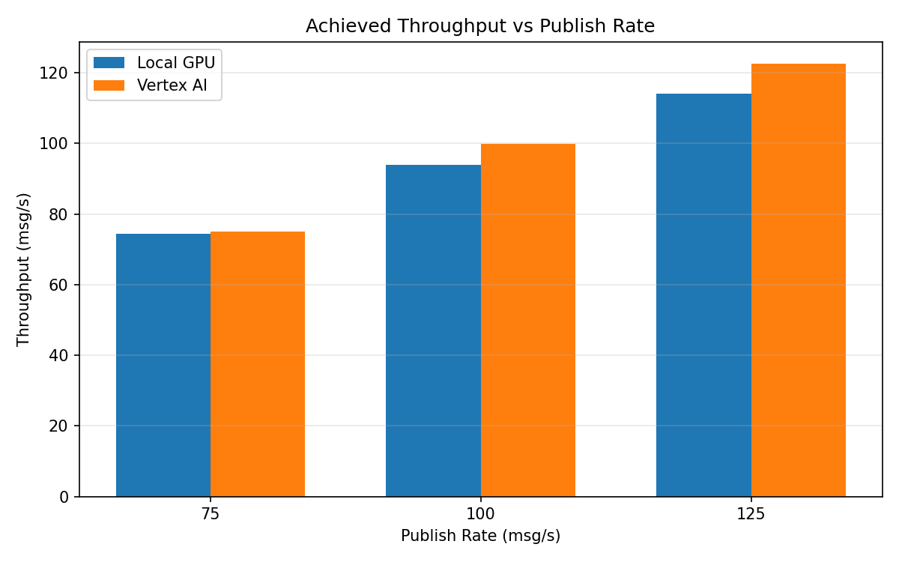

# Benchmark Report

Generated: 2026-03-07 23:39:57

## Configuration

| Parameter | Value |
|---|---|
| Messages per phase | 100s per phase |
| Rates (msg/s) | 75, 100, 125 |
| Experiments | Local GPU, Vertex AI |

## Throughput

| Rate (msg/s) | Local GPU | Vertex AI |
|---|---|---|
| 75 | 74.4 | 75.0 |
| 100 | 94.0 | 99.9 |
| 125 | 114.0 | 122.6 |

## End-to-End Latency (ms)

| Rate | Percentile | Local GPU | Vertex AI |
|---|---|---|---|
| 75 | p50 | 739.0 | 55.0 |
| 75 | p95 | 831.0 | 100.0 |
| 75 | p99 | 871.0 | 492.0 |
| 100 | p50 | 5399.0 | 87.0 |
| 100 | p95 | 6687.0 | 216.0 |
| 100 | p99 | 6764.0 | 292.0 |
| 125 | p50 | 8069.0 | 2330.0 |
| 125 | p95 | 12350.0 | 2649.0 |
| 125 | p99 | 12600.0 | 2709.0 |

## GPU Inference Time (ms)

| Rate | Percentile | Local GPU | Vertex AI |
|---|---|---|---|
| 75 | p50 | 49.4 | 6.4 |
| 75 | p95 | 58.6 | 25.3 |
| 75 | p99 | 63.0 | 38.8 |
| 100 | p50 | 43.0 | 27.2 |
| 100 | p95 | 58.1 | 39.9 |
| 100 | p99 | 62.7 | 50.3 |
| 125 | p50 | 26.8 | 29.6 |
| 125 | p95 | 57.1 | 40.0 |
| 125 | p99 | 62.2 | 49.7 |

## Charts

### Latency vs Publish Rate

### GPU Inference Time vs Publish Rate

### Throughput vs Publish Rate

