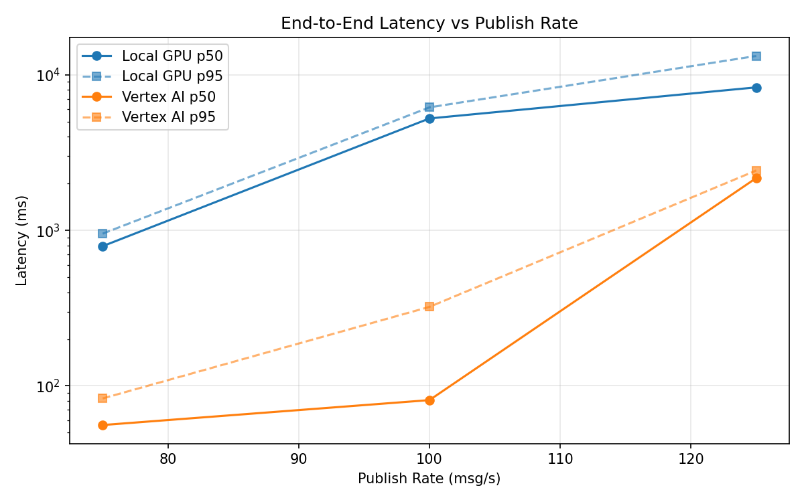
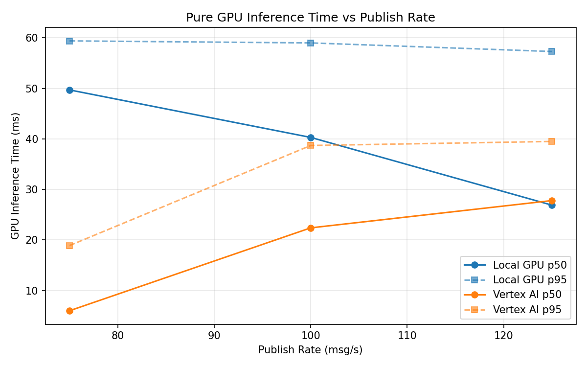
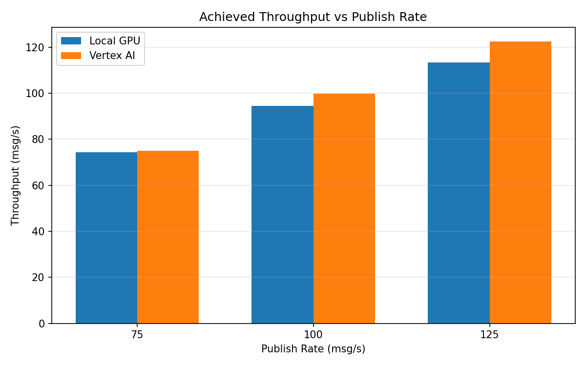

# Benchmark Report

Generated: 2026-03-07 23:52:47

## Configuration

| Parameter | Value |
|---|---|
| Messages per phase | 100s per phase |
| Rates (msg/s) | 75, 100, 125 |
| Experiments | Local GPU, Vertex AI |

## Throughput

| Rate (msg/s) | Local GPU | Vertex AI |
|---|---|---|
| 75 | 74.4 | 75.0 |
| 100 | 94.5 | 99.8 |
| 125 | 113.3 | 122.5 |

## End-to-End Latency (ms)

| Rate | Percentile | Local GPU | Vertex AI |
|---|---|---|---|
| 75 | p50 | 791.0 | 56.0 |
| 75 | p95 | 952.0 | 83.0 |
| 75 | p99 | 989.0 | 152.0 |
| 100 | p50 | 5241.0 | 81.0 |
| 100 | p95 | 6175.0 | 322.0 |
| 100 | p99 | 6339.0 | 419.0 |
| 125 | p50 | 8304.5 | 2169.0 |
| 125 | p95 | 13222.0 | 2425.0 |
| 125 | p99 | 13791.0 | 2493.0 |

## GPU Inference Time (ms)

| Rate | Percentile | Local GPU | Vertex AI |
|---|---|---|---|
| 75 | p50 | 49.7 | 6.0 |
| 75 | p95 | 59.4 | 18.9 |
| 75 | p99 | 63.6 | 34.8 |
| 100 | p50 | 40.3 | 22.4 |
| 100 | p95 | 59.0 | 38.7 |
| 100 | p99 | 63.2 | 48.8 |
| 125 | p50 | 26.9 | 27.8 |
| 125 | p95 | 57.3 | 39.5 |
| 125 | p99 | 63.0 | 49.9 |

## Charts

### Latency vs Publish Rate

### GPU Inference Time vs Publish Rate

### Throughput vs Publish Rate

