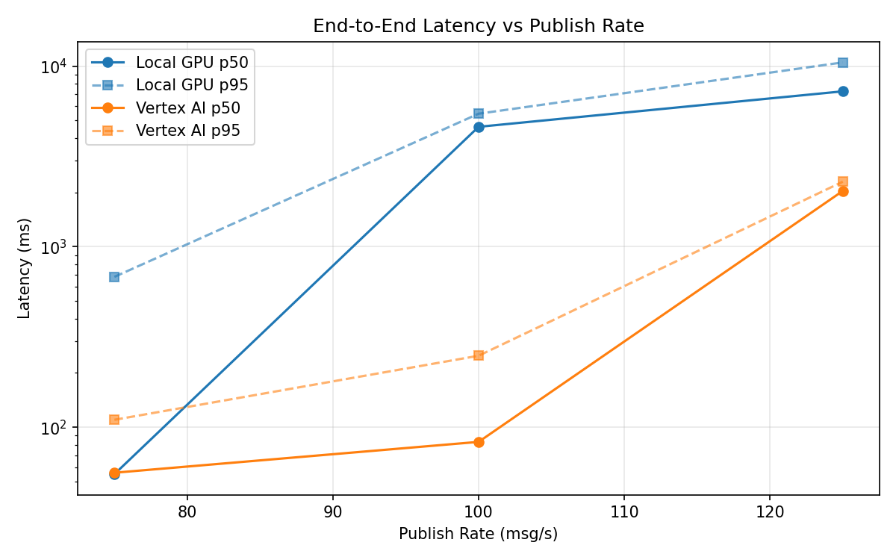
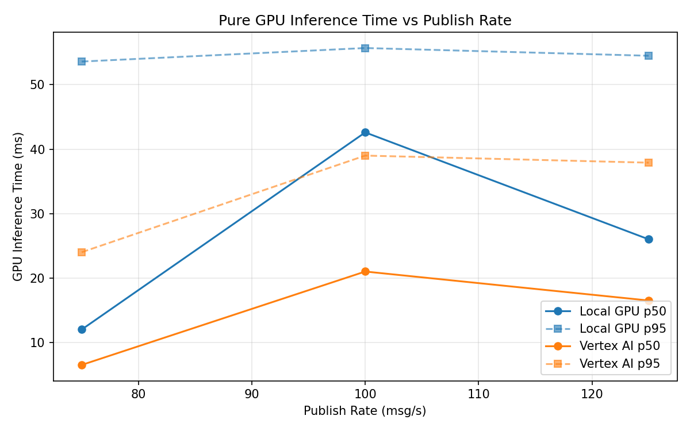
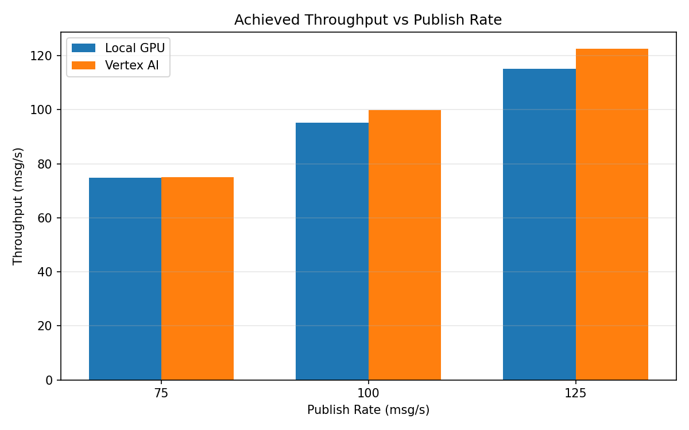

# Benchmark Report

Generated: 2026-03-08 00:05:51

## Configuration

| Parameter | Value |
|---|---|
| Messages per phase | 100s per phase |
| Rates (msg/s) | 75, 100, 125 |
| Experiments | Local GPU, Vertex AI |

## Throughput

| Rate (msg/s) | Local GPU | Vertex AI |
|---|---|---|
| 75 | 74.8 | 75.0 |
| 100 | 95.2 | 99.9 |
| 125 | 115.1 | 122.6 |

## End-to-End Latency (ms)

| Rate | Percentile | Local GPU | Vertex AI |
|---|---|---|---|
| 75 | p50 | 55.0 | 56.0 |
| 75 | p95 | 681.0 | 110.0 |
| 75 | p99 | 893.0 | 1131.0 |
| 100 | p50 | 4616.0 | 83.0 |
| 100 | p95 | 5456.0 | 249.0 |
| 100 | p99 | 5571.0 | 410.0 |
| 125 | p50 | 7257.0 | 2037.0 |
| 125 | p95 | 10497.0 | 2292.0 |
| 125 | p99 | 10764.0 | 2412.0 |

## GPU Inference Time (ms)

| Rate | Percentile | Local GPU | Vertex AI |
|---|---|---|---|
| 75 | p50 | 12.0 | 6.5 |
| 75 | p95 | 53.6 | 24.0 |
| 75 | p99 | 58.3 | 36.6 |
| 100 | p50 | 42.6 | 21.0 |
| 100 | p95 | 55.7 | 39.0 |
| 100 | p99 | 60.5 | 48.3 |
| 125 | p50 | 26.0 | 16.5 |
| 125 | p95 | 54.5 | 37.9 |
| 125 | p99 | 59.6 | 45.7 |

## Charts

### Latency vs Publish Rate

### GPU Inference Time vs Publish Rate

### Throughput vs Publish Rate

