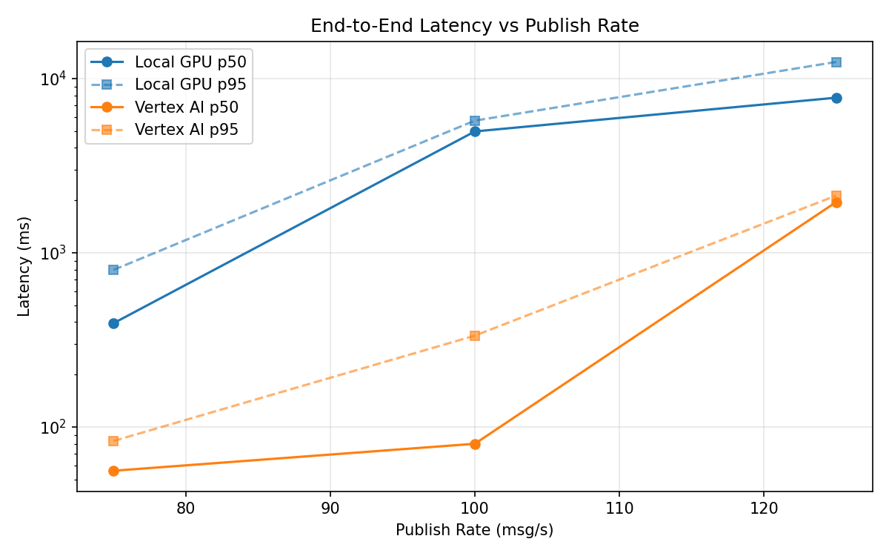
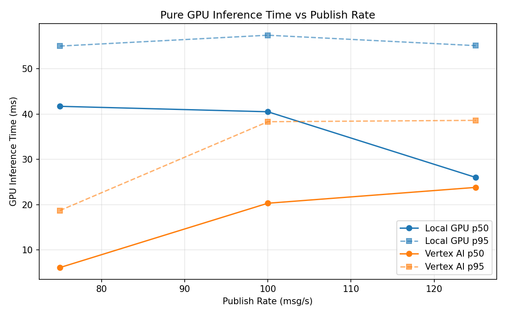
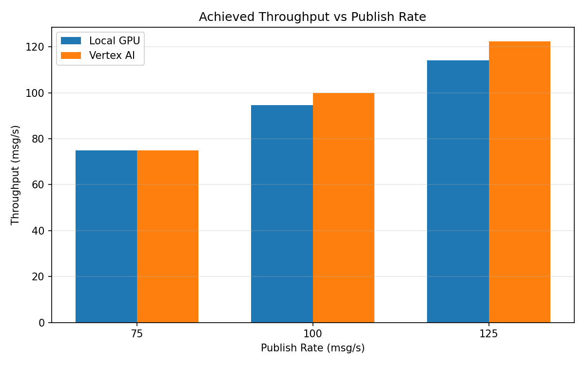

# Benchmark Report

Generated: 2026-03-08 00:19:37

## Configuration

| Parameter | Value |
|---|---|
| Messages per phase | 100s per phase |
| Rates (msg/s) | 75, 100, 125 |
| Experiments | Local GPU, Vertex AI |

## Throughput

| Rate (msg/s) | Local GPU | Vertex AI |
|---|---|---|
| 75 | 75.0 | 75.0 |
| 100 | 94.6 | 99.9 |
| 125 | 114.1 | 122.4 |

## End-to-End Latency (ms)

| Rate | Percentile | Local GPU | Vertex AI |
|---|---|---|---|
| 75 | p50 | 393.5 | 56.0 |
| 75 | p95 | 796.0 | 83.0 |
| 75 | p99 | 828.0 | 250.1 |
| 100 | p50 | 4963.0 | 80.0 |
| 100 | p95 | 5725.0 | 334.0 |
| 100 | p99 | 5815.0 | 505.0 |
| 125 | p50 | 7750.0 | 1952.0 |
| 125 | p95 | 12430.0 | 2126.0 |
| 125 | p99 | 12553.0 | 2174.0 |

## GPU Inference Time (ms)

| Rate | Percentile | Local GPU | Vertex AI |
|---|---|---|---|
| 75 | p50 | 41.7 | 6.1 |
| 75 | p95 | 55.0 | 18.7 |
| 75 | p99 | 59.0 | 34.0 |
| 100 | p50 | 40.5 | 20.3 |
| 100 | p95 | 57.4 | 38.3 |
| 100 | p99 | 62.0 | 47.7 |
| 125 | p50 | 26.0 | 23.8 |
| 125 | p95 | 55.1 | 38.6 |
| 125 | p99 | 60.1 | 48.3 |

## Charts

### Latency vs Publish Rate

### GPU Inference Time vs Publish Rate

### Throughput vs Publish Rate

