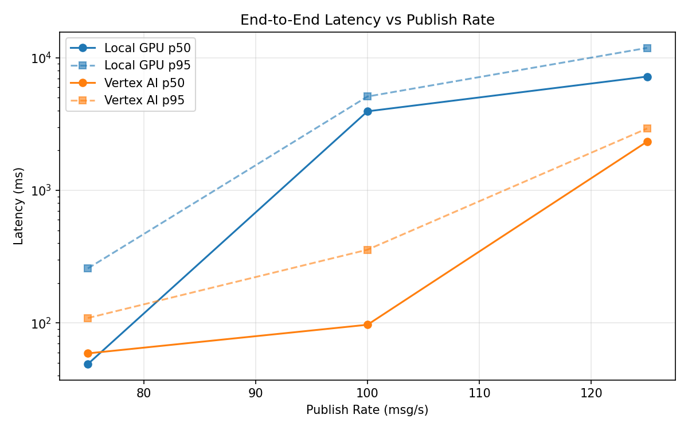
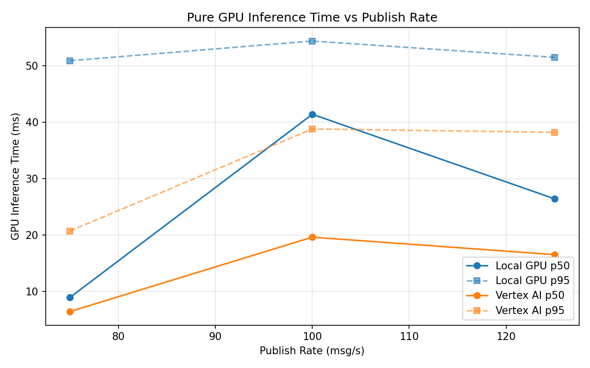
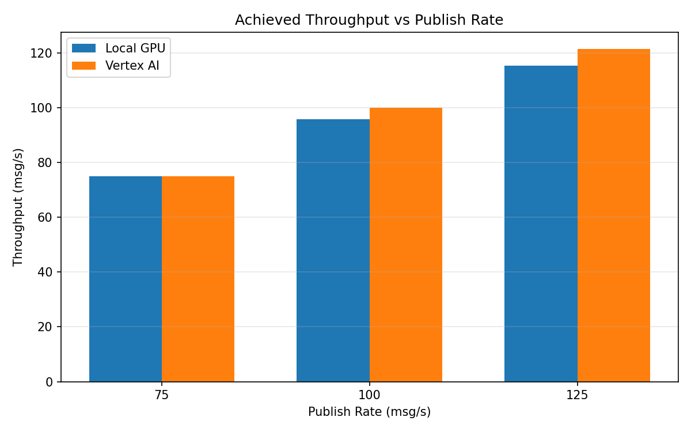

# Benchmark Report

Generated: 2026-03-07 23:01:02

## Configuration

| Parameter | Value |
|---|---|
| Messages per phase | 100s per phase |
| Rates (msg/s) | 75, 100, 125 |
| Experiments | Local GPU, Vertex AI |

## Throughput

| Rate (msg/s) | Local GPU | Vertex AI |
|---|---|---|
| 75 | 75.0 | 75.0 |
| 100 | 95.8 | 100.0 |
| 125 | 115.2 | 121.4 |

## End-to-End Latency (ms)

| Rate | Percentile | Local GPU | Vertex AI |
|---|---|---|---|
| 75 | p50 | 49.0 | 59.0 |
| 75 | p95 | 258.0 | 109.0 |
| 75 | p99 | 379.0 | 503.0 |
| 100 | p50 | 3948.0 | 97.0 |
| 100 | p95 | 5105.0 | 357.0 |
| 100 | p99 | 5176.0 | 599.0 |
| 125 | p50 | 7216.5 | 2333.0 |
| 125 | p95 | 11872.0 | 2930.0 |
| 125 | p99 | 12268.0 | 3001.0 |

## GPU Inference Time (ms)

| Rate | Percentile | Local GPU | Vertex AI |
|---|---|---|---|
| 75 | p50 | 8.9 | 6.4 |
| 75 | p95 | 50.9 | 20.7 |
| 75 | p99 | 55.3 | 34.3 |
| 100 | p50 | 41.4 | 19.6 |
| 100 | p95 | 54.4 | 38.8 |
| 100 | p99 | 59.0 | 48.1 |
| 125 | p50 | 26.4 | 16.5 |
| 125 | p95 | 51.5 | 38.2 |
| 125 | p99 | 56.0 | 47.4 |

## Charts

### Latency vs Publish Rate

### GPU Inference Time vs Publish Rate

### Throughput vs Publish Rate

