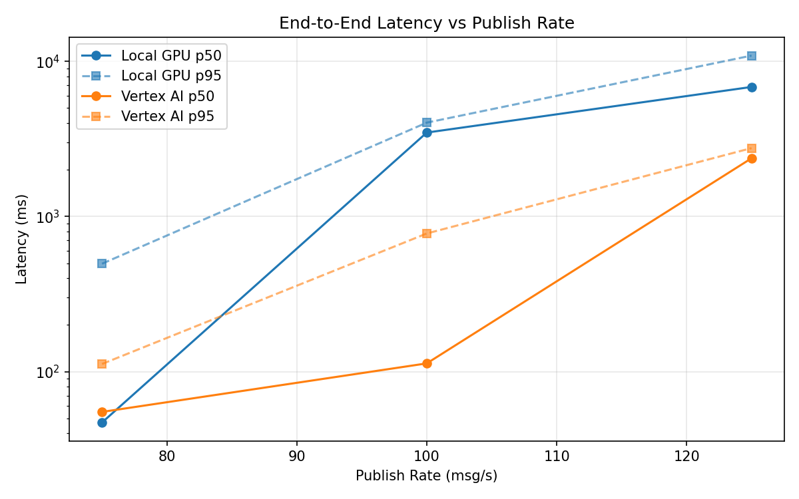
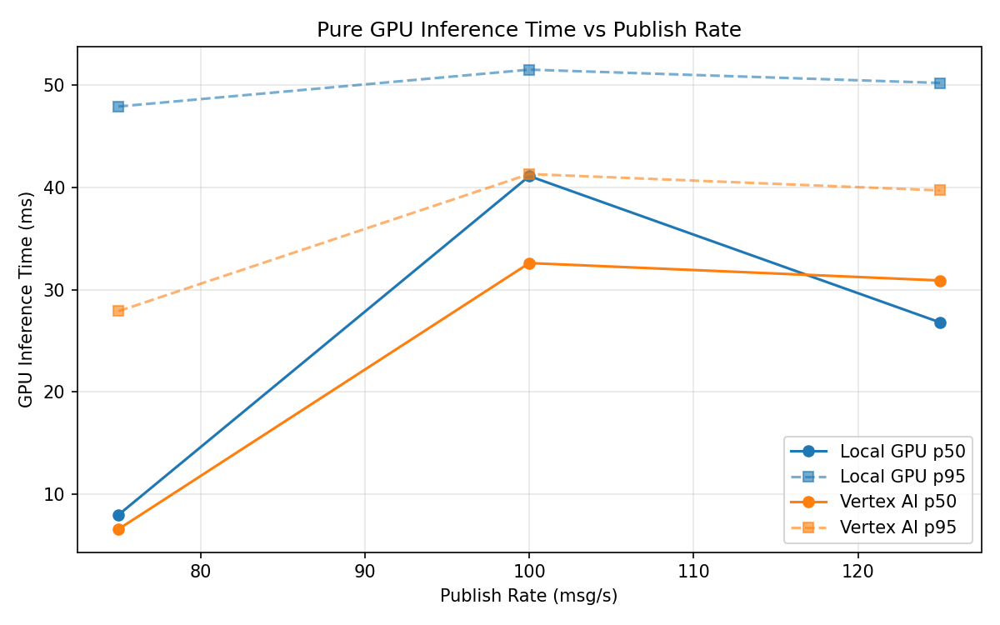
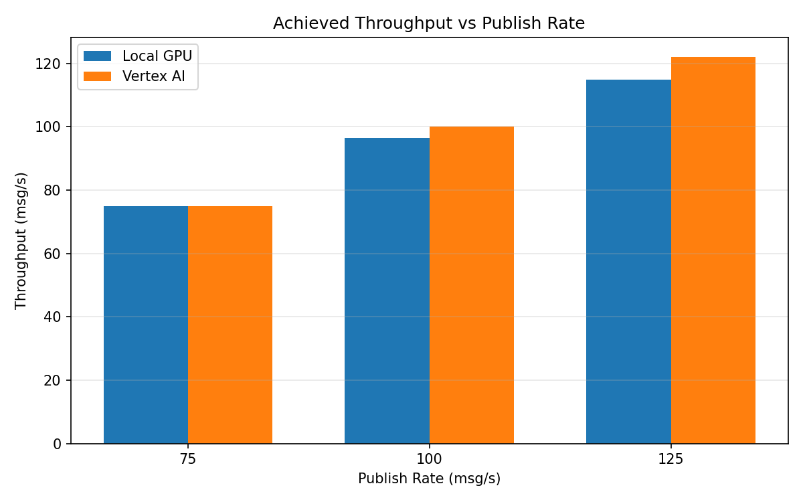

# Benchmark Report

Generated: 2026-03-07 23:14:16

## Configuration

| Parameter | Value |
|---|---|
| Messages per phase | 100s per phase |
| Rates (msg/s) | 75, 100, 125 |
| Experiments | Local GPU, Vertex AI |

## Throughput

| Rate (msg/s) | Local GPU | Vertex AI |
|---|---|---|
| 75 | 75.0 | 75.0 |
| 100 | 96.5 | 100.0 |
| 125 | 114.9 | 122.1 |

## End-to-End Latency (ms)

| Rate | Percentile | Local GPU | Vertex AI |
|---|---|---|---|
| 75 | p50 | 47.0 | 55.0 |
| 75 | p95 | 496.1 | 112.0 |
| 75 | p99 | 826.0 | 1010.0 |
| 100 | p50 | 3475.0 | 113.0 |
| 100 | p95 | 4027.0 | 777.0 |
| 100 | p99 | 4085.0 | 931.0 |
| 125 | p50 | 6839.0 | 2373.0 |
| 125 | p95 | 10890.0 | 2759.0 |
| 125 | p99 | 11064.0 | 2854.0 |

## GPU Inference Time (ms)

| Rate | Percentile | Local GPU | Vertex AI |
|---|---|---|---|
| 75 | p50 | 8.0 | 6.6 |
| 75 | p95 | 47.9 | 27.9 |
| 75 | p99 | 52.7 | 38.0 |
| 100 | p50 | 41.1 | 32.6 |
| 100 | p95 | 51.5 | 41.3 |
| 100 | p99 | 55.3 | 50.4 |
| 125 | p50 | 26.8 | 30.9 |
| 125 | p95 | 50.2 | 39.7 |
| 125 | p99 | 54.3 | 48.8 |

## Charts

### Latency vs Publish Rate

### GPU Inference Time vs Publish Rate

### Throughput vs Publish Rate

