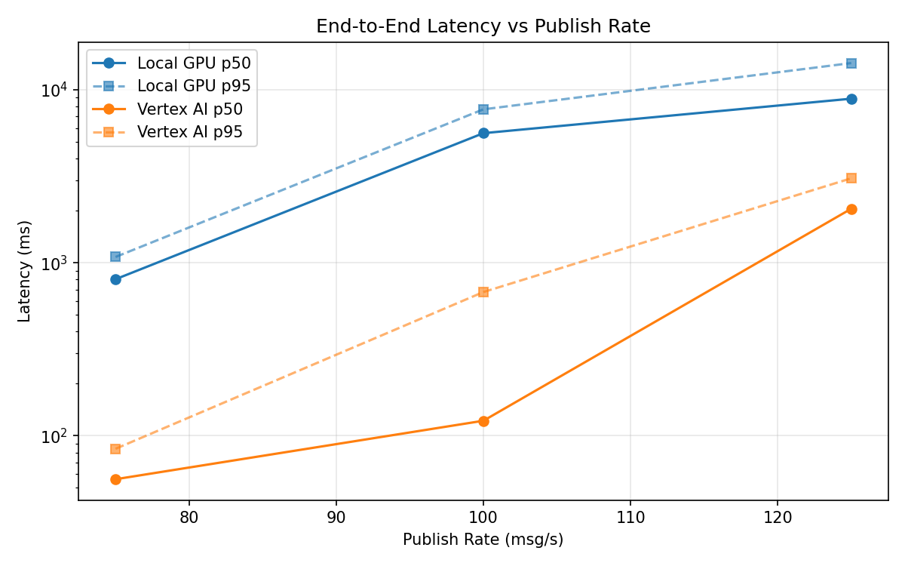
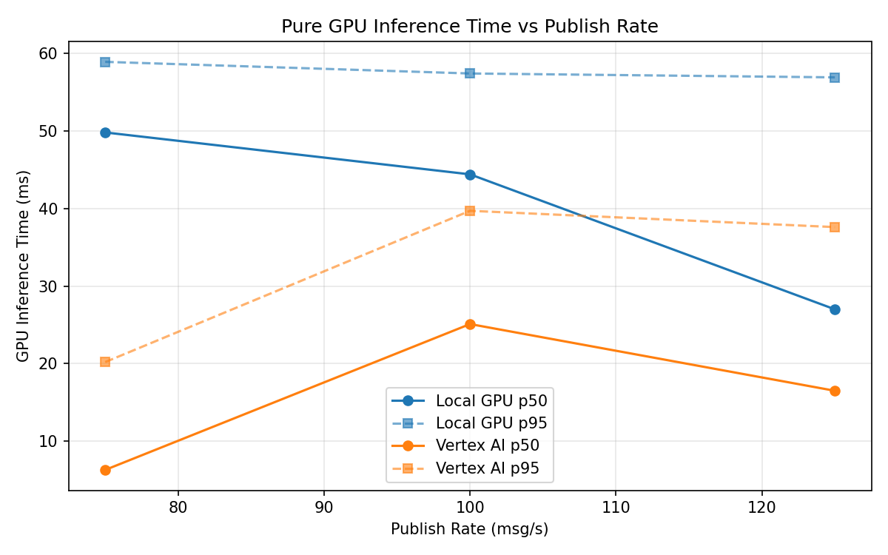
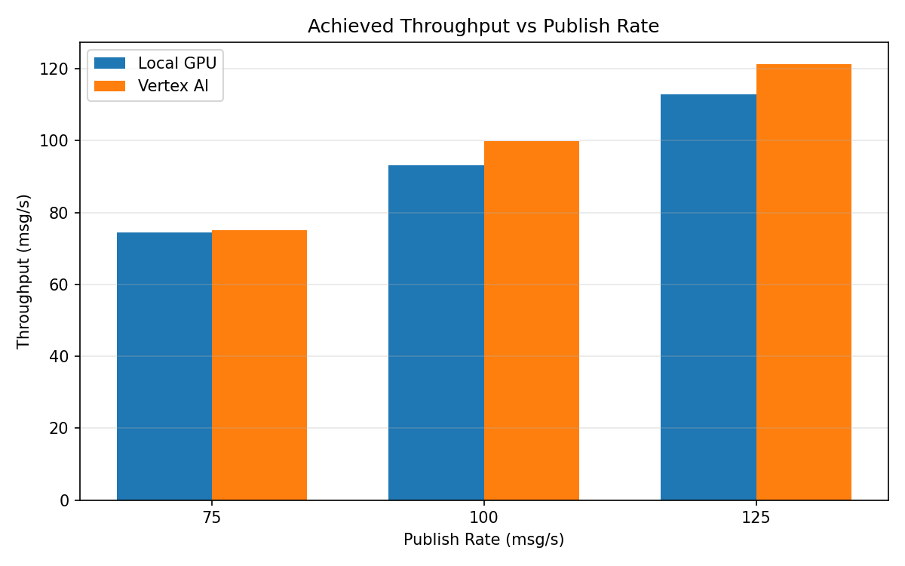

# Benchmark Report

Generated: 2026-03-08 00:33:09

## Configuration

| Parameter | Value |
|---|---|
| Messages per phase | 100s per phase |
| Rates (msg/s) | 75, 100, 125 |
| Experiments | Local GPU, Vertex AI |

## Throughput

| Rate (msg/s) | Local GPU | Vertex AI |
|---|---|---|
| 75 | 74.5 | 75.0 |
| 100 | 93.2 | 99.9 |
| 125 | 112.9 | 121.3 |

## End-to-End Latency (ms)

| Rate | Percentile | Local GPU | Vertex AI |
|---|---|---|---|
| 75 | p50 | 803.0 | 56.0 |
| 75 | p95 | 1080.0 | 84.0 |
| 75 | p99 | 1118.0 | 276.1 |
| 100 | p50 | 5613.0 | 122.0 |
| 100 | p95 | 7710.0 | 677.0 |
| 100 | p99 | 7944.0 | 899.0 |
| 125 | p50 | 8883.5 | 2052.0 |
| 125 | p95 | 14274.0 | 3078.0 |
| 125 | p99 | 14940.0 | 3232.0 |

## GPU Inference Time (ms)

| Rate | Percentile | Local GPU | Vertex AI |
|---|---|---|---|
| 75 | p50 | 49.8 | 6.3 |
| 75 | p95 | 58.9 | 20.2 |
| 75 | p99 | 63.0 | 34.2 |
| 100 | p50 | 44.4 | 25.1 |
| 100 | p95 | 57.4 | 39.7 |
| 100 | p99 | 62.0 | 49.4 |
| 125 | p50 | 27.0 | 16.5 |
| 125 | p95 | 56.9 | 37.6 |
| 125 | p99 | 62.3 | 47.2 |

## Charts

### Latency vs Publish Rate

### GPU Inference Time vs Publish Rate

### Throughput vs Publish Rate

