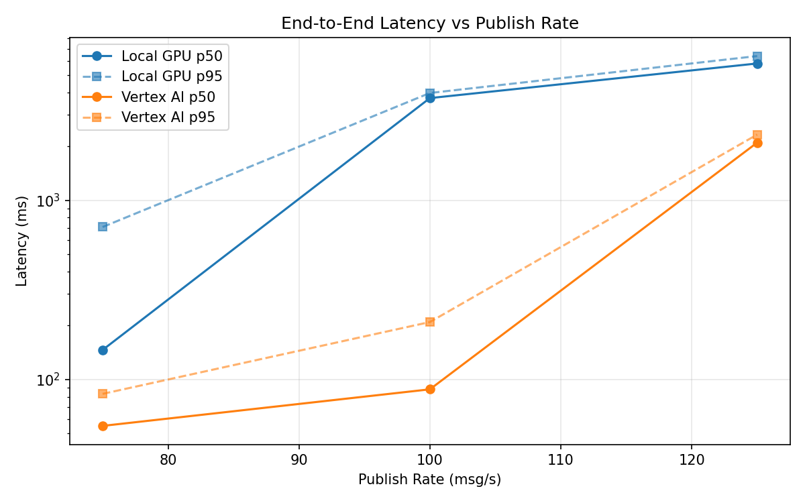
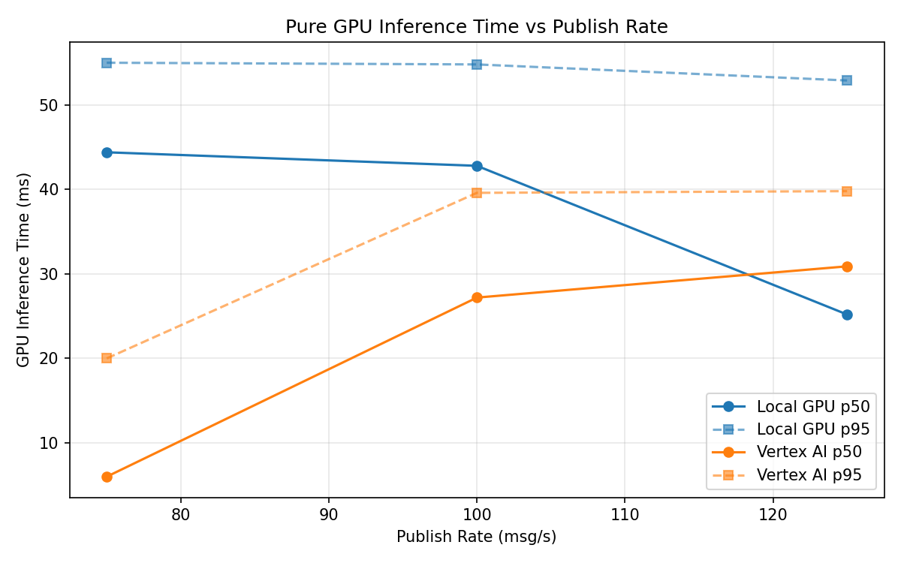
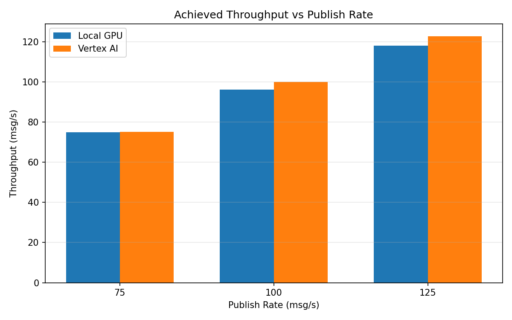

# Benchmark Report

Generated: 2026-03-08 01:11:58

## Configuration

| Parameter | Value |
|---|---|
| Messages per phase | 100s per phase |
| Rates (msg/s) | 75, 100, 125 |
| Experiments | Local GPU, Vertex AI |

## Throughput

| Rate (msg/s) | Local GPU | Vertex AI |
|---|---|---|
| 75 | 74.8 | 75.0 |
| 100 | 96.2 | 99.9 |
| 125 | 117.9 | 122.7 |

## End-to-End Latency (ms)

| Rate | Percentile | Local GPU | Vertex AI |
|---|---|---|---|
| 75 | p50 | 146.0 | 55.0 |
| 75 | p95 | 709.0 | 83.0 |
| 75 | p99 | 883.0 | 389.1 |
| 100 | p50 | 3719.0 | 88.0 |
| 100 | p95 | 3971.0 | 209.0 |
| 100 | p99 | 4046.0 | 262.0 |
| 125 | p50 | 5804.0 | 2098.0 |
| 125 | p95 | 6385.0 | 2327.0 |
| 125 | p99 | 6499.0 | 2393.0 |

## GPU Inference Time (ms)

| Rate | Percentile | Local GPU | Vertex AI |
|---|---|---|---|
| 75 | p50 | 44.4 | 6.0 |
| 75 | p95 | 55.0 | 20.0 |
| 75 | p99 | 59.1 | 36.0 |
| 100 | p50 | 42.8 | 27.2 |
| 100 | p95 | 54.8 | 39.6 |
| 100 | p99 | 59.0 | 49.0 |
| 125 | p50 | 25.2 | 30.9 |
| 125 | p95 | 52.9 | 39.8 |
| 125 | p99 | 57.3 | 48.7 |

## Charts

### Latency vs Publish Rate

### GPU Inference Time vs Publish Rate

### Throughput vs Publish Rate

