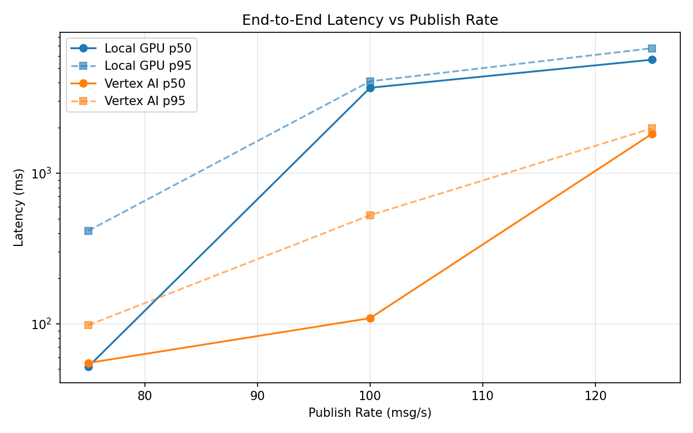
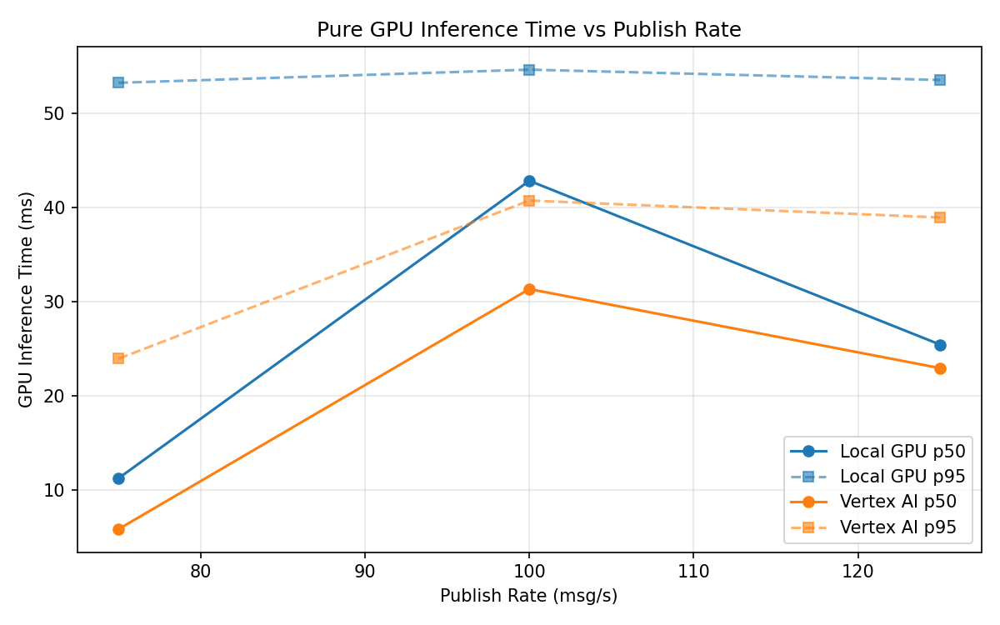
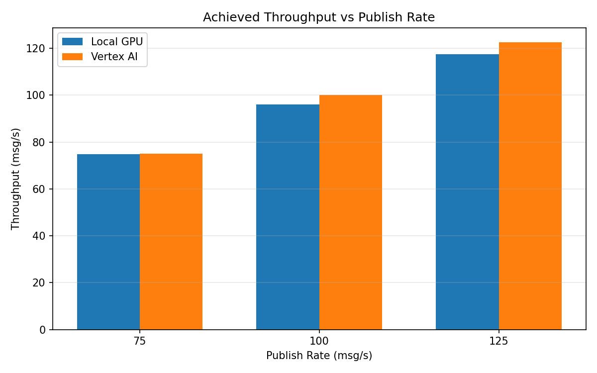

# Benchmark Report

Generated: 2026-03-08 01:24:37

## Configuration

| Parameter | Value |
|---|---|
| Messages per phase | 100s per phase |
| Rates (msg/s) | 75, 100, 125 |
| Experiments | Local GPU, Vertex AI |

## Throughput

| Rate (msg/s) | Local GPU | Vertex AI |
|---|---|---|
| 75 | 74.8 | 75.0 |
| 100 | 96.1 | 100.0 |
| 125 | 117.5 | 122.6 |

## End-to-End Latency (ms)

| Rate | Percentile | Local GPU | Vertex AI |
|---|---|---|---|
| 75 | p50 | 52.0 | 55.0 |
| 75 | p95 | 415.1 | 98.0 |
| 75 | p99 | 643.0 | 670.0 |
| 100 | p50 | 3690.5 | 109.0 |
| 100 | p95 | 4072.0 | 526.0 |
| 100 | p99 | 4141.0 | 646.0 |
| 125 | p50 | 5663.0 | 1821.0 |
| 125 | p95 | 6749.0 | 1982.0 |
| 125 | p99 | 6874.0 | 2078.0 |

## GPU Inference Time (ms)

| Rate | Percentile | Local GPU | Vertex AI |
|---|---|---|---|
| 75 | p50 | 11.2 | 5.8 |
| 75 | p95 | 53.2 | 23.9 |
| 75 | p99 | 57.9 | 36.4 |
| 100 | p50 | 42.8 | 31.3 |
| 100 | p95 | 54.6 | 40.7 |
| 100 | p99 | 58.5 | 51.3 |
| 125 | p50 | 25.4 | 22.9 |
| 125 | p95 | 53.5 | 38.9 |
| 125 | p99 | 58.0 | 48.2 |

## Charts

### Latency vs Publish Rate

### GPU Inference Time vs Publish Rate

### Throughput vs Publish Rate

