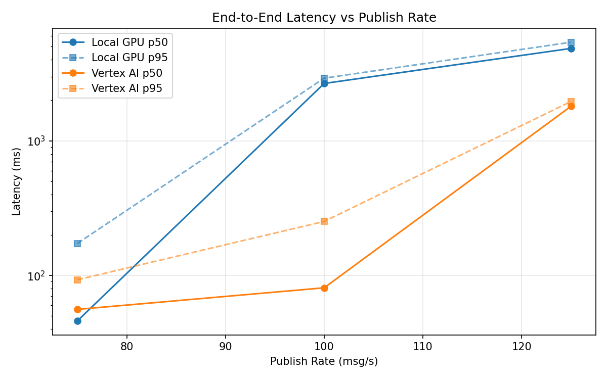
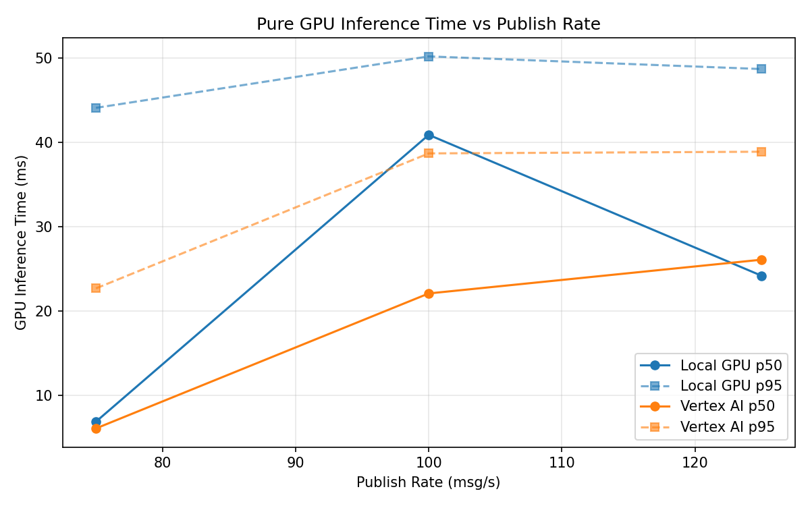
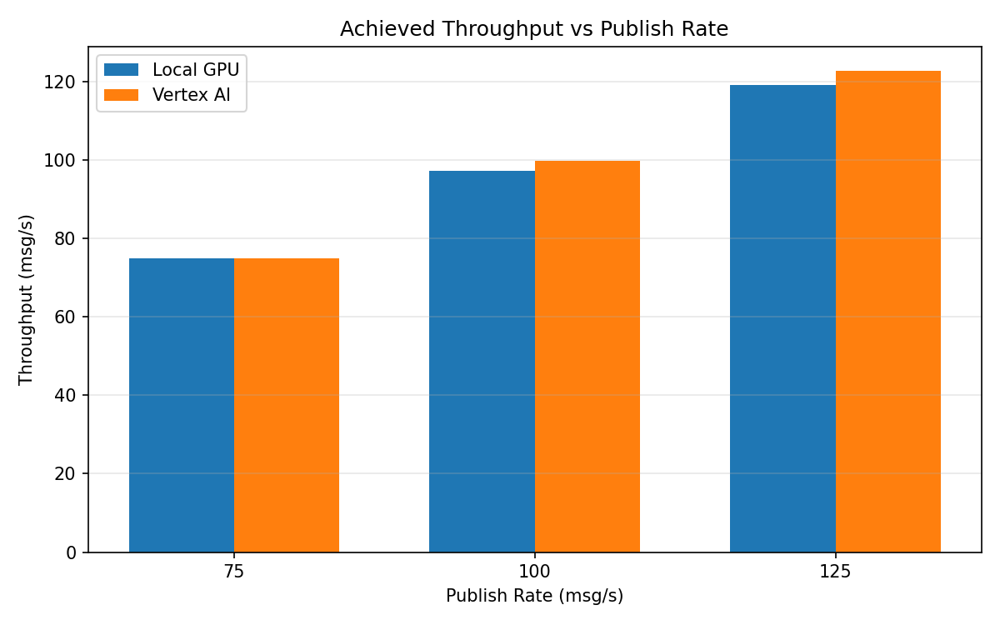

# Benchmark Report

Generated: 2026-03-08 00:45:45

## Configuration

| Parameter | Value |
|---|---|
| Messages per phase | 100s per phase |
| Rates (msg/s) | 75, 100, 125 |
| Experiments | Local GPU, Vertex AI |

## Throughput

| Rate (msg/s) | Local GPU | Vertex AI |
|---|---|---|
| 75 | 75.0 | 75.0 |
| 100 | 97.2 | 99.9 |
| 125 | 119.2 | 122.8 |

## End-to-End Latency (ms)

| Rate | Percentile | Local GPU | Vertex AI |
|---|---|---|---|
| 75 | p50 | 46.0 | 56.0 |
| 75 | p95 | 173.0 | 93.0 |
| 75 | p99 | 316.0 | 623.0 |
| 100 | p50 | 2667.0 | 81.0 |
| 100 | p95 | 2920.0 | 252.0 |
| 100 | p99 | 2975.0 | 422.0 |
| 125 | p50 | 4856.0 | 1804.0 |
| 125 | p95 | 5398.0 | 1959.0 |
| 125 | p99 | 5464.0 | 2000.0 |

## GPU Inference Time (ms)

| Rate | Percentile | Local GPU | Vertex AI |
|---|---|---|---|
| 75 | p50 | 6.9 | 6.1 |
| 75 | p95 | 44.1 | 22.7 |
| 75 | p99 | 50.4 | 35.9 |
| 100 | p50 | 40.9 | 22.1 |
| 100 | p95 | 50.2 | 38.7 |
| 100 | p99 | 53.7 | 49.2 |
| 125 | p50 | 24.2 | 26.1 |
| 125 | p95 | 48.7 | 38.9 |
| 125 | p99 | 52.4 | 48.3 |

## Charts

### Latency vs Publish Rate

### GPU Inference Time vs Publish Rate

### Throughput vs Publish Rate

